# 2026.03.17.Hackthon.Changsha

## Hackthon in Changsha

- 17 March 2026

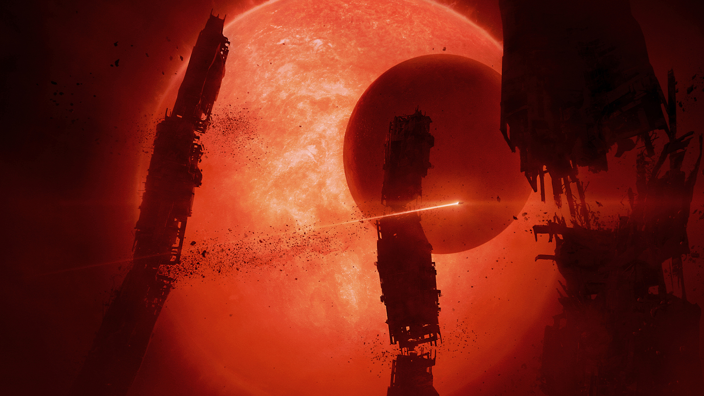

---

## Slide 2

- 打造单一服务器共享的沉浸世界
- 鼓励协作，提升社交
- 打造深度游戏内经济体系
- 通过塑造不断演变的宇宙，开创持续运营的先河
- 我们专注于 …
- CCP - 游戏行业的常青树 蓄势待发，引领下一个增长
- 运营年数
- 65M+
- 累计用户
- $1.4Bn+
- 累计收入
- 4Bn+
- 累计游戏时长
- 28
- 过去的25年
- 下一个10年

### Notes

> 2

---

## Slide 3

- # 414 名员工
- # 35+ 不同国籍
- # 3 个办公室
- Reykjavik
- London
- Shanghai
- CCP 在1997年于冰岛创立
- 以EVE宇宙而闻名的传奇游戏公司
- “EVE is the most real place we´ve ever created on the internet”
- “One of the best sandbox MMOs in existence”
- ”EVE Online is the biggest game you could possibly hope to play”
- “EVE Online is first and foremost the greatest definition of the term MMORPG”
- ”It might be the best online game ever made, but don´t tell anyone I told you that”

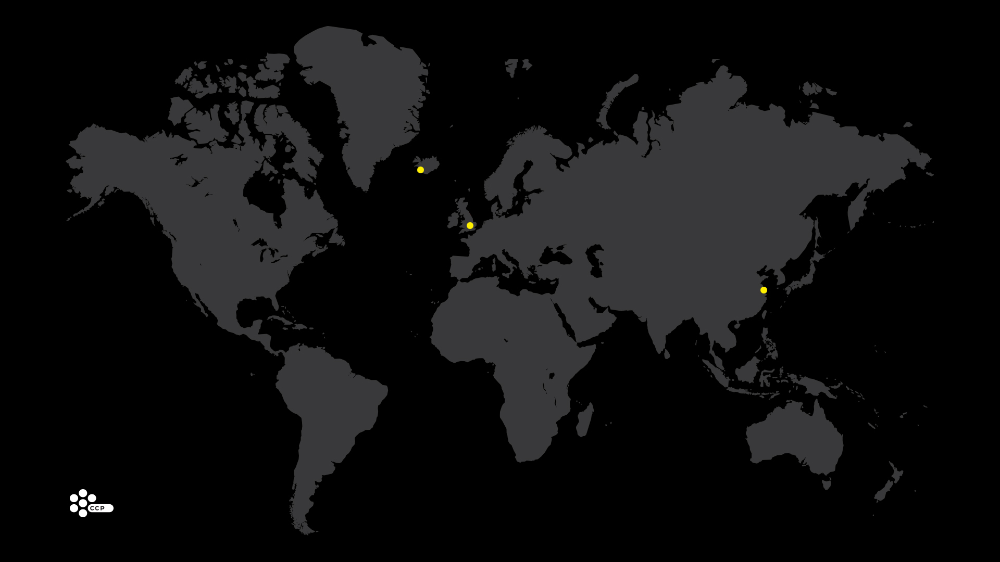

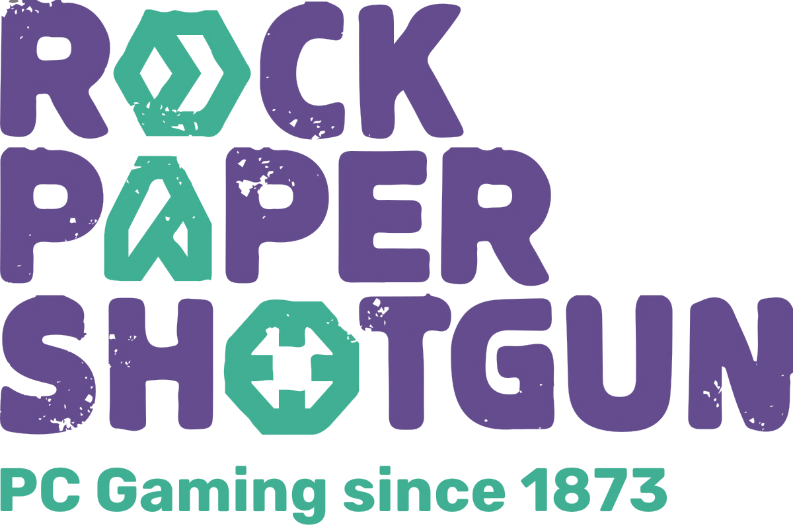

### Notes

> 3

---

## Slide 4

- Have helped create the EVE Universe that has generated over
- $1 billion
- in revenue

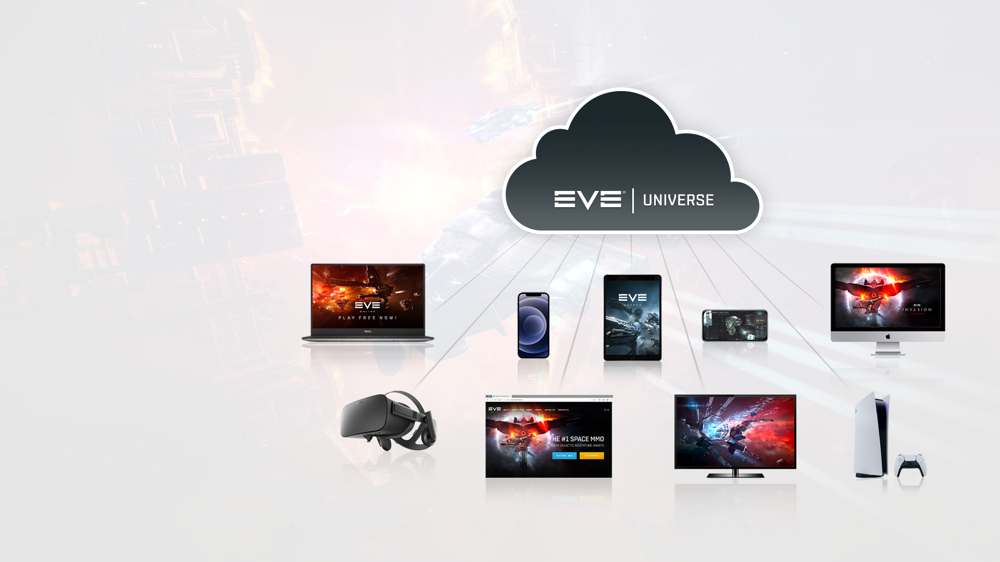

### Notes

> NOTES FOR READERS GOING THROUGH THE PRESENTATION
> Games on PC, consoles, mobile, VR, and a bright future to tap into
> EVE Online on PC, and available in browser.
> Dust 514 and EVE Valkyrie on consoles.
> EVE Portal, EVE’s companion app on mobile.
> EVE Echoes, ‘EVE Online lite’ on mobile.
> EVE in China.
> Sparc, Gunjack and Valkyrie in VR.

---

## 25 年的开拓之旅

- 首个构建为原生关系型数据库的MMO
- 2000
- EVE的联盟系统赋予社会组织前所未有的规模
- 引入可交易游戏时间的代币，连接法币与游戏内经济
- 2008
- 使用时间膨胀技术，通过服务器端速率控制，确保大规模会战稳定
- 2013
- EVE Online 作为首个“单一宇宙”MMO上线
- 2003
- 游戏中最早开放公开API的先驱
- 2004
- “海地赈灾”活动，让EVE玩家能够用他们的PLEX捐款，累计筹集120万美元
- 2009
- 2016
- 2020
- 2025
- “a one-of-a-kind MMO modding experiment”
- 技术，虚拟世界，在线经济与广阔社区
- DUST 514在PS3平台发布，实现FPS与MMO的全球首次跨平台经济互通
- 2007
- 2007
- 2010
- 2011
- 2019
- 2020
- 首个被经济学家定期撰写虚拟世界宏观报告的游戏
- CSM – 首个由民主选举产生的玩家委员会成立
- HyperNet Relay, 受监管的游戏内稀有/非流动性资产抽奖市场
- 全年仍有130万人首次踏入EVE世界
- 发现计划上线，奖励玩家为现实科学做出贡献
- 获得吉尼斯认证的史上最大规模游戏会战
- 推出“军团项目”，为MMO军团开启新的模式，规范贡献经济体系
- “Building from the incredible reputation of space-sim MMO EVE Online, EVE Frontier looks set to carry on CCP’s reputation for enabling player freedom across an entire galaxy”

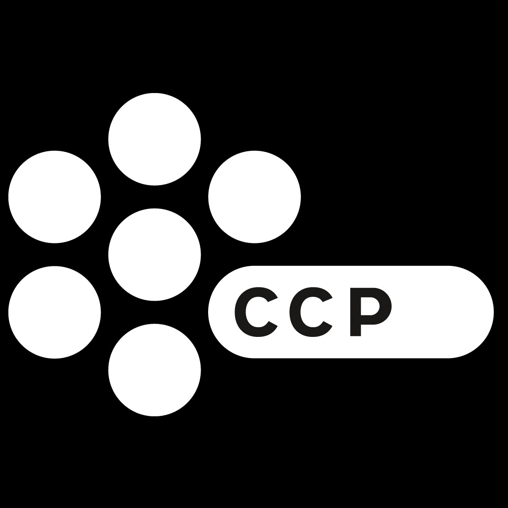

### Notes

> 2000 - First MMO that is built as a native relational database application
> 2003 - EVE Online releases as the first "one universe" MMO
> 2004 - EVE's Alliance system provides unprecedented scale for social organization, enabling coalitions and proto-nations
> 2007 - One of the earliest public API in gaming opening data to 3rd-party developed tools and services
> 2007 - Quarterly Economic Newsletter, the first recurring economist-authored macro report for a virtual world, establishing EVE as a case study for digital economies.
> 2008 - CSM, the first democratically elected player council in gaming, bringing structured representation and consultation into virtual governance.
> 2009 - PLEX introduced, tradeable time tokens linking fiat and ISK economies
> 2010 - PLEX Aid for Haiti enables EVE Players to donate their PLEX for humanitarian aid totaling over 1 million USD through EVE's history
> 2011 - Time Dilation, server-side rate control so mega-battles remain consistent, leading to several world records.
> 2013 - DUST 514 releases on PS3, an early experiment in cross-platform economic integration between an FPS and an MMO.
> 2016 - Project Discovery, rewarding players to contributed to real world science, such as cancer research and expo planet discovery
> 2019 —
> HyperNet
> Relay: Regulated, in-client raffle market for rare/illiquid assets (price discovery/liquidity).
> 2020 - Guinness World Record for the largest gaming battle ever recorded
> 2020 - 1.3 million people join EVE for the first time in their lives
> 2025 - Corporation projects, unlocks gig-economy for an MMO corporations, formalizing contribution economies and integrating with APIs for further transparency and expansion.
> 5

---

## Slide 6

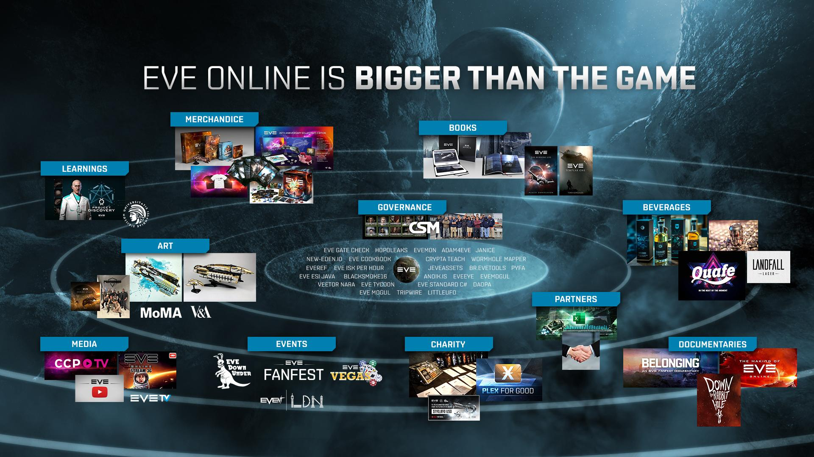

---

## Slide 7

- EVE玩家在游戏过程中交到了新的朋友
- *Survey answers from April 2019

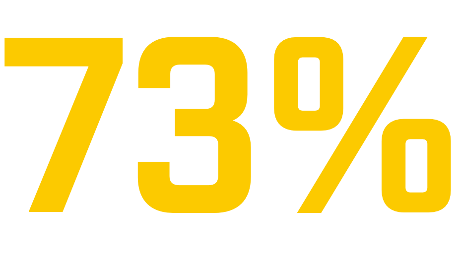

---

## 第三方开发一直是CCP的基因

- 玩家数十年来持续为EVE生态做出贡献
- EVE中的第三方开发
- Awesome EVE资源库, 由开发者舰队管理.是发现和分享这些资源的中心枢纽
- 它包含大量与游戏个方面相关的项目，代码库和指南，列如市场分析、舰队管理、工具集成等
- 该代码库拥有超过150个独立应用，全部构建与单一的只读API上
- EVE api gateway
- EVE 的数据库每秒处理6k-10k次调用，其中超过一半来自第三方开发者
- 已有数千名开发者与之交互
- EVE全球市场系统每24小时完成约100万次交易
- 部分第三方网站和应用每月的流量量超过百万
- 玩家联盟使用API的实例
- TEST Alliance Please Ignore
- 17,043 名玩家
- 2 – 3 名主要应用开发者
- 5 – 6 名不定期贡献开发者
- 大约有6种专为联盟编写的定制工具
- 对公共工具的依赖度较低
- Goonswarm Federation
- 29,651 名玩家
- 3 名主要应用开发者
- 多达10名其他活跃开发者
- 大约有12种专为联盟编写的定制工具
- 外加多达10种通用工具

---

## Slide 9

- 成功范式转移
- EVE Online
- 22年历史，见证帝国的兴衰，丰碑与传承
- 丰富的玩法与功能集
- 300种不同的太空飞船
- 久经考验的稳定技术栈
- 成熟的社区
- 受货币管控的经济体系
- EVE Frontier
- 首款面向PC端的AAA级区块链MMO
- 全新的开始，每个人都是公平的开局
- 精心打磨的太空生存新诠释
- 拥有可供未来数十年发展的内容和路线图
- 从开始就拥抱给予区块链的服务器模块，主要特性有社区创造
- 完全去中心化，无限制的开放经济
- 从传奇MMO到全球首款AAA级区块链MMO

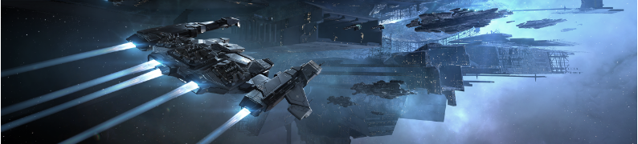
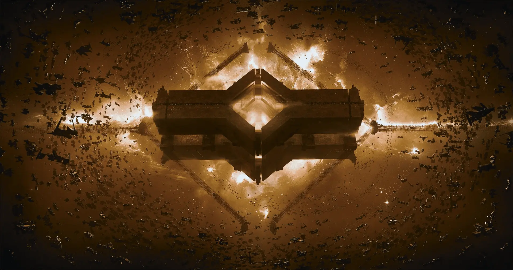

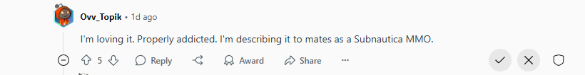

### Notes

> World of Warcraft
> : Approximately 135 million registered players.
> Old School RuneScape
> : Approximately 45.67 million registered players.
> FINAL FANTASY XIV
> : Approximately 50.8 million registered players.
> Baldur's Gate III
> : Approximately 93.58 million registered players.
> Warframe
> : Approximately 36.34 million registered players.
> Diablo IV
> : Approximately 51.33 million registered players.
> Lost Ark
> : Approximately 15.85 million registered players.
> Destiny 2
> : Approximately 44.73 million registered players.
> RuneScape
> : Approximately 18.79 million registered players.
> Guild Wars 2
> : Approximately 19.22 million registered players.
> The Elder Scrolls Online
> : Approximately 23.58 million registered players.
> Black Desert Online
> : Approximately 13.27 million registered players.
> Path of Exile
> : Approximately 33.63 million registered players.
> Star Citizen
> : Approximately 21.5 million registered players.
> MapleStory
> : Approximately 6.48 million registered players.
> ROBLOX
> : Approximately 67.25 million registered players.
> World of Tanks
> : Approximately 7.92 million registered players.
> Star Wars: The Old Republic
> : Approximately 12.49 million registered players.
> EVE Online
> : Approximately 10.17 million registered players.
> Diablo Immortal
> : Not included in top 20 but notable for its high player count.
> Adding these numbers together gives us a rough total of around 708.71 million registered accounts across these popular MMOs. Note that there is overlap in these numbers, as players may have accounts in multiple MMOs.
> 9

---

## Slide 10

- April 2nd
- Free trial
- MARCH 31ST
- HACKATHON
- May 14-16th
- March 11th
- Cycle 5
- 2026 roadmap
- Cycle 5 starts
- SUI on Stillness
- Hackathon Starts
- Start of free trial
- Ends 10 days later
- June 18th
- Cycle 6
- SEP 16TH
- TGE
- Dec 8TH
- RELEASE
- Fanfest
- Start of cycle 6
- Next big release
- Final dress rehersal
- Hype moment
- HACKATHON ENDS
- Hackathon Results deployed to stillness
- Gamescom
- Hyping up tge
- Aug 26th
- MAINNET
- Big game release
- FOLLOWING UP WITH A RELEASE before holidays

### Notes

> 10

---

## Slide 11

- EVE Frontier × Sui 黑客松2026是一场线上全球黑客松活动，诚邀创作者为EVE Frontier构建可扩展并与之交互的模组和工具
- 黑客松主题:
- A Toolkit for Civilization
- 黑客松启动日期: 11 March 2026
- 黑客松提交截止日期: 31 March 2026
- 获奖名单公布: 24 April 2026
- https://www.deepsurge.xyz/evefrontier2026
- 黑客松活动概览
- Hackathon – march 2026

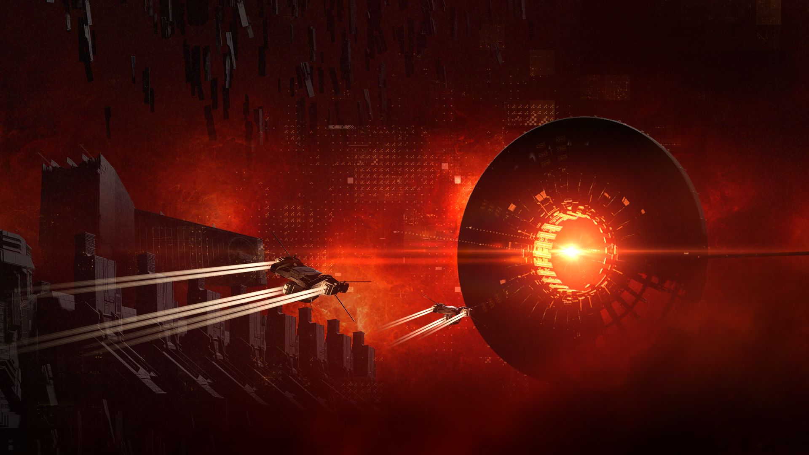

---

## Slide 12

- 本次黑客松设有1，2，3名大奖，以及五个类别的冠军奖项
- 1st Place 2nd Place 3rd Place
- $15k USD $7.5k USD $5k USD
- EVE Fanfest passes and travel packages Ascended Founder Access Ascended Founder Access
- Ascended Founder Access Primal Tribe Pack Primal Tribe Pack
- Primal Tribe Pack EVE Points EVE Points
- EVE Points $5k USD worth of Sui Tokens $2.5k USD worth of Sui Tokens
- $10k USD worth of Sui tokens x5 tickets to Sui Basecamp 2026 x3 Tickets to Sui Basecamp 2026
- x5 tickets to Sui Basecamp 2026
- Category Winners
- $5k USD
- Ascended Founder Access
- Primal Tribe Pack
- EVE Points
- $1k USD worth of Sui tokens
- x2 tickets to Sui Basecamp 2026
- Utility
- Mods that materially change how players survive, coordinate, explore, or compete.
- Technical implementation
- Clean architecture, smart use of Frontier systems, scalability, and robustness.
- Creative
- Novel ideas, clever reinterpretations, and bold system concepts that feel uniquely Frontier.
- Weirdest idea
- Visually striking, surprising, or meme-worthy creations that push the Frontier in strange directions.
- Live frontier integration
- Mods that are deployed and functioning in Stillness, interacting with the live world and real players.
- 奖项设置
- Hackathon – march 2026

---

## Slide 13

---

## Slide 14

- FRONTIER产品介绍
- MMO MODDABLE SURVIVAL GAMING

### Notes

> 14

---

## Slide 15

- Frontier官网首页

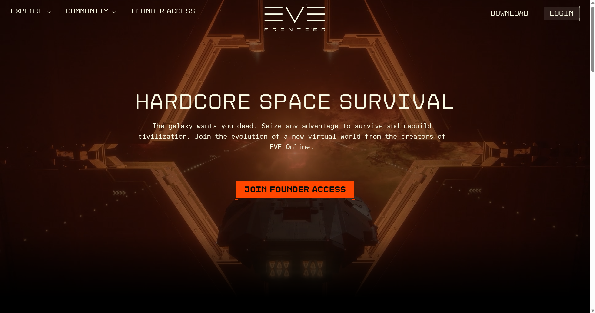

### Notes

> 15

---

## Slide 16

- 采集
- 建设
- 生产
- 航行
- 扫描
- 战斗
- 星图
- 星系
- 跃迁

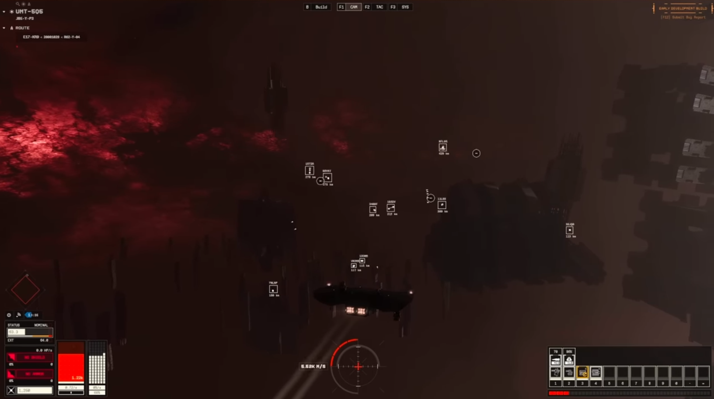
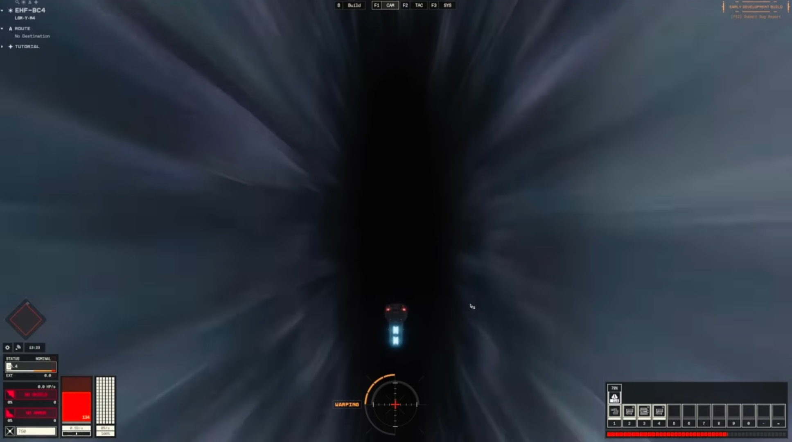
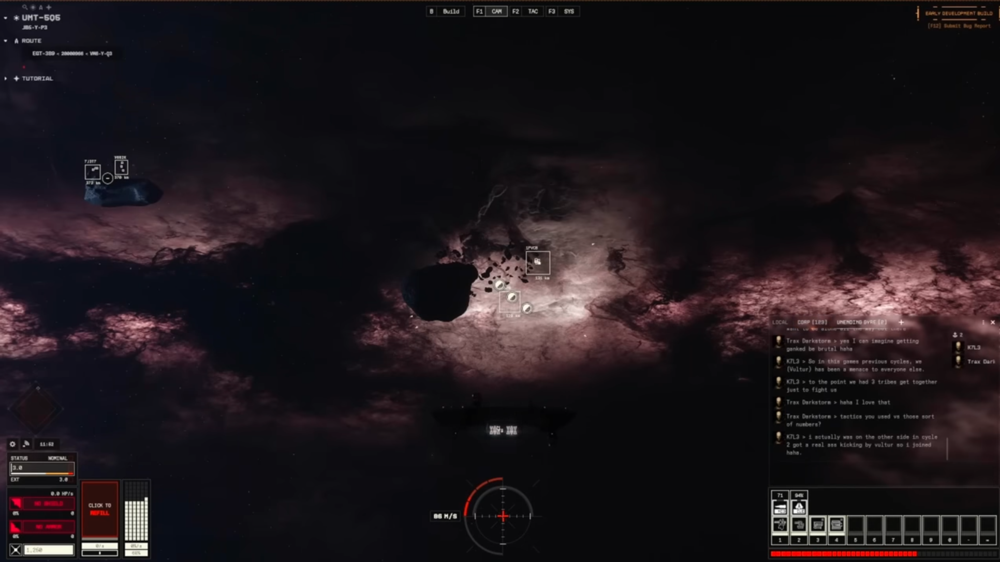
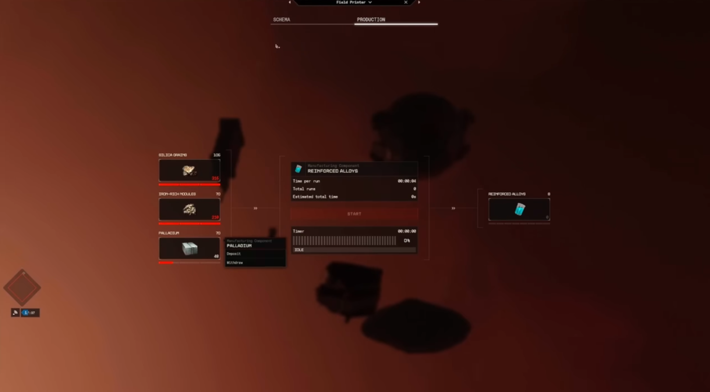
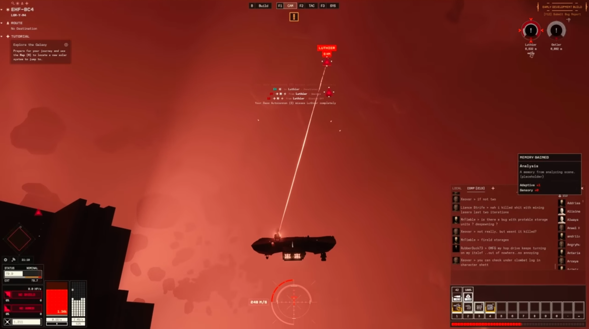
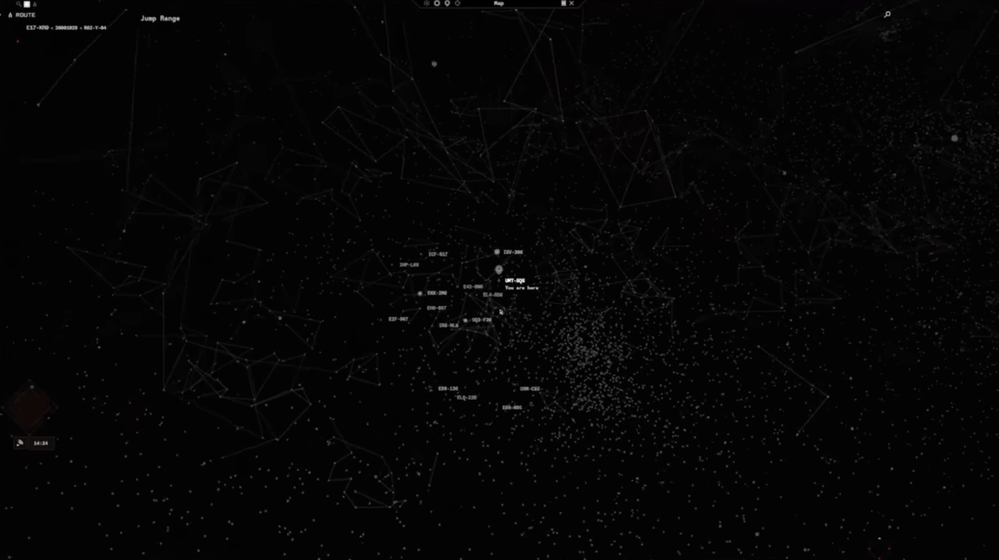
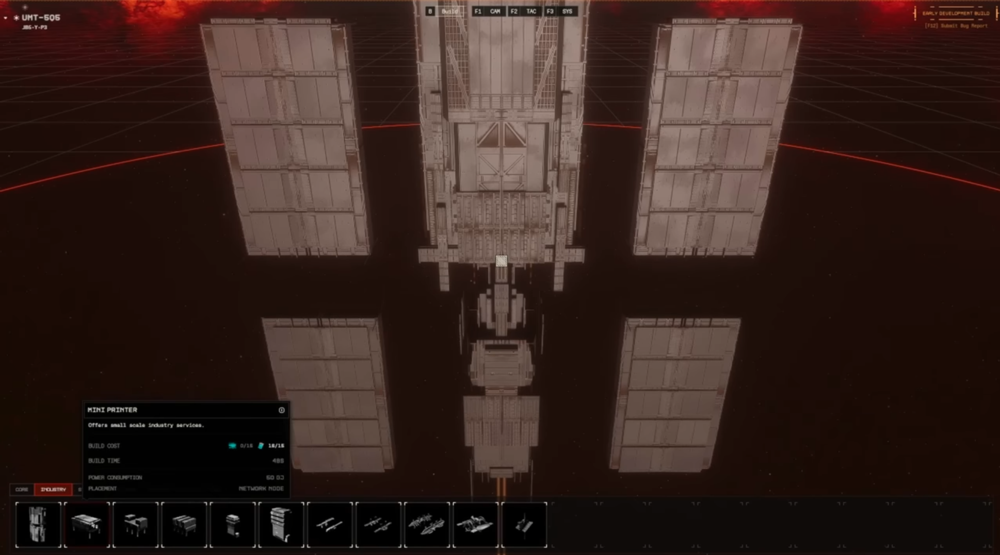
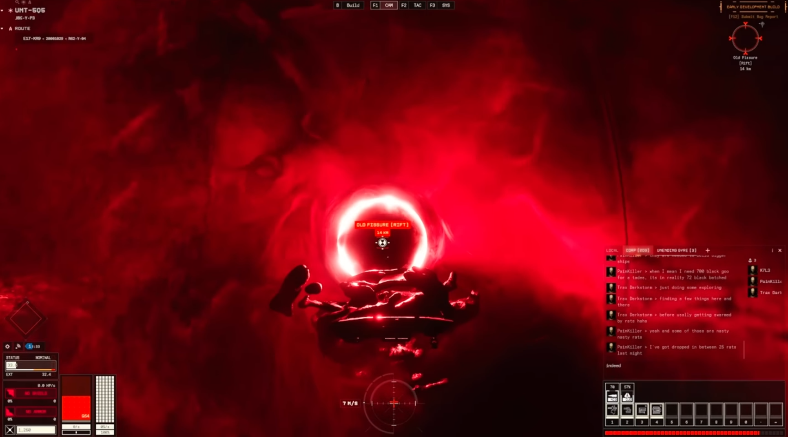
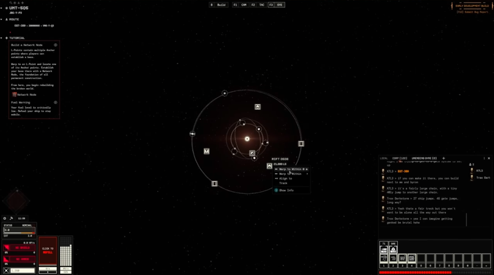

### Notes

> 16

---

## 背景故事：太空荒原

- Frontier 是三座遥远星系相互碰撞交汇的产物。这场碰撞撕裂了空间，形成了被称为“裂隙（Rifts）”的空间裂口。
- 这些裂隙使人们能够采集一种名为“粗质物（Crude Matter）”的异质材料——它可用于先进的能源与计算技术，因此对地球人（Terrans）而言极其抢手。于是他们通过微小的空间通道投送了无数“种子”，这些种子在漫长岁月里成长为巨型工厂殖民地。历经数千年，它们最终变成了一张庞大的“幽灵基础设施”网络。
- 人类曾多次试图在 Frontier 生存与定居，但都以失败告终。不同的群体先后到来——强化殖民者、宗教邪教、军事力量……然而迟早，他们都死了：要么败于 Frontier 本身严酷的环境，要么被“野化 AI（Feral AIs）”的压力所摧毁。所谓野化 AI，是一种野生且危险的本地人工生态系统，源自最初地球人自动化体系的后裔。
- 如今，又过了数千年。当“守护之境”（Keep）遥遥瞥见了远在天边的新伊甸（New Eden）的存在——那是一个试图拯救文明的神秘实体——它开始唤醒 Frontier 的玩家角色。于是，人类文明在此重建的又一次尝试，就此开启……

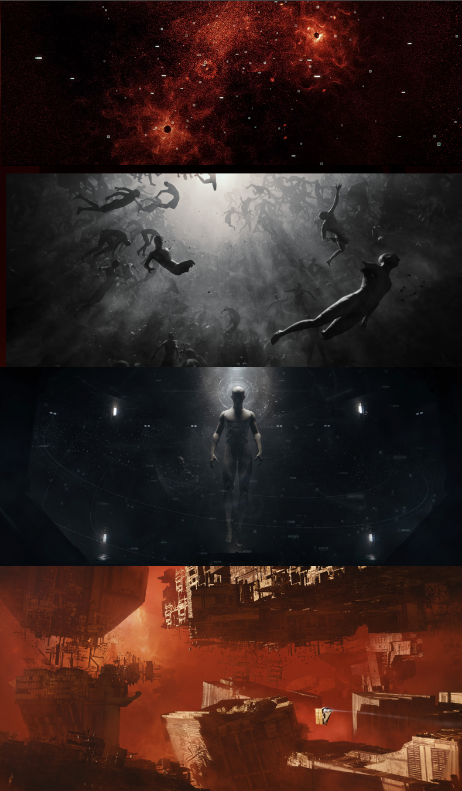

### Notes

> 17

---

## 世界轮廓

- Frontier 的底层逻辑是科学。这里的科学可以很前沿、很离奇，甚至带点推测性质（比如超光速技术），但它始终讲得通、前后自洽，不会凭空胡来。
- Frontier 是一种“远古的未来”。它明明建立在硬核科学的基础上，但生活在这里的人看它时却像隔着一层滤镜——带着神话感、原始感、神秘感，甚至有点邪门和瘆人。
- Frontier 是一座死去的世界，也是考古现场。除了玩家之外，所有人都已经死了，而且死了几千年。你面对的是遗迹、残骸、旧文明的尸体。
- Frontier 是彻底的“地狱式死亡”。它壮丽、冷漠、致命：一个逼人挣扎、也可能逼人开悟的地方。
- Frontier 是 grimpunk（阴郁朋克/灰暗朋克）。是的，你可以把尸体加工成制造材料——但那不是为了酷，也不是为了享乐，而是为了在几乎不可能的环境里活下去。
- REBUILDING A BROKEN WORLD
- CRUEL SURVIVAL EXPERIENCE
- GROUNDED IN SCIENCE

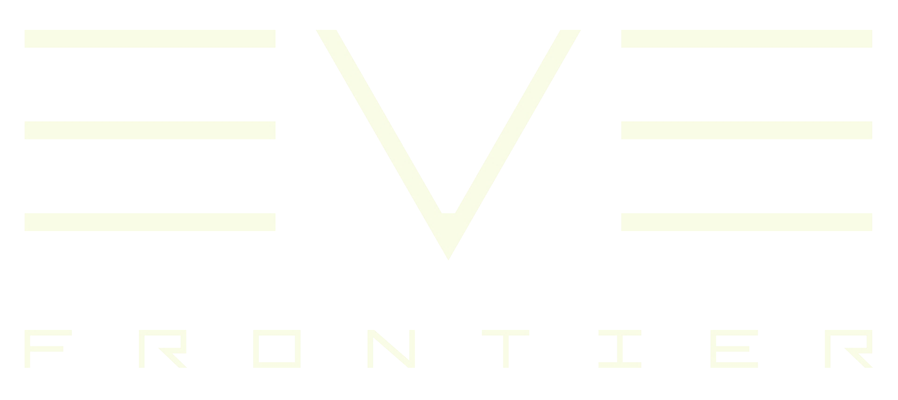

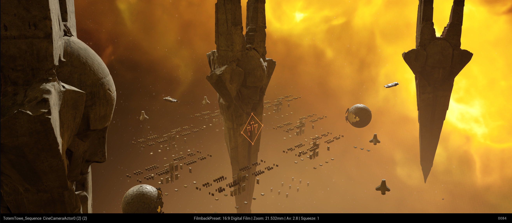
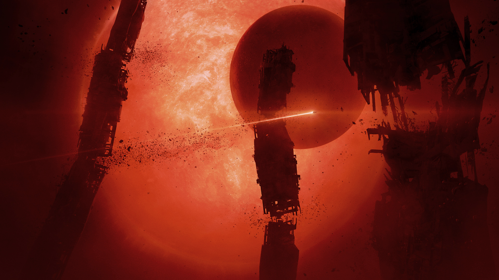

### Notes

> 18

---

## 美术方向

- 远古的未来（Ancient future）：不是《苍穹浩瀚》（The Expanse）那种冷峻的蓝色科幻，而是更接近《沙丘》或塔图因（Tatooine）那种被烈日烘烤过的、温暖而苍茫的遥远未来。
- 整体配色偏单色系（但常常依然很鲜艳）：尽可能采用单色（或接近单色）的整体色调，这样“必要的”颜色强调元素（可自定义的玩家资产、UI、特效 VFX）才能更醒目地跳出来。
- 粗野主义 + 极简主义（Brutalism, minimalism）：为了可读性与可达性，尽量牺牲装饰性细节，但整体仍要保持克制而优雅。
- EVE Online里的飞船
- EVE Frontier里的飞船

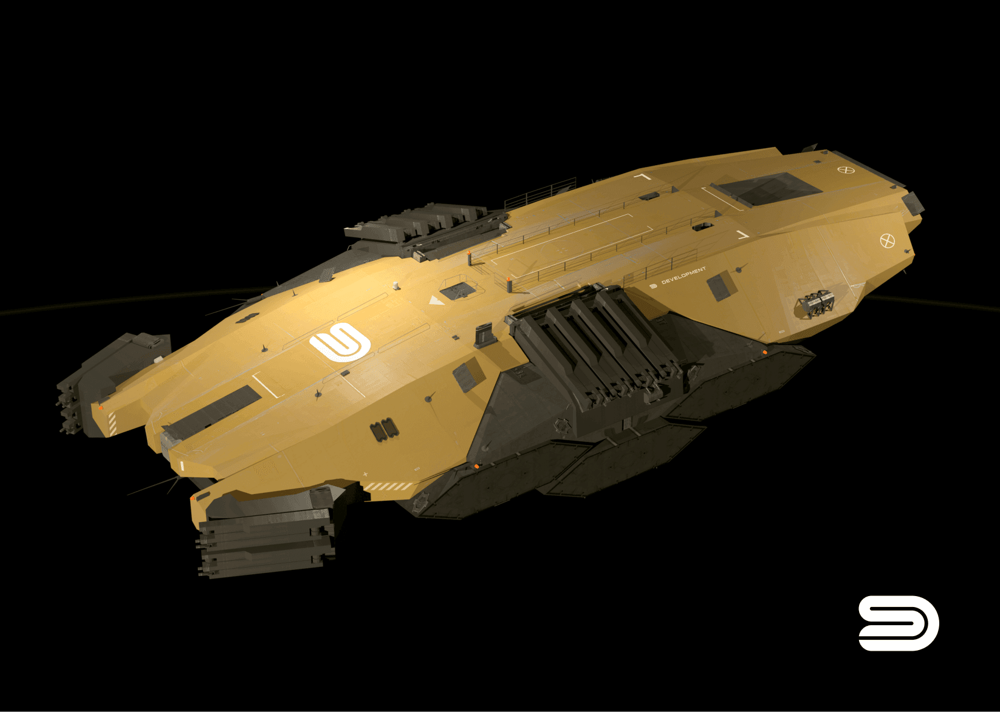

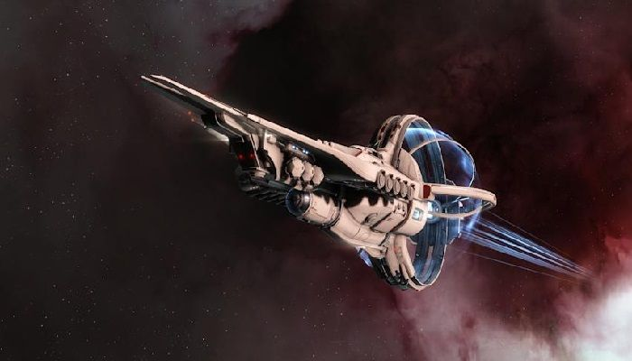
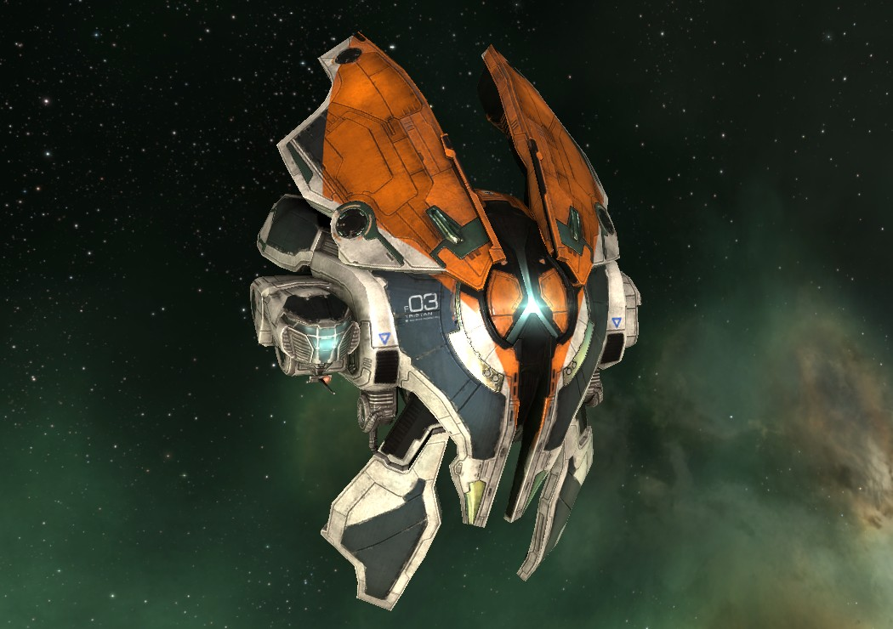

### Notes

> 19

---

## 美术方向

- EVE Online宣传片《起源》
- EVE Frontier先导预告片

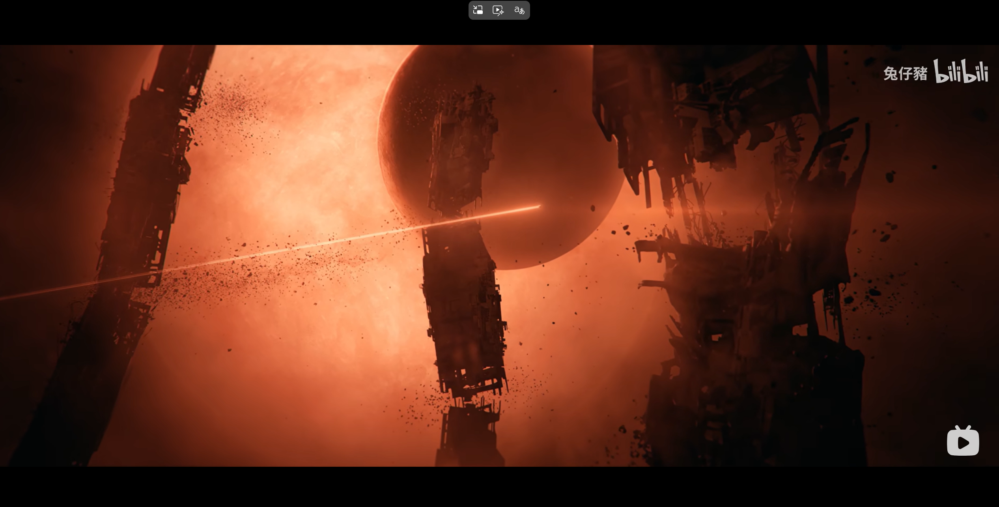

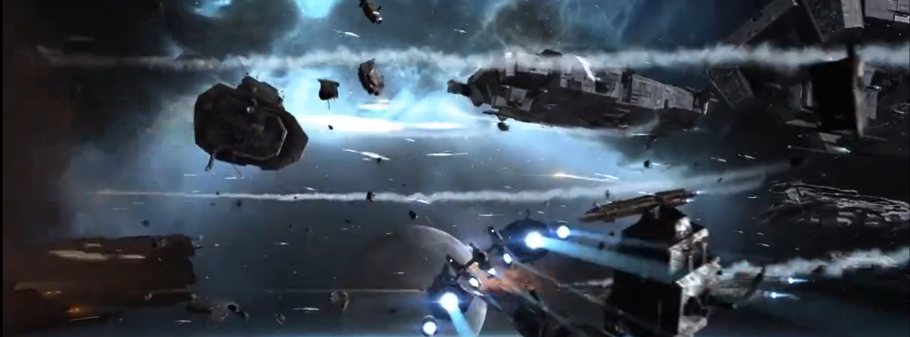

### Notes

> 20

---

## Slide 21

- EVE Frontier 将面向非常广泛的受众：加密圈、游戏玩家以及科幻爱好者。
- 部分现有 EVE 玩家会来体验 EVE Frontier，并可能迁移过来，或同时参与两个世界。
- 部分离开 EVE 的老玩家也会对“重新开局”产生兴趣——这是社区多年来一直在讨论的诉求。
- 部分了解 EVE、对 EVE 感兴趣但一直没有真正入坑的人，也会把这看作一次很好的加入机会。
- 区块链爱好者会看到技术层面的机会，同时也会被游戏内与游戏外的参与方式所吸引。
- 最后，对区块链游戏感兴趣的玩家，也会把这视为参与“首个上链的 AAA 级游戏”的机会。
- 目标用户
- MMO MODDABLE SURVIVAL GAMING

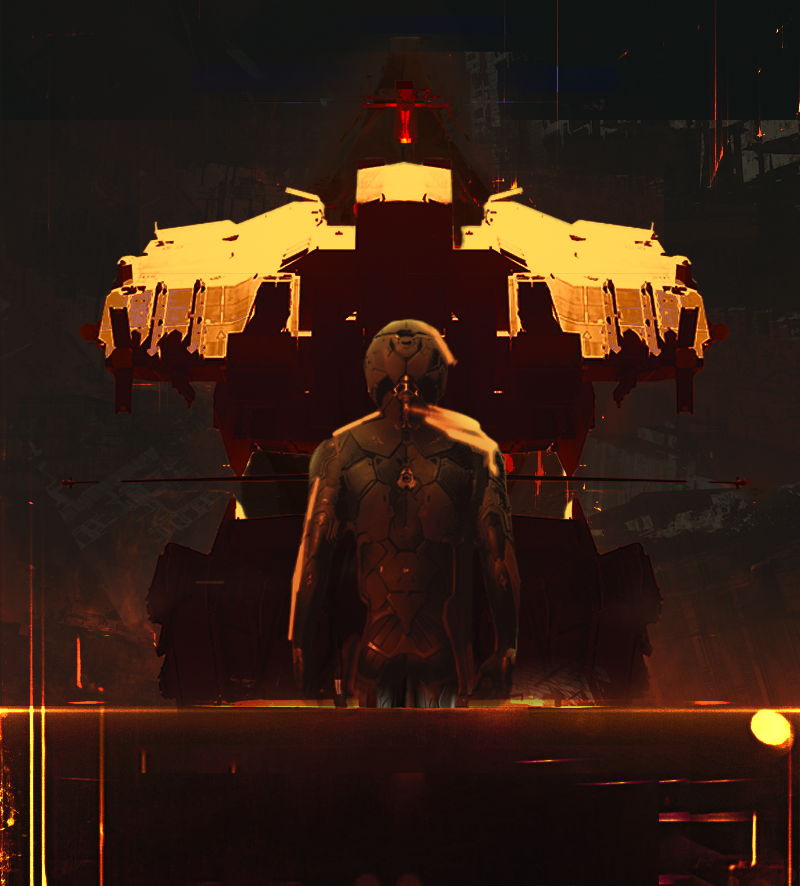

---

## Slide 22

- 数字社会
- 经济由供求和市场力量驱动，CCP担任游戏的中央银行。
- 数字货币支持游戏内交易。
- 玩家必须努力赚取资源，比如实打实地花时间采集矿物。
- 与社区共建
- 核心社区随时间发展，每年举办嘉年华，定期举办见面会。
- 星际管理委员会（玩家代表团）。
- 丰富的第三方（玩家）开发工具和创造内容。
- 有意义的损毁
- 损毁是游戏核心机制。
- 玩家必须谨慎行事，所有行动都不可逆。
- CCP立场中立，不偏袒任何玩家，甚至不偏袒玩家本身。
- 所有行为都是社交性的
- 为玩家提供灵活的工具和激励措施，使其能自主组织、合作、竞争。
- 宏伟壮丽的世界
- 有史以来最大的MMO开放世界。
- 由玩家驱动的持续进化的游玩体验，周而复始地上演个人与集体戏剧性的故事和引人瞩目的星际战事。
- 随心所欲地玩
- 沙盒玩法给玩家足够自由度。
- 所有行为都对世界产生影响。
- 品牌认知
- 开拓与实验
- 经济设计能力
- 游戏开发
- 社区建设
- EVE Online 贯彻25年的设计理念
- 经过实战验证的文化、哲学与原则，成为Frontier成功的基础
- 1
- 2
- 3
- 4
- 5
- 6

---

## Slide 23

- 玩家故事——高度自由世界的剪影

### Notes

> 23

---

## Slide 24

- 一支为 YGG DAO 工作的小型雇佣兵舰队。
- 他们的舰船由该 DAO 建造并以租赁形式提供，这既能保证他们采用有效的作战配置，也让雇佣兵不必先自掏腰包购买舰船。
- 他们正在这一地区追猎气体采集船，通过确认击杀来领取代币报酬；DAO 之所以支付这些报酬，是为了让自己的空间保持“干净”，免受窃贼骚扰。
- 这支队伍由一个外部的 Discord 社区进行管理，该社区负责发掘并训练舰队指挥官。
- PLAYER STORIES
- 游骑兵

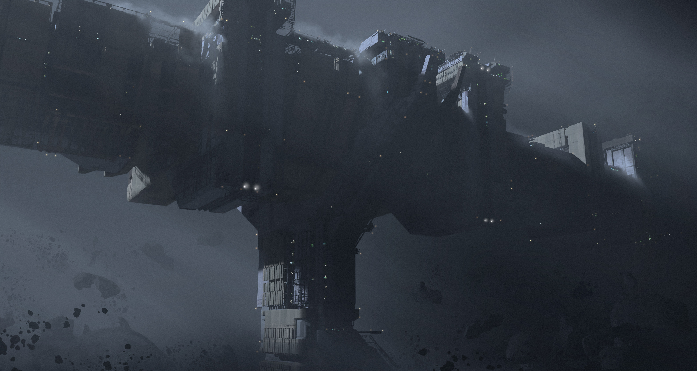

---

## Slide 25

- 一名气矿采集独狼，比任何人都更熟悉这片空间。
- Frontier 深处的一片星云里，有些区域狭窄逼仄、几乎无法生存；最富的气体就出自那里。想要穿越这些区域，必须非常小心地管理热量与电容（cap）消耗。
- 他采集到的高价值资源可以在附近的贸易站卖出，收入足够覆盖他的舰船成本，甚至还能额外赚点钱。
- 由于当地贸易站站长提供的情报，他总能提前知道什么时候会有漫游者和雇佣兵来猎他。
- PLAYER STORIES
- 采气工

---

## Slide 26

- 一位在 Frontier 边缘区域拥有并运营数个小型贸易站的企业家。
- 她能借助游戏外投机者与 DeFi 团体的风险投资来持有这些基础设施，但这些出资方会从她每月的税收收入中抽成。
- 她正在攒钱，打算单飞——这样就能把所有收益都留给自己。
- 她担心当地雇佣兵会对她宣战，因为他们怀疑她在向采集者泄密（打小报告），导致他们的行动暴露。
- PLAYER STORIES
- 投机者

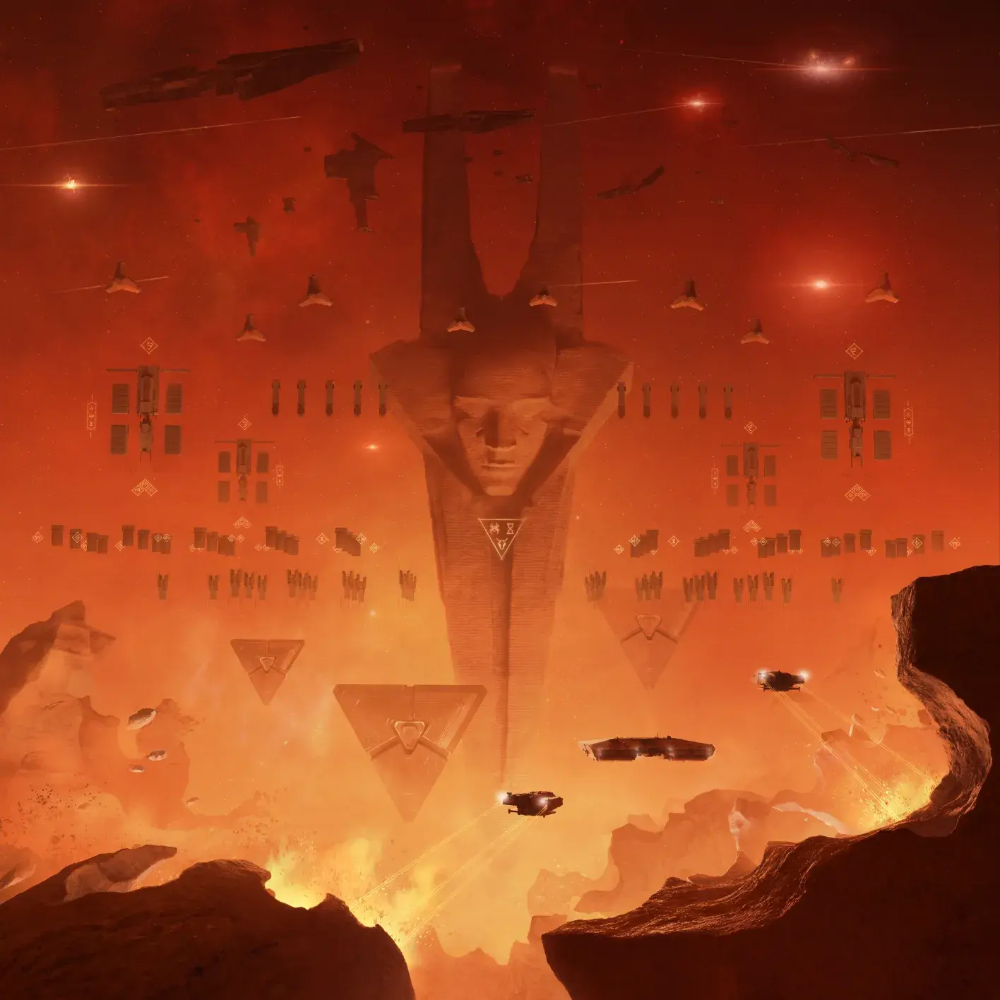

---

## Slide 27

- 一位富有远见的实业家正在 Frontier 太空边缘资助一项规模巨大的星门工程。
- 游戏外的出资方会提前提供资金，并从未来通过星门产生的通行费与贸易流量中分红。
- 他（她）需要管理一张由矿工、运输队和安保舰队构成的合约网络——任何一环出问题，都可能让整个项目偏离轨道，同时动摇投资者信心。
- 一旦星门建成，它将重塑该区域的权力格局、开启新的边疆，但也会让建造者成为一个巨大的众矢之的。
- PLAYER STORIES
- 造门人

---

## Slide 28

- 玩法与经济循环

### Notes

> 28

---

## Slide 29

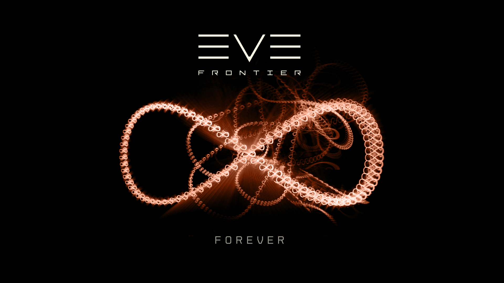

### Notes

> 29

---

## Frontier的核心循环

- 在 Frontier 里，就像在《EVE Online》里一样，核心循环围绕着一个真正由玩家驱动的经济展开：每一艘飞船、每一架无人机、甚至每一发弹药，都是由玩家使用玩家采集到的材料生产出来的。
- 此外，我们引入了“能量”和“燃料”的概念，进一步加深经济循环，并为我们在体验中更充分地拥抱自动化与 AI 打开空间——在这个体系里，每一个行动者（agent）都能成为经济中有价值的贡献者。
- Frontier 的起点是先搭建支撑核心循环所需的关键组件，并在此基础上持续以我们的聚焦愿景去改进和完善它们。
- 随着时间推移，我们会继续与社区紧密协作，不断加入新的系统与内容。
- 其中一个关键的差异点在于“破坏”的重要性——大多数游戏最终都会遭遇通货膨胀和战力膨胀（power creep）的问题，结果往往变成只服务于一个规模不断缩小的老玩家群体。
- 死亡是严肃的机制：它是“永续游戏”的一项核心设计原则。
- Each step in the core loop requires energy, a key TO FRONTIER‘S ECONOMY
- SURVIVE

### Notes

> 30

---

## 粗质物与燃料

- Frontier里的每个行为都在为$EVE赋予价值
- 固定比例
- CCP定价
- 供应控制
- Ccp pricing
- 外部市场
- 燃料消耗
- 来自 Frontier 深空的粗质物（Crude Matter）被精炼成燃料（Fuel）——这是 Frontier 上每一次行动背后的能量来源。
- 由于每一个行动都会消耗燃料，燃料就成了支配这个世界“物理规则”的关键力量。
- 通过把“成本”与“玩法”绑定在一起，Frontier 将稀缺性、平衡性与决策的重量内置进玩家的每一次选择。
- 要开采粗质物必须使用透镜（Lenses），而透镜只能通过消耗 $EVE 获取——因此所有活动都会推动对 $EVE 的需求上升。
- 通过在游戏内对 $EVE 进行主动的供给控制、对关键游戏内物品实行垄断式定价，并强制保持稀缺性，系统将形成一种自我平衡的经济，从而确保长期可持续。

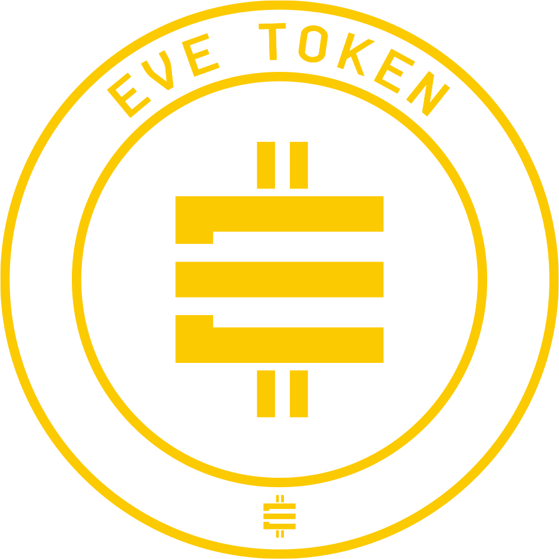

### Notes

> 31

---

## Slide 32

- 我们能为FRONTIER做的

### Notes

> 32

---

## Slide 33

- EVE 社会信用（EVE Social Credit）
- 路线规划工具
- 自动化市场系统
- 创始人社区共创示例
- 在Testnet的live coding和各类hackathon已经产出了不少令人惊叹和“炸裂”的成果
- 一个面向 Frontier 玩家、链上记录的信誉评分系统。接入该服务后，你的智能基础设施就可以区分那些有良好/不良行为历史的玩家。当前会追踪击杀记录（killmails），未来计划扩展到元交易（meta transactions）/智能基础设施相关的行为数据。
- 已经存在许多制图/导航工具，帮助玩家在全宇宙范围内规划高效路线，同时考虑玩家建设的基础设施、热度（heat）、跃迁距离、燃料、质量（mass）等因素。
- 在智能仓储单元里实现自动化市场系统，会随着实际使用情况动态调整供需，从而引导玩家向仓储所有者“更需要囤积的物资”倾斜。

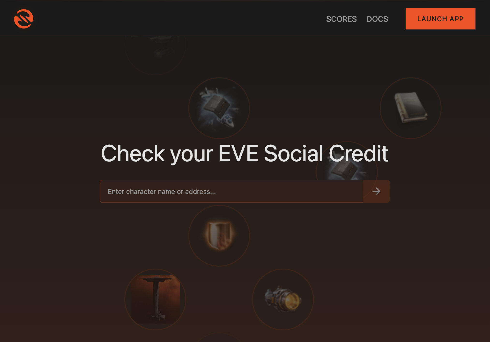
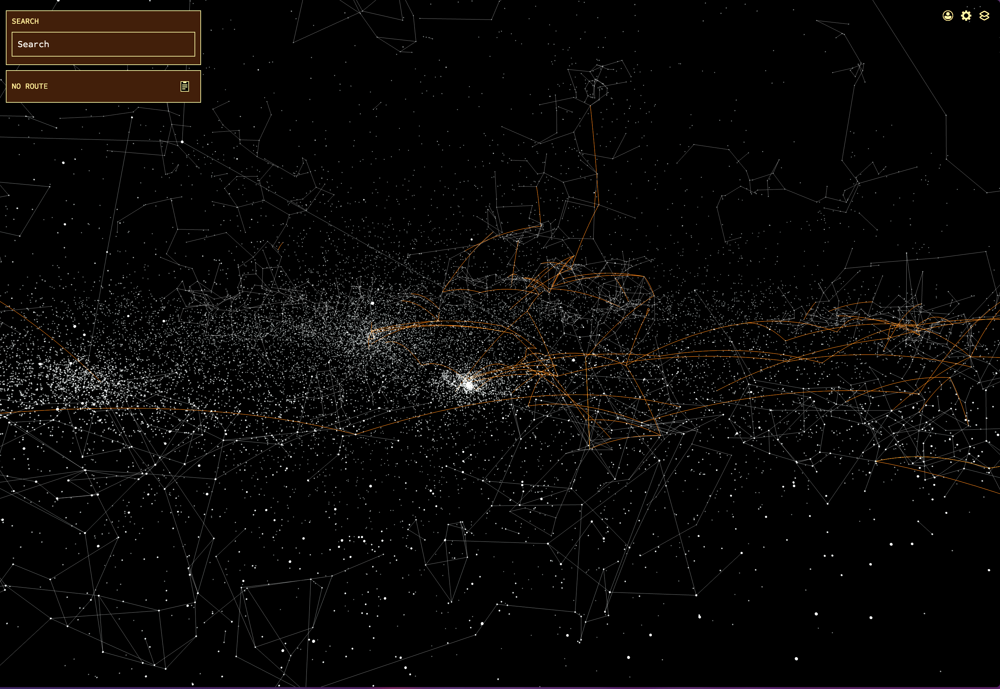
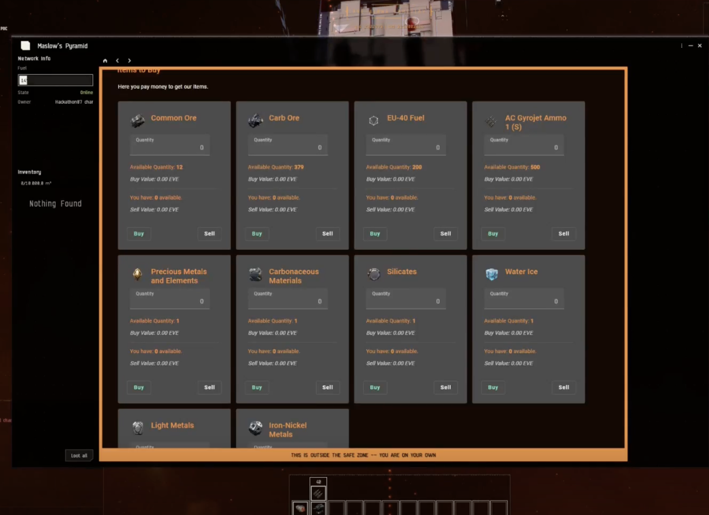

### Notes

> 33

---

## Slide 34

- 后勤规划工具
- 怪东西（Weird stuff）
- 自动化游戏内锦标赛系统
- 用于分配任务与规划，例如给星门网络补燃料、规划基地建设、拆解并输出建造/制造所需的物料清单（Bill of Materials, BOM）等
- 比如“给它一块水冰帮它保湿，作为回报它给你燃料”这类古怪交换/交互。
- 玩家支付报名费（buy-in）即可进入/发起一场游戏/对局/回合；奖池归胜者所有，但运营方会抽取一定比例作为手续费（rake）。模式例子包括：山丘之王（King of the Hill）、区域控制（Area Control）、夺旗（Capture the Flag）。
- 创始人社区共创示例
- 在Testnet的live coding和各类hackathon已经产出了不少令人惊叹和“炸裂”的成果

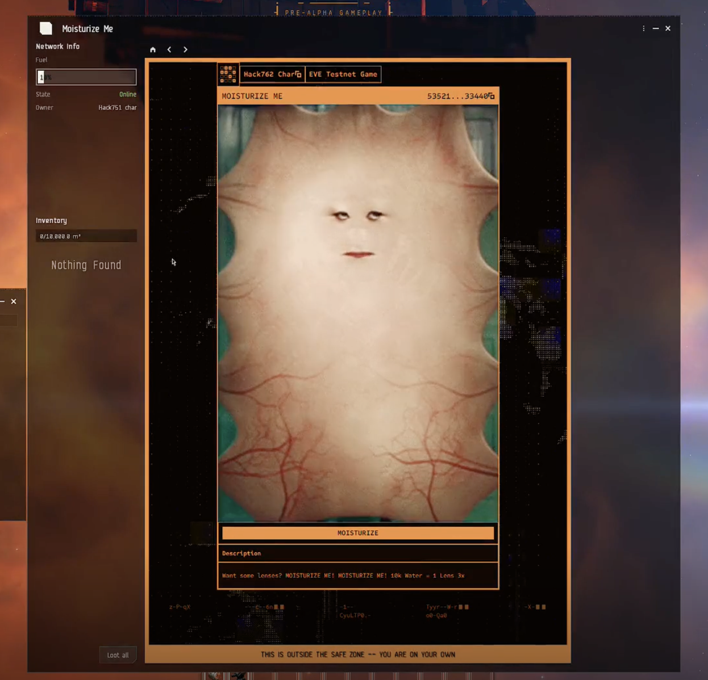
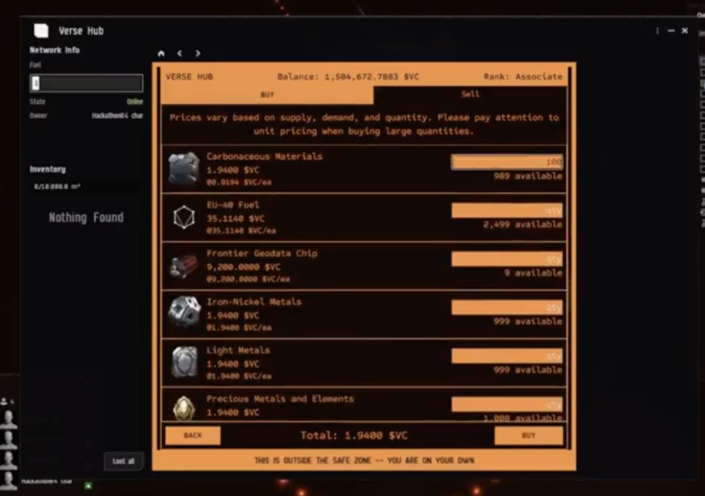
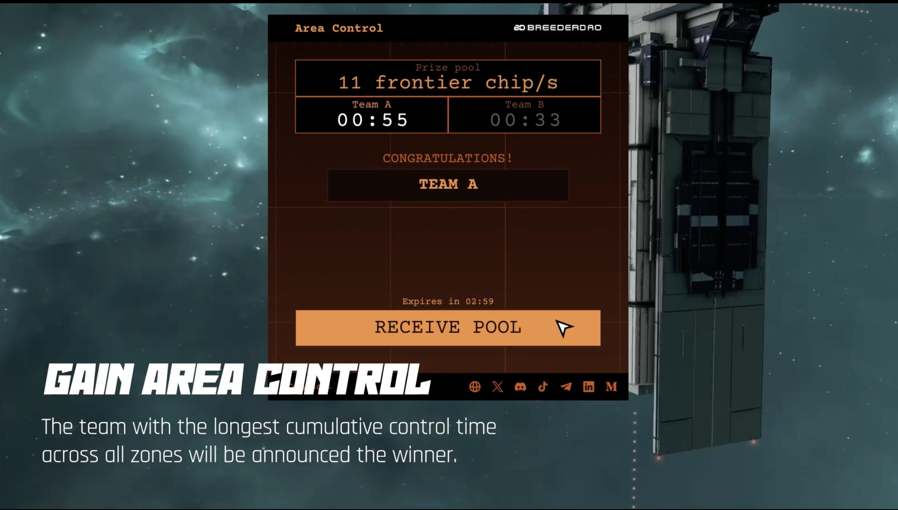

### Notes

> 34

---

## Slide 35

- 星门网络管理工具
- 链上吉祥物
- AI 生成任务的概念验证
- 提供便捷部署与管理一个或多个星门网络的能力（个人或部落/组织使用）。支持轻松配置、修改规则、网络管理与监管、使用统计、基于规则的访问控制等。
- 为部落提供内容工具，让他们能为成员创造更多内容与参与感——例如：一种“链上吉祥物”系统，玩家通过在游戏内提供实用服务/功能来获得吉祥物。
- 类似市场系统，用“任务 + 奖励”的方式鼓励玩家去做特定行为，例如收集材料、清理野化无人机（feral drones）等。
- 创始人社区共创示例
- 在Testnet的live coding和各类hackathon已经产出了不少令人惊叹和“炸裂”的成果

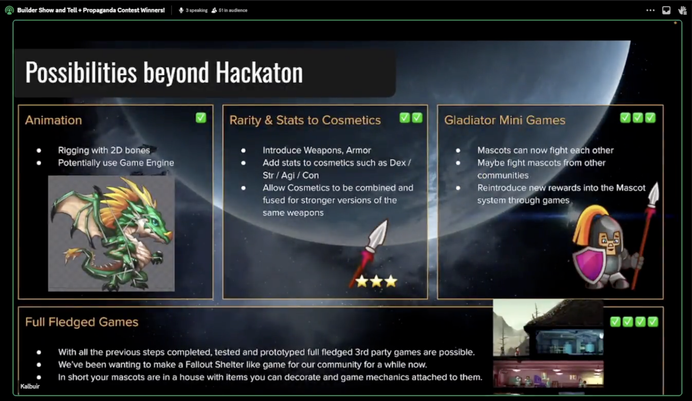
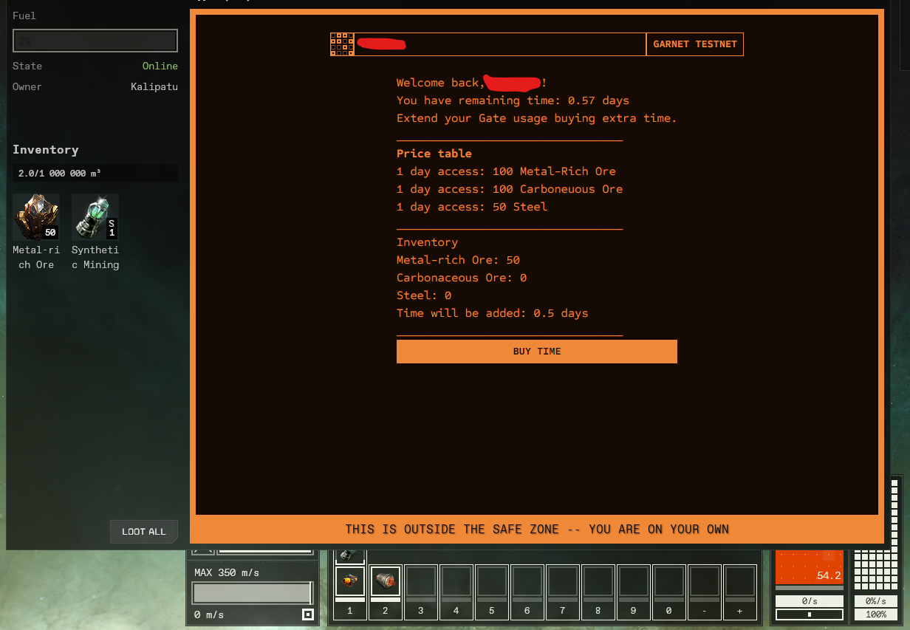
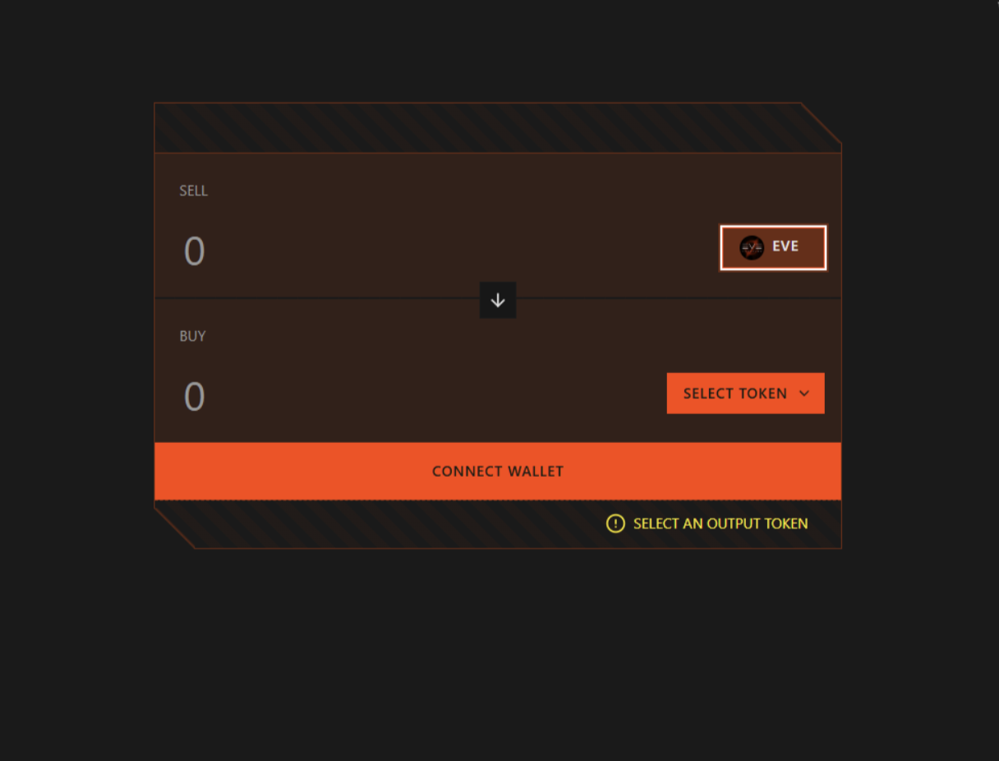

### Notes

> 35

---

## Slide 36

- jotunn.lol

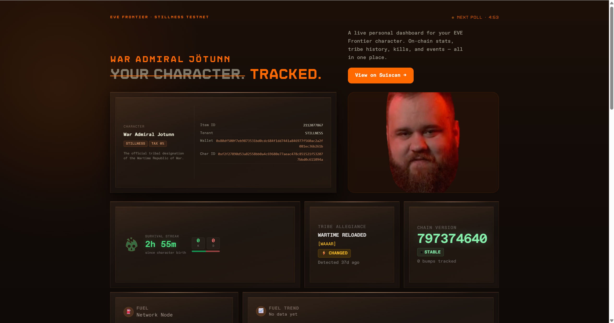

### Notes

> 36

---

## Slide 37

- Flappy Bird in Frontier

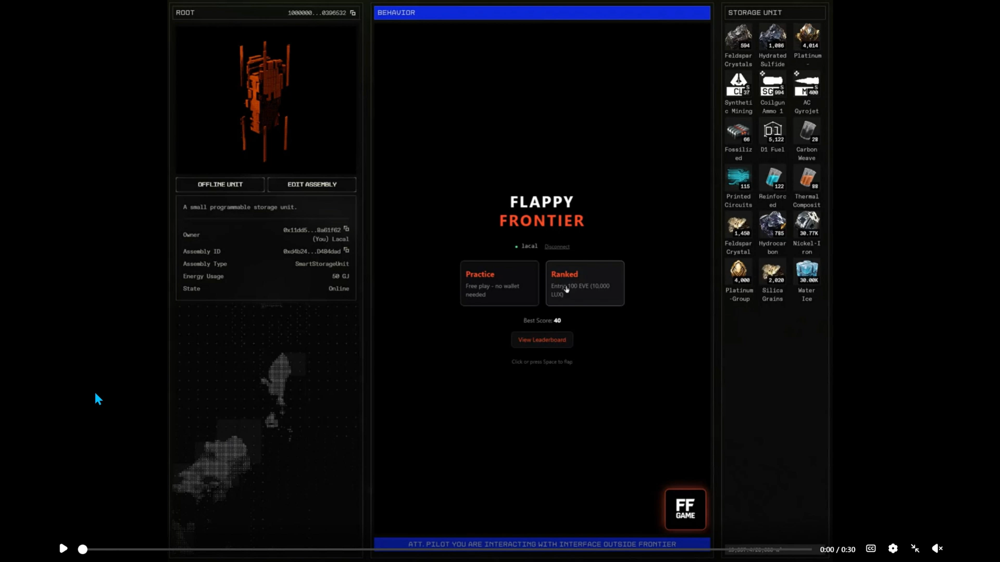

### Notes

> 37

---

## Slide 38

- 我们能为FRONTIER做的——从内容出发

### Notes

> 38

---

## Slide 39

- 一类特殊的游戏内基础设施：它们是可编程、由玩家建造的结构，锚定在 EVE Frontier 宇宙中的特定地点。每个装配体都可以承担一种独特的机制性用途，并向 Builder 提供可配置的接口，让他们能够在默认玩法功能之外进行更深度的创新与扩展。
- 智能装配体

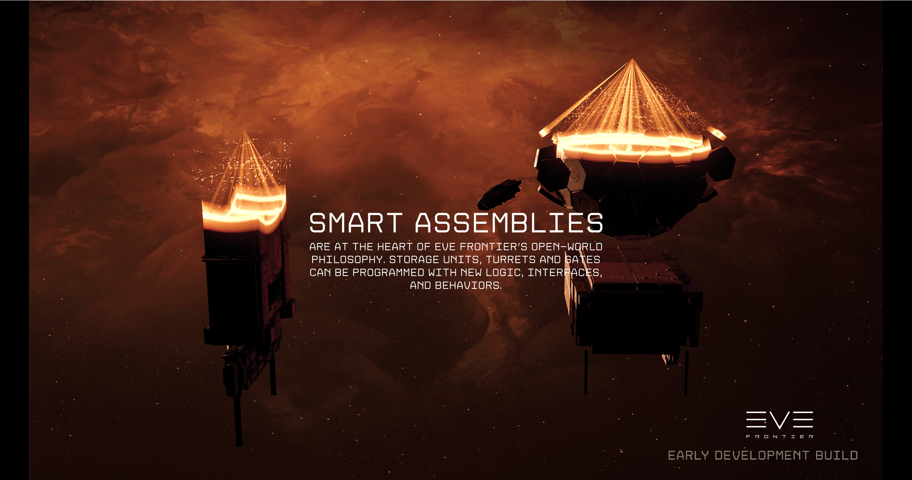
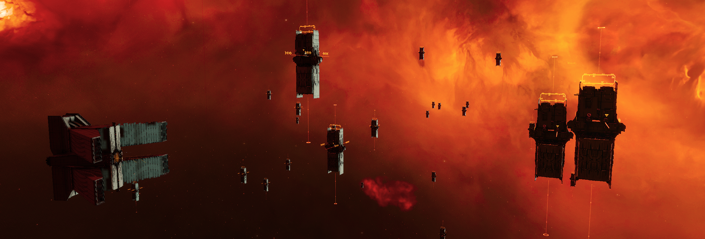
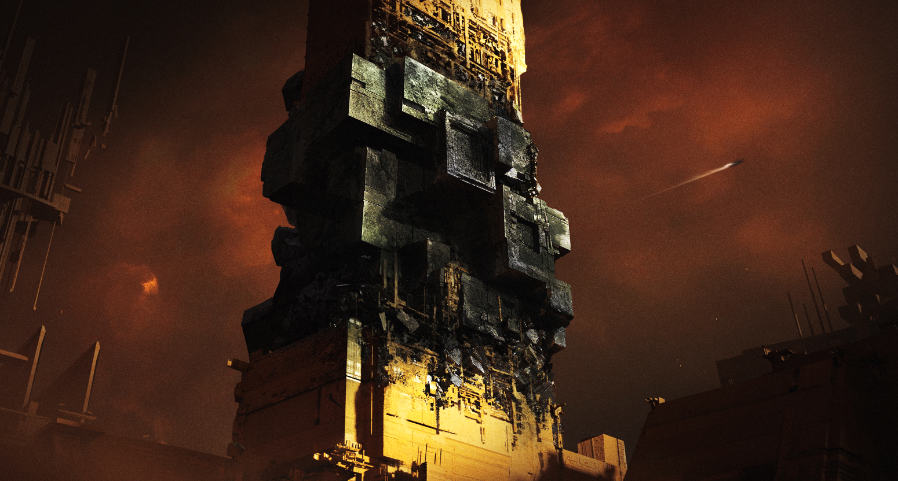

### Notes

> 39

---

## Slide 40

- 物品存取的自定义规则
- 例：自动售货机，交易中心。
- 智能存储单元：分发物品

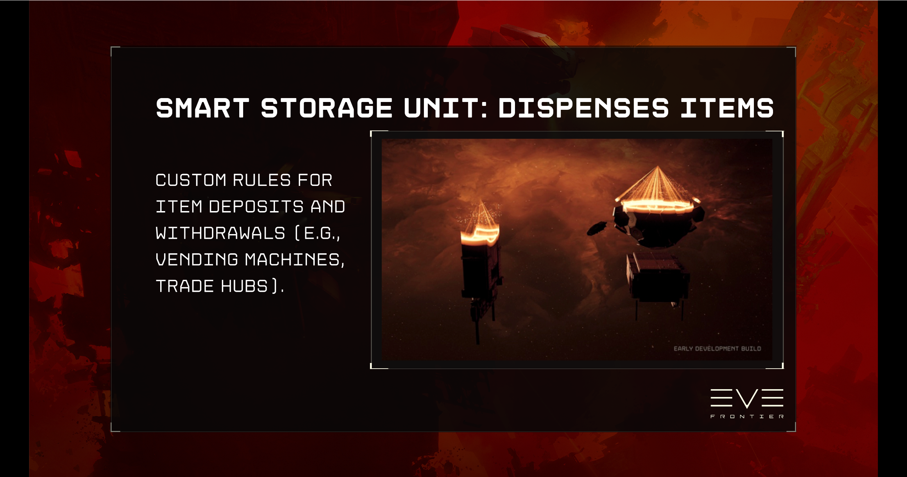

### Notes

> 40

---

## Slide 41

- 自定义目标逻辑
- 智能炮塔: 自动化防御


### Notes

> 41

---

## Slide 42

- 星际旅行的规则自定义
- 例：收费站，访问列表
- 智能星门：交通控制


### Notes

> 42

---

## Slide 43

- 我们能为FRONTIER做的——从标准出发

### Notes

> 43

---

## Slide 44

- There are overall prizes for first, second and third place, as well as x5 category champions to be crowned.
- 1st Place 2nd Place 3rd Place
- $15k USD $7.5k USD $5k USD
- EVE Fanfest passes and travel packages Ascended Founder Access Ascended Founder Access
- Ascended Founder Access Primal Tribe Pack Primal Tribe Pack
- Primal Tribe Pack EVE Points EVE Points
- EVE Points $5k USD worth of Sui Tokens $2.5k USD worth of Sui Tokens
- $10k USD worth of Sui tokens x5 tickets to Sui Basecamp 2026 x3 Tickets to Sui Basecamp 2026
- x5 tickets to Sui Basecamp 2026
- Category Winners
- $5k USD
- Ascended Founder Access
- Primal Tribe Pack
- EVE Points
- $1k USD worth of Sui tokens
- x2 tickets to Sui Basecamp 2026
- Utility
- Mods that materially change how players survive, coordinate, explore, or compete.
- Technical implementation
- Clean architecture, smart use of Frontier systems, scalability, and robustness.
- Creative
- Novel ideas, clever reinterpretations, and bold system concepts that feel uniquely Frontier.
- Weirdest idea
- Visually striking, surprising, or meme-worthy creations that push the Frontier in strange directions.
- Live frontier integration
- Mods that are deployed and functioning in Stillness, interacting with the live world and real players.
- PRIZING
- Hackathon – March 2026

---

## Slide 45

- 实质性改变玩家生存、协调、探索或竞争方式的模组。
- 实用性


### Notes

> 45

---

## Slide 46

- 技术实现力
- 简洁架构、Frontier系统的巧妙使用、可扩展性和鲁棒性。


### Notes

> 46

---

## Slide 47

- 创新性
- 新颖的想法、巧妙的重新诠释以及大胆的系统概念，且贴合Frontier的特色。


### Notes

> 47

---

## Slide 48

- 奇葩点子
- 视觉冲击力强、令人惊讶或具有梗价值的创作，把Frontier推往奇怪的方向。


### Notes

> 48

---

## Slide 49

- Frontier线上整合
- 在Stillness（在线服务器）部署且运行的模组，与线上环境真实交互


### Notes

> 49

---

## Slide 50


### Notes

> 50

---

## 为什么 Sui 适合 Frontier

- 对象优先，而不是账户优先
- 并行执行，克服性能瓶颈
- 可预期的费用支撑稳定的交互循环
- 用 Move 与所有权模型驾驭不安全的复杂性
- 面向 Builder 自建系统的基础设施
- Sui 提供了恰到好处的基础设施与能力，使其成为 Frontier 非常契合的技术底座。
- Powered by

---

## 对象优先，而不是账户优先

- 对象中心模型 vs. 账户中心模型
- Sui 不是围绕简单账户构建，而是围绕对象构建。这带来了：
- 更直接的所有权模型，与 Frontier 的世界结构天然契合
- 借助 Move，可以构建表达能力更强的智能合约
- 账户中心模型更容易在交易执行中形成瓶颈
- 借助 Sui 以对象为中心的架构，为 EVE Frontier 实现更好的扩展性、性能与可组合能力
- Powered by


### Notes

> 52

---

## 并行执行

- 面向高活跃世界的并行执行能力
- 相互独立的对象可以并行更新
- 这使大量玩家能够同时与世界交互，而不容易形成系统瓶颈
- 借助 Sui 以对象为中心的架构，为 EVE Frontier 实现更好的扩展性、性能与可组合能力
- Powered by


### Notes

> 53

---

## Move Language

- 具备强类型安全的 Move 语言
- 让复杂游戏逻辑的构建更容易，同时降低实现风险
- 清晰的所有权与权限模型
- 有助于落实 Digital Physics 规则，并确保只有正确的行为主体才能修改游戏状态
- Move Contract 在链上执行逻辑
- 支持构建交易所、自动化工厂以及其他基础设施系统
- 借助 Sui 以对象为中心的架构，为 EVE Frontier 实现更好的扩展性、性能与可组合能力


### Notes

> 54

---

## Strong Partnership

- 可预期的低交易成本
- 这样的费用模型让高频交互真正具备可行性
- 玩家可以更新状态、移动物品，或与 Smart Assemblies 交互，而不会承担过高成本
- 用户接入与上手
- zkLogin 让 Web2 到 Web3 的接入过程更加顺滑，例如使用邮箱和密码登录后即可获得钱包；这是 Sui 原生支持的能力
- 与 Mysten Labs 的深度合作
- 我们与 Sui 背后的团队 Mysten Labs 保持紧密合作
- 这让我们在构建 Frontier 的过程中，能够获得直接协作、技术支持，以及更稳固的合作伙伴关系
- 借助 Sui 以对象为中心的架构，为 EVE Frontier 实现更好的扩展性、性能与可组合能力
- Powered by

### Notes

> 55

---

## What Builders Can Change

- Writing to the world: Move contracts / Smart Assemblies
- Reading the world: GraphQL / gRPC
- Player-facing tooling: In-game custom dApp
- Accessing in-game data: World API
- Sandbox access to Utopia
- Frontier 的 modding 工具链


---

## Move Contracts and Smart Assemblies

- Move Contract 负责定义逻辑
- Builder 可以使用 Move 编写自定义链上逻辑
- Smart Assemblies 将逻辑连接到游戏世界
- Smart Assemblies 是 Frontier 中最核心的扩展点之一
- 它让自定义规则和行为能够真正成为世界交互的一部分
- 这也是 Builder 从静态对象走向可编程系统的关键路径
- 写入能力不只是发起交易，更是在改变这个世界的运行方式
- Powered by


### Notes

> 57

---

## Read Access: GraphQL and gRPC

- Builder 不仅需要写入能力，也需要理解游戏世界当前所处的状态
- GraphQL 和 gRPC 提供了对对象、事件、所有权、assemblies 以及系统状态的访问能力
- 这使前端、仪表盘、自动化、分析系统以及各类工具成为可能
- 查询接口不仅是部署逻辑的补充，更是构建可用系统的基础
- 如果说写入能力改变了世界，那么查询能力让这个世界变得可观察
- Powered by


### Notes

> 58

---

## World API：访问游戏内数据

- 它提供的是参考数据与世界层级的数据，例如：
- types： 物品的名称、图标及其他信息
- universe： 星座（Constellation）与恒星系（Solar Systems）
- 以及其他游戏世界数据
- 这使得构建依赖世界数据的界面、辅助工具与工作流变得更加容易。
- Stillness: https://world-api-stillness.live.tech.evefrontier.com/docs/index.html
- Utopia: https://world-api-utopia.uat.pub.evefrontier.com/docs/index.html
- 如果说 GraphQL 和 gRPC 暴露的是链上状态，那么 World API 暴露的则是围绕其上的 Web2 世界数据层


### Notes

> 59

---

## Sandbox Access: Utopia

- 一个安全的构建环境 —— Utopia
- Builder 需要一个可控环境来测试合约、工作流以及各种集成
- Sandbox access 是从 onboarding 进入真实开发流程的重要一环
- 如何进入 Utopia
- 右键点击 Eve Launcher 的快捷方式，并打开属性
- 在 Shortcut 页签的 Target 项最后，添加 --frontier-test-servers=Utopia
- Slash commands
- /moveme - 显示一个恒星系列表，你可以立即移动到其中任意位置
- /giveitem <itemid> <quantity> - 将指定物品生成到当前舰船的货舱中
- /giveitem "<item name>" <quantity> - 与上面功能相同，但可以直接使用物品名称，而不是 ItemID
- 一套成熟的 Builder 工作流，不仅取决于工具本身，也取决于这些工具能否在安全的环境中被验证
- Powered by

### Notes

> 60

---

## Builder Scaffold 与 Builder 工作流

- 目标不只是跑通一个 demo，而是建立一套可重复的 Builder 工作流
- Powered by


---

## 什么是 builder-scaffold?

- https://github.com/evefrontier/builder-scaffold
- builder-scaffold 是 Builder 上手的起点
- 它提供了一个面向 Frontier 开发的结构化仓库
- 其中包含起步代码、脚本、示例以及常见集成模式
- 它降低了环境搭建与接入成本，并缩短了从想法到原型的路径
- 它不只是一个示例仓库，而是进入 Builder 工作流的起点。


### Notes

> 62

---

## Tutorial Part 1: Localnet Setup

- 第一步，是先把 localnet 开发环境跑起来
- 核心工具包括：
- Docker 方向: Docker
- Host 方向: Sui CLI and Node.js
- 目标是在继续往下之前，先在本地构造一个测试世界和发布一个最小合约
- localnet 是最合适的起点，因为它能降低搭建成本，并支持快速迭代
- The goal here is not depth — it is readiness.


### Notes

> 63

---

## Tutorial Part 2: Creating a Smart Contract

- 以 move-contracts/smart_gate_extension 为例
- 这一步，Builder 开始从环境搭建进入世界逻辑本身
- 关键在于编写自定义的 Move 合约逻辑
- Builder 在这里定义规则、条件、权限以及状态转换
- This is the first real step from tooling into authorship.


### Notes

> 64

---

## Tutorial Part 3: Connecting a Live dApp

- 最后一步，是把 Smart Assemblies 逻辑连接到一个真正可用的交互界面上
- 这一部分会介绍一个围绕以下能力构建的 dApp：
- EVE Vault
- evefrontier/dapp-kit
- GraphQL queries
- World API queries
- 目标不只是展示数据，而是建立一个可用的交互闭环
- 这也是 Builder 逻辑真正走向玩家侧、走向可操作体验的阶段
- 只有当逻辑连接到界面，系统才真正可用


### Notes

> 65

---

## Tutorial Part 3: Connecting a Live dApp

- 只有当逻辑连接到界面，系统才真正可用
- 查询角色信息
- 查询 Network Node 下属建筑
- 查询 Storage 仓库内部道具信息


### Notes

> 66

---

## 从教程走向完整的 Builder 工作流

- The tutorials are useful individually, but they matter most when they work as one system.
- 这三部分教程并不是彼此割裂的练习
- 它们共同构成了一条完整的 Builder 路径：
- 搭建 Sui 开发环境
- 用 Move Contract 实现自定义世界逻辑
- 将其连接到可用的 dApp
- 这正是 builder-scaffold 的真正目的
- Powered by


### Notes

> 67

---

## Slide 68

- Happy Hacking
- JOIN Discord first, next FORK the scaffold, then start HACKING
- Discord - 第一站，最重要的交流渠道
- 在这里提问、分享进展、寻找示例，与其他 Builder 建立联系
- https://discord.gg/evefrontier
- Official Docs
- https://docs.evefrontier.com/
- https://sui-docs.evefrontier.com/
- GitHub Repositories
- https://github.com/evefrontier/builder-documentation
- https://github.com/evefrontier/builder-scaffold
- https://github.com/evefrontier/world-contracts
- Powered by


---
