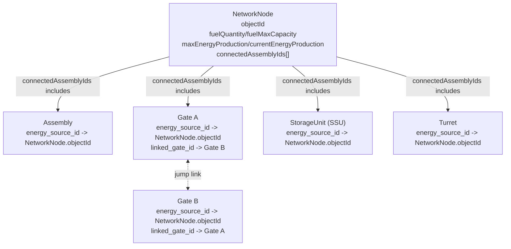

# 🐸 Fuel Frog Panic — Product Requirements Document

**版本**：v2.7.1
**最后更新**：2026-03-31  
**产品性质**：EVE Frontier 链上竞技任务平台（Hackathon Demo）  
**核心链**：Sui  
**核心合约模块**：`world::fuel`（`FuelEvent(DEPOSITED)`）

---

## 目录

1. [产品概述](#1-产品概述)
2. [背景与问题定义](#2-背景与问题定义)
3. [目标用户](#3-目标用户)
4. [核心功能模块](#4-核心功能模块)
   - 4.0 [登录流程](#40-登录流程)
   - 4.1 [创建 & 发布比赛](#41-创建--发布比赛)（含赞助费机制、付费模式）
   - 4.2 [创建战队](#42-创建战队)
   - 4.3 [发现 & 参加比赛](#43-发现--参加比赛)（含入场费机制）
   - 4.4 [启动比赛](#44-启动比赛)（含计分系统、链上归因逻辑）
   - 4.5 [自动分账](#45-自动分账)（含平台抽成、奖池分配）
5. [技术架构要点](#5-技术架构要点)
6. [扩展功能（Roadmap）](#6-扩展功能roadmap)
7. [关键数据对比表](#7-关键数据对比表)
8. [链上 / 链下边界](#8-链上--链下边界on-chain-vs-off-chain)  

---

## 0. EVE Frontier 链上合约模块说明

**Package ID**: `0xd12a70c74c1e759445d6f209b01d43d860e97fcf2ef72ccbbd00afd828043f75`
**Package Alias**: `world`

EVE Frontier 的核心游戏逻辑由 19 个 Move 合约模块组成，本平台主要与以下模块交互：

### 0.1 核心基础设施模块（本平台直接使用）

| 模块 | 全名 | 核心作用 | 本平台使用场景 |
|------|------|---------|--------------|
| **`network_node`** | `world::network_node` | 🎯 **主要数据源**<br>管理所有网络节点（SSU、星门、炮塔）的燃料容器和能量系统 | **定时轮询**：获取站点油量（`fuel_quantity`、`fuel_max_capacity`）计算 `fill_ratio`，触发自动比赛生成 |
| **`fuel`** | `world::fuel` | 🎯 **唯一计分依据**<br>燃料加油/消耗/燃烧逻辑，发射 `FuelEvent(DEPOSITED)` | **实时监听**：订阅 `FuelEvent` 事件流，通过三重过滤归因玩家加油动作并计算得分 |
| **`location`** | `world::location` | 位置坐标管理（哈希存储 + 可选公开） | **地图展示**：从 `LocationRegistry` 读取已公开的站点坐标 (x, y, z, solarsystem)，渲染星系热力图 |
| **`status`** | `world::status` | 设施在线/离线状态管理 | **过滤逻辑**：仅展示在线（online）的站点，离线站点不进入比赛候选池 |

### 0.2 其他基础设施模块（EVE Frontier 游戏侧）

| 模块 | 全名 | 核心作用 |
|------|------|---------|
| **`gate`** | `world::gate` | 星门管理：玩家跳跃通道、双向连接、jump permit 验证 |
| **`storage_unit`** | `world::storage_unit` | 智能存储单元（SSU）：存储容量、访问权限控制 |
| **`turret`** | `world::turret` | 防御炮塔：目标锁定、自动/手动射击、能量消耗 |
| **`energy`** | `world::energy` | 能量生产与分配：`EnergySource` 对象管理，燃料燃烧转换能量 |

### 0.3 访问控制与安全模块

| 模块 | 全名 | 核心作用 |
|------|------|---------|
| **`access`** | `world::access` | 权限管理三层体系：`GovernorCap`（最高权限）、`AdminACL`（服务器授权）、`OwnerCap`（对象级所有权） |
| **`sig_verify`** | `world::sig_verify` | 链下签名验证：服务器签名校验、位置证明验证 |

### 0.4 游戏对象与记录模块

| 模块 | 全名 | 核心作用 |
|------|------|---------|
| **`character`** | `world::character` | 玩家角色 NFT：tenant ID、character address、OwnerCap 绑定 |
| **`inventory`** | `world::inventory` | 物品库存系统：物品列表、数量、类型 ID 管理 |
| **`assembly`** | `world::assembly` | 通用设施（Assembly）基础逻辑：连接 `NetworkNode`、能量消耗、在线/离线切换 |
| **`killmail`** | `world::killmail` | 击杀记录系统（PvP 战损报告）：attacker、victim、timestamp、loot 明细 |
| **`killmail_registry`** | `world::killmail_registry` | 击杀记录注册表：全局击杀事件索引 |
| **`metadata`** | `world::metadata` | 设施元数据管理：名称、描述、图标 URL |

### 0.5 注册表与工具模块

| 模块 | 全名 | 核心作用 |
|------|------|---------|
| **`object_registry`** | `world::object_registry` | 全局对象注册表：所有链上对象 ID 的中心索引，用于 `derived_object` 确定性派生 |
| **`in_game_id`** | `world::in_game_id` | 游戏内 ID 映射：`TenantItemId` 结构体（game_item_id + tenant）↔ 链上对象 ID |
| **`extension_freeze`** | `world::extension_freeze` | 扩展冻结机制：防止恶意扩展绕过原有逻辑（freeze_extension / unfreeze_extension） |
| **`world`** | `world::world` | World 合约根模块：`GovernorCap` 最高权限发行、包级别初始化 |

---

### 0.6 关键数据结构说明

#### `NetworkNode` 对象（`world::network_node::NetworkNode`）

**平台核心依赖对象**，所有站点（SSU、Gate、Turret）的燃料与能量容器：

```move
public struct NetworkNode has key {
    id: UID,                          // 链上唯一对象 ID
    key: TenantItemId,                // 游戏内 ID（item_id + tenant）
    owner_cap_id: ID,                 // 关联的 OwnerCap<NetworkNode> ID
    type_id: u64,                     // 站点类型 ID（SSU/Gate/Turret）
    status: AssemblyStatus,           // 在线/离线状态
    location: Location,               // 位置哈希（sha256）
    fuel: Fuel,                       // ⭐ 燃料数据（quantity、max_capacity、is_burning）
    energy_source: EnergySource,      // 能量生产配置
    metadata: Option<Metadata>,       // 可选元数据（名称、描述、URL）
    connected_assembly_ids: vector<ID>, // 连接的设施列表（Gate/Turret/SSU）
}
```

**关键字段**：
- `fuel.quantity` — 当前油量（平台核心指标）
- `fuel.max_capacity` — 最大容量
- `fuel.is_burning` — 是否正在消耗燃料
- `status.is_online` — 是否在线（离线站点不参与比赛）

#### `NetworkNode` API 字段字典（前后端统一）

以下字段用于 `/api/network-nodes` 与比赛匹配逻辑的统一解释，避免前端、后端和运营口径不一致：

| 字段 | 含义 |
|---|---|
| `id` | 节点记录唯一标识（通常与 `objectId` 一致）。 |
| `objectId` | Sui 链上对象 ID（`NetworkNode` Shared Object）。 |
| `name` | 节点展示名。 |
| `typeId` | 节点类型 ID（对应 SSU / Gate / Turret 等类型映射）。 |
| `ownerAddress` | 对象所有者地址；`shared` 表示共享对象，不归属单一钱包。 |
| `ownerCapId` | 关联 `OwnerCap<NetworkNode>` 的对象 ID（权限关联标识）。 |
| `isPublic` | 该节点是否公开可见/可被公开读取坐标。 |
| `coordX` | 节点 X 坐标。 |
| `coordY` | 节点 Y 坐标。 |
| `coordZ` | 节点 Z 坐标。 |
| `solarSystem` | 所在星系 ID。 |
| `fuelQuantity` | 当前燃料存量。 |
| `fuelMaxCapacity` | 燃料最大容量。 |
| `fuelTypeId` | 当前燃料类型 ID；`null` 表示尚未指定燃料类型。 |
| `fuelBurnRate` | 燃料消耗速率参数（单位以合约定义为准，用于推导燃烧节奏）。 |
| `isBurning` | 当前是否处于燃料燃烧中。 |
| `fillRatio` | 燃料填充率，计算口径：`fuelQuantity / fuelMaxCapacity`。 |
| `urgency` | 紧急等级（如 `critical` / `warning` / `safe`），用于比赛筛选与权重展示。 |
| `maxEnergyProduction` | 最大能量产出能力。 |
| `currentEnergyProduction` | 当前实际能量产出。 |
| `isOnline` | 节点是否在线；离线节点默认不进入比赛候选池。 |
| `connectedAssemblyIds` | 与该节点连接的设施对象 ID 列表（NetworkNode -> Assembly/Gate/StorageUnit/Turret）。 |
| `description` | 节点描述信息；`null` 表示无描述。 |
| `imageUrl` | 节点图像 URL；`null` 表示未配置。 |
| `lastUpdatedOnChain` | 最近一次链上同步口径时间（UTC，当前实现为索引器同步时间戳，后续可替换为链上版本/事件时间）。 |
| `updatedAt` | 平台侧记录更新时间（用于接口响应与缓存同步）。 |
| `activeMatchId` | 当前关联的活跃比赛 ID；`null` 表示当前无进行中比赛。 |

#### `NetworkNode` 关系模型（EVE Frontier 语义）

`NetworkNode` 在 EVE Frontier 中承担“燃料容器 + 能源中枢”角色。当前关系模型是**节点挂载设施**，而不是“节点连节点”：

```text
NetworkNode (fuel + energy_source)
  └─ connectedAssemblyIds: [assembly_id...]
      ├─ Assembly
      ├─ Gate
      ├─ StorageUnit (SSU)
      └─ Turret
```

- 主关系：
  - `NetworkNode.connected_assembly_ids` 保存所有已连接设施 ID。
  - 各设施通过 `energy_source_id` 反向指向供能 `NetworkNode`。
- 关系约束：
  - 连接动作由 `network_node::connect_assemblies` / `connect_assembly` 建立。
  - 断开动作由 `network_node::disconnect_assembly` 处理。
  - `NetworkNode` 下线、卸载（unanchor）时，需要先处理所有已连接设施（合约用 hot potato 结构强制同交易收敛）。
- 特殊关系：
  - `Gate.linked_gate_id` 是星门到星门的跳跃连接关系，独立于 `NetworkNode` 供能关系。

#### 设施对象关系图（按 `/api/network-nodes` 字段口径）



- 运营/产品解读：
  - `connectedAssemblyIds` 代表“这个 NetworkNode 当前给哪些设施供能/挂载”，不是节点对节点拓扑。
  - `Gate.linked_gate_id` 才是跨星门跳跃路径关系（Gate 与 Gate 之间）。
  - 前端星图里可将“供能关系”和“跳跃关系”分别渲染为两种线型，避免语义混淆。

#### `/api/network-nodes` 字段在 EVE Frontier 中的语义分层

为避免把“链上原生事实”和“平台推导状态”混淆，`/api/network-nodes` 字段按三层解释：

| 分层 | 字段 | 在游戏中的意义 |
|---|---|---|
| **链上原生字段** | `objectId`, `typeId`, `ownerCapId`, `fuelQuantity`, `fuelMaxCapacity`, `fuelTypeId`, `fuelBurnRate`, `isBurning`, `maxEnergyProduction`, `currentEnergyProduction`, `isOnline`, `connectedAssemblyIds` | 描述这个站点在链上的真实运行状态：归属、油量、燃烧状态、供能能力、在线状态和挂载设施关系。 |
| **链上事件映射字段** | `coordX`, `coordY`, `coordZ`, `solarSystem` | 优先来自 `LocationRevealedEvent` 的公开坐标；若 `NetworkNode` 自身未公开位置，平台可回退使用其 `connectedAssemblyIds` 对应设施的公开位置，决定节点在星图中的位置与所属星系。 |
| **平台计算字段** | `fillRatio`, `urgency` | `fillRatio = fuelQuantity / fuelMaxCapacity`；`urgency` 由填充率阈值映射，用于比赛筛选与权重展示。 |
| **平台业务字段** | `activeMatchId` | 节点当前是否被平台比赛系统占用；用于大厅联动和状态展示，不属于链上原生字段。 |
| **索引同步字段** | `lastUpdatedOnChain`, `updatedAt` | 标记索引结果的时效性，帮助前端与运营判断数据新鲜度。 |

---

#### `FuelEvent` 事件（`world::fuel::FuelEvent`）

**平台唯一计分数据源**，玩家每次加油触发：

```move
public struct FuelEvent has copy, drop {
    assembly_id: ID,          // ⭐ 被加油的 NetworkNode ID
    assembly_key: TenantItemId,
    type_id: u64,             // 燃料类型 ID
    old_quantity: u64,        // ⭐ 加油前油量
    new_quantity: u64,        // ⭐ 加油后油量
    is_burning: bool,
    action: Action,           // ⭐ DEPOSITED(加油) / WITHDRAWN(抽取) / BURNING_STARTED / BURNING_STOPPED
}
```

**计分逻辑**：
```typescript
const fuelAdded = event.parsedJson.new_quantity - event.parsedJson.old_quantity;
const fuelTypeId = event.parsedJson.type_id;
const fuelGradeBonus = getFuelGradeBonus(fuelTypeId);  // 1.0x / 1.25x / 1.5x
const score = fuelAdded × urgency_weight(node_fill_ratio) × panic_multiplier × fuelGradeBonus;
```

> **燃料品级加成**：通过 `type_id` 查询 `FuelConfig.fuel_efficiency`，映射为品级加成系数（详见 0.8 章节）。

---

### 0.7 平台技术集成架构

```
平台后端
├─ Worker: Node Scanner (每 5 秒)
│   └─ sui.queryEvents({ type: NetworkNodeCreatedEvent })   ← 发现新站点
│   └─ sui.multiGetObjects({ ids: [...node_ids] })          ← 批量读取 fuel.quantity
│   └─ 计算 fill_ratio → 触发自动比赛生成（< 20% 红色警戒）
│
├─ Worker: Fuel Event Listener (实时)
│   └─ sui.subscribeEvent({ type: FuelEvent })              ← 监听加油事件
│   └─ 三重过滤（白名单 + 站点校验 + 时间窗口）
│   └─ 计算得分 → WebSocket 推送至游戏内浮窗
│
└─ API: GET /api/network-nodes
    └─ 从缓存读取 fill_ratio → 前端地图渲染
```

---

### 0.8 燃料品级体系（Fuel Grade System）

EVE Frontier 游戏内燃料种类繁多，类似现实中汽油有 #92、#95、#98 等不同标号。本平台利用链上 `FuelConfig.fuel_efficiency` 配置，将燃料划分为三个品级，并在计分时给予差异化加成，增加策略深度。

#### 0.8.1 品级划分规则

**数据来源**：`world::fuel::FuelConfig.fuel_efficiency` 表

```move
public struct FuelConfig has key {
    id: UID,
    fuel_efficiency: Table<u64, u64>,  // fuel_type_id → efficiency (10-100)
}
```

**品级映射逻辑**：

| 品级 | 名称 | 效率区间 | 计分加成 | 视觉标识 |
|------|------|----------|----------|----------|
| **Tier 1** | 标准燃料 (Standard) | 10% – 40% | **1.0x** | ⚪ 白色 |
| **Tier 2** | 高效燃料 (Premium) | 41% – 70% | **1.25x** | 🟡 金色 |
| **Tier 3** | 精炼燃料 (Refined) | 71% – 100% | **1.5x** | 🟣 紫色 |

> **设计理念**：高品级燃料在游戏中更稀缺、获取成本更高，给予计分加成是对玩家额外付出的奖励，同时鼓励团队在比赛前做好资源储备。

#### 0.8.2 品级获取方式（后端实现）

```typescript
// 从 FuelConfig 获取燃料效率
async function getFuelEfficiency(fuelTypeId: number): Promise<number> {
  const fuelConfig = await suiClient.getObject({ id: FUEL_CONFIG_ID });
  return fuelConfig.fuel_efficiency[fuelTypeId] ?? 0;
}

// 根据效率映射品级
function getFuelGrade(efficiency: number): { tier: 1 | 2 | 3; bonus: number; label: string } {
  if (efficiency >= 71) return { tier: 3, bonus: 1.5, label: 'Refined' };
  if (efficiency >= 41) return { tier: 2, bonus: 1.25, label: 'Premium' };
  return { tier: 1, bonus: 1.0, label: 'Standard' };
}
```

#### 0.8.3 品级缓存策略

| 数据 | 缓存位置 | 刷新频率 | 说明 |
|------|----------|----------|------|
| `FuelConfig.fuel_efficiency` | 后端内存 | 每 5 分钟 | 燃料效率配置变化极少 |
| `fuel_type_id → grade` 映射表 | 后端内存 | 随 FuelConfig 刷新 | 预计算避免实时查表 |

#### 0.8.4 边界情况处理

| 场景 | 处理方式 |
|------|----------|
| `fuel_type_id` 不在 FuelConfig 中 | 默认视为 Tier 1（1.0x），记录告警日志 |
| `efficiency = 0` | 视为无效燃料，不计分，记录异常 |
| FuelConfig 读取失败 | 降级为全部 1.0x，保证比赛不中断 |

---

## 1. 产品概述

**Fuel Frog Panic** 是构建于 EVE Frontier 之上的一个**链上竞技任务平台**。  
它将游戏内最枯燥的后勤动作——"送燃料（Fuel）"——改造成一场**10 分钟限时竞速赛**，通过：

- 实时链上计分
- LUX 奖池激励
- 游戏内浮窗（In-game Overlay）反馈
- 多角色协作分工

让"送油"从无名的义务劳动变成有成就感、有即时收益的竞技体验。

---

## 2. 背景与问题定义

### 2.1 为什么"燃料"是游戏核心？

在 EVE Frontier 中，**燃料（Fuel）是文明的血液**，所有基础设施都依赖其运转：

| 设施 | 断油后果 |
|---|---|
| **星门 (Gates)** | 无法在星系间跳跃，玩家被困死在当前星区 |
| **智能存储单元 (SSU)** | 无法处理任何交易、制造或合约执行 |
| **防御炮塔 (Turrets)** | 持续烧油，断电后家门口毫无防范 |

站点油量由 **`fill_ratio`（填充率）** 表示，三级告警如下：

- 🔴 **红色（< 20%）**：极度危险，随时停机
- 🟡 **黄色（< 50%）**：一般警告
- 🟢 **绿色（> 50%）**：安全运行

### 2.2 "送油"的供应链结构

送油不是一个人能完成的，涉及完整的工业流水线：

| 角色 | 职责 | 痛点 |
|---|---|---|
| **采集 (Collector)** | 寻找燃料气云/矿石 → 开采 → 装舱 | 枯燥等待、易被偷袭 |
| **运输 (Hauler)** | 装载燃料 → 规划航线 → 规避风险区 → 对接站点 | 飞船笨重、跳跃繁复、无战斗爽感 |
| **护航 (Escort)** | 扫描威胁 → 保护运输船 | 大量时间"发呆"，若无敌人则毫无感知 |

### 2.3 核心痛点总结

| 维度 | 现状 |
|---|---|
| **反馈缺失** | 完成后链上只跳出一个小数字，没有成就感 |
| **利益分配模糊** | 后勤玩家是"无名英雄"，难以实时看到劳动换算的收益 |
| **协作脱节** | 队长喊"快去送油"，但队员不知道哪个站最急、能拿多少奖励 |
| **高风险低回报** | 运输最后一公里被海盗击毁，所有辛苦化为乌有且无人知晓 |

---

## 3. 目标用户

| 用户角色 | 描述 | 核心诉求 |
|---|---|---|
| **站点所有者 / 联盟盟主** | 持有 SSU 或星门的玩家，担心设施停机 | 快速吸引外部玩家来救急，防止防线崩溃 |
| **竞技型玩家 / 战队队长** | 追求竞技乐趣与 LUX 收益 | 找到合适的对手/站点，用技术和协作赢走奖池 |
| **新手 / 普通联盟成员** | 想参与却不知道干什么、干完没有反馈 | 清晰的任务目标、即时的成就感、可见的收益 |

---

## 4. 核心功能模块

---

### 4.0 登录流程

#### 4.0.1 功能说明

平台的一切功能（查看比赛、组队、付费、链上计分）都以**已连接钱包的用户身份**为前提。

**核心能力**：
- 连接 EVE Frontier 内置钱包
- 读取钱包地址与 LUX 余额
- 管理钱包会话生命周期

**功能权限矩阵**：

| 功能 | 未连接 | 已连接 |
|---|---|---|
| 浏览比赛列表 | ✅ | ✅ |
| 创建比赛 | ❌ | ✅ |
| 创建/加入战队 | ❌ | ✅ |
| 支付入场费 | ❌ | ✅ |
| 链上计分归因 | ❌ | ✅ |
| 领取奖励 | ❌ | ✅ |

---

#### 4.0.2 技术支持

**依赖组件**：

| 组件 | 说明 |
|---|---|
| Sui dApp Kit | 钱包连接标准实现 |
| EVE Frontier Wallet | 游戏内置钱包 |
| authStore | 钱包状态管理（Zustand） |
| authService | 钱包连接业务逻辑 |

**API 接口**：

```typescript
// 钱包连接
walletService.connectWallet(): Promise<{ address: string; balance: number }>

// 余额查询
walletService.getBalance(address: string): Promise<number>

// 断开连接
walletService.disconnectWallet(): Promise<void>
```

---

#### 4.0.3 用户操作漏斗

```
① 访问平台
   ↓
② 检测钱包连接状态
   ├─ 已连接 → 直接进入比赛大厅
   └─ 未连接 → 展示连接引导
        ↓
③ 点击 [Connect Wallet]
        ↓
④ EVE Frontier 钱包弹窗授权
        ↓
⑤ 授权成功 → 读取地址与余额 → 进入比赛大厅
```

---

#### 4.0.4 UI 设计

**连接引导页**：

```
┌─────────────────────────────────────────────────────────────────┐
│                                                                 │
│                    🐸 FUEL FROG PANIC                           │
│                                                                 │
│              ─────────────────────────────────                  │
│                                                                 │
│                  请连接钱包以继续                                │
│                                                                 │
│              ┌─────────────────────────┐                        │
│              │   🔗 Connect Wallet     │                        │
│              └─────────────────────────┘                        │
│                                                                 │
│              支持 EVE Frontier 内置钱包                          │
│                                                                 │
└─────────────────────────────────────────────────────────────────┘
```

**钱包状态栏（页面右上角常驻）**：

```
┌──────────────────────────────────────┐
│  0x1a2b...cd3e  │  1,2500 LUX  │ EXIT │
└──────────────────────────────────────┘
```

| 字段 | 说明 |
|---|---|
| 钱包地址 | 前 6 位 + `...` + 后 4 位 |
| LUX 余额 | 实时显示，余额不足时标红 |
| EXIT | 断开钱包连接 |

---

### 4.1 创建 & 发布比赛

#### 4.1.1 功能说明

玩家可创建加油比赛，邀请其他玩家参与竞技。平台支持两种比赛模式：

| 模式 | 目标范围 | 适用场景 |
|---|---|---|
| **自由模式** | 指定星系内的**任意节点** | 探索型玩法，团队分头行动 |
| **精准模式** | 指定星系内的**特定节点**（1-5 个） | 定向救援，集中火力 |

**当前阶段范围澄清**：

- **P0（当前 Demo 基线）**：比赛目标仅限 `NetworkNode`，即站点/基础设施加油竞赛。
- **P1（扩展玩法）**：若 EVE Frontier 后续提供**可验证的舰船级加油事件或舰船燃料状态查询**，新增独立的「舰船补给赛 / Ship Refuel Match」。
- **模式边界**：舰船是移动目标，发现、归因、反作弊和计分口径均不同，**不直接并入**现有自由模式 / 精准模式的节点计分规则。

---

##### Mode 1：自由模式（Free Mode）

**核心机制**：
- 创建者选择一个**目标星系（Solar System）**
- 参赛玩家只能在该星系内寻找供能节点（Network Node）进行加油
- **不指定具体节点**：星系内任意在线节点都可作为加油目标
- 玩家需自行探索星系，寻找高价值节点

**创建参数**：

| 参数 | 说明 | 可选值 |
|---|---|---|
| `solar_system_id` | **必须指定**目标星系 | 任意有效星系 ID |
| `sponsorship_fee` | **必须支付**赞助费 | ≥ 50 LUX（无上限） |
| `max_teams` | 参赛队伍数上限 | 2 ~ 16 支 |
| `team_size` | **每队固定人数**；该比赛下所有战队必须一致 | 3 ~ 8 人 |
| `entry_fee` | 入场费 / 人 | 0 ~ 1000 LUX |
| `duration_hours` | 比赛时长 | 1 ~ 72 小时 |

**适用场景**：
- 星系探索赛（"谁能在这个星系找到最多高价值节点"）
- 日常竞技、团队协作
- 长时间持久战（最长 72 小时）

---

##### Mode 2：精准模式（Precision Mode）

**核心机制**：
- 创建者选择一个**目标星系（Solar System）**
- 前端展示该星系内所有供能节点的**地图视图**
- 创建者从地图中**手动选择目标节点**（1-5 个）
- **只有给指定节点加油才能得分**，其他节点不计分

**创建参数**：

| 参数 | 说明 | 可选值 |
|---|---|---|
| `solar_system_id` | **必须指定**目标星系 | 任意有效星系 ID |
| `target_nodes` | **必须指定**目标节点 | 1 ~ 5 个节点 ID |
| `sponsorship_fee` | **必须支付**赞助费 | ≥ 50 LUX（无上限） |
| `max_teams` | 参赛队伍数上限 | 2 ~ 16 支 |
| `team_size` | **每队固定人数**；该比赛下所有战队必须一致 | 3 ~ 8 人 |
| `entry_fee` | 入场费 / 人 | 0 ~ 1000 LUX |
| `duration_hours` | 比赛时长 | 1 ~ 72 小时 |

**适用场景**：
- 定向救援（"这几个站快没油了，集中火力"）
- 战术竞技（指定关键节点，考验团队执行力）
- 公会任务（盟主指定需要补给的站点）

---

##### 星系选择规则

**地图层级结构**（EVE Frontier）：

```
星座 (Constellation)    2213 个    ← 有官方 API
  └─ 星系 (System)      每个星座若干个
       └─ 节点 (NetworkNode)
```

**星系可选性判断**：

创建比赛时，只有满足以下条件的星系才可被选择：

| 条件 | 说明 |
|---|---|
| 有在线节点 | 该星系至少有 1 个 `isOnline = true` 的节点 |
| 有公开坐标 | 该星系至少有 1 个 `isPublic = true` 的节点 |

**判断公式**：
```
星系可选 = 该星系至少有 1 个节点满足 (isOnline = true AND isPublic = true)
```

**不可选星系的处理**：

| 状态 | 展示方式 | 说明 |
|---|---|---|
| 无节点 | 灰显 + "无节点" 标签 | 该星系内没有任何 NetworkNode |
| 节点全离线 | 灰显 + "节点离线" 标签 | 有节点但全部 `isOnline = false` |
| 无公开坐标 | 灰显 + "坐标未公开" 标签 | 节点存在但 `isPublic = false` |

**特殊情况**：
- 同一星系允许同时存在多个比赛（因为一个星系可能有很多节点）
- 精准模式下，若选定节点在比赛期间离线，仍计分但 UI 标记"离线风险"

---

##### 星系选择交互设计

**核心原则**：搜索优先 + 智能推荐 + 星座浏览辅助

**搜索结果展示策略**：

- 保留所有匹配到的星系，不因 `no_nodes / offline_only / not_public` 而直接隐藏。
- 搜索框聚焦且为空时，不展示空白；应优先展示一组 `Ready Systems` 候选，默认来自有可用 `NetworkNode` 的 `selectable` 星系。
- 用户输入关键词后，结果按两组展示：
  - `Ready Systems`：可直接选择
  - `Unavailable Systems`：保留展示但禁用选择
- 用户输入关键词后，先按文本命中，再按可选性与节点情况排序。
- 文本命中同时支持：
  - 当前 world API 返回的系统名
  - canonical / legacy 系统名（如 `Jita`）
  - `systemId`
- 不可选星系仍需保留，但必须下沉展示并标注原因，避免用户误以为搜索结果缺失。
- `Unavailable Systems` 必须明确标注原因：`No Nodes` / `Offline Only` / `Not Public`。

**交互入口优先级**：

| 优先级 | 入口 | 说明 |
|---|---|---|
| 1 | 搜索框 | 支持星系名、星座名模糊匹配 |
| 2 | 推荐列表 | 展示有紧急节点的星系（按紧急度排序） |
| 3 | 星座浏览 | 2213 个星座，按需展开查看下属星系 |

**星座列表排序策略**：

| 排序优先级 | 逻辑 |
|---|---|
| 1 | 有紧急节点（🔴 < 20%）的星座优先 |
| 2 | 有警告节点（🟡 < 50%）的星座次之 |
| 3 | 按可选星系数量降序 |
| 4 | 字母排序兜底 |

**筛选器**：

| 筛选项 | 选项 |
|---|---|
| 状态 | 有紧急节点 / 有警告节点 / 仅安全节点 / 显示不可选 |
| 首字母 | A-E / F-J / K-O / P-T / U-Z |

**系统搜索排序策略**：

| 排序优先级 | 逻辑 |
|---|---|
| 1 | `selectable` 星系优先（至少有 1 个 `isOnline && isPublic` 节点） |
| 2 | `nodeCount` 更多的星系优先 |
| 3 | 有 `critical / warning` 节点的星系优先 |
| 4 | `offline_only / not_public / no_nodes` 下沉显示 |
| 5 | 字母排序兜底 |

---

##### 赞助费机制（创建比赛必须）

**创建比赛的玩家必须支付一笔赞助费**，这是创建比赛的前置条件：

| 参数 | 说明 |
|---|---|
| **最低赞助费** | **50 LUX**（测试阶段降低门槛，方便快速验证流程） |
| **最高赞助费** | **无上限**（大额赞助吸引更多参赛者） |
| **用途** | 赞助费 100% 进入奖池，不收取手续费 |
| **退款规则** | 比赛未满足开赛条件且取消时，可全额退还 |

**设计理由**：
- **过滤低质量比赛**：赞助费门槛确保创建者有一定投入，避免随意创建空比赛
- **保底奖池**：即使入场费为 0，赞助费也能保证比赛有基础奖励
- **激励机制**：创建者可通过高额赞助吸引更多优质玩家参赛

**赞助费 + 入场费组合场景**：

| 场景 | 赞助费 | 入场费 | 奖池构成 | 适用情况 |
|---|---|---|---|---|
| 基础竞技 | 50 LUX | 0 | 50 LUX（纯赞助） | 入门级比赛 / 测试 |
| 标准付费赛 | 50 LUX | 100 LUX/人 | 赞助费 + `maxTeams × teamSize × entryFee` 的潜在入场费上限 | 常规竞技 |
| 高奖金邀请赛 | 1000+ LUX | 200 LUX/人 | 高额赞助 + 固定编制人头费 | 高水平对决 |
| 站主紧急救援 | 2000+ LUX | 0 | 纯赞助 | 站点危急、急需救援 |

---

##### 奖池规则（两种模式通用）

| 入场费设置 | 奖池来源 | 说明 |
|---|---|---|
| 入场费 > 0 | 赞助费 + 所有队伍入场费总和 | 赞助费保底 + 参赛者贡献 |
| 入场费 = 0 | 纯赞助费（≥50 LUX） | 免费参赛模式，赞助费预先锁定到合约 |

**编制规则（新增基线）**：
- 比赛创建时必须定义 `teamSize`（每队固定人数）。
- 同一场比赛下，所有战队都必须遵守这个固定编制；不允许某支队伍 3 人、另一支队伍 5 人。
- `entryFee` 继续按**每名玩家**报价，但由于 `teamSize` 固定，比赛创建完成时即可确定**单队总报名费**：`teamEntryFee = entryFee × teamSize`。
- 若后续需要“大小队混战”玩法，应作为独立模式，不与当前标准比赛共享同一收费规则。

---

##### 两种模式对比

| 维度 | 自由模式 | 精准模式 |
|---|---|---|
| 目标范围 | 指定星系内**任意节点** | 指定星系内**特定节点** |
| 节点选择 | 无需选择 | 创建时从地图手动选择（1-5 个） |
| 计分范围 | 星系内所有节点 | 仅目标节点 |
| 团队策略 | 分头探索 | 集中火力 |
| 创建复杂度 | 简单 | 中等 |

---

#### 4.1.2 技术支持

**依赖组件**：

| 组件 | 说明 |
|---|---|
| solarSystemRuntime | 星系数据查询与缓存 |
| nodeRuntime | 节点数据查询 |
| matchRuntime | 比赛创建与管理 |
| matchStore | 比赛状态管理（Zustand） |

**API 接口**：

```typescript
// ========== 星座与星系选择 ==========

// 星座列表（带聚合统计，支持筛选排序）
GET /api/constellations?
  hasUrgentNodes=true&         // 筛选有紧急节点的星座
  sortBy=urgency|systems|name& // 排序：紧急度 | 星系数 | 名称
  limit=50&offset=0            // 分页

// 星座详情（含下属星系列表）
GET /api/constellations/{constellationId}
Response: {
  id: string,
  name: string,
  systemCount: number,
  urgentNodeCount: number,
  systems: Array<{
    id: string,
    name: string,
    nodeCount: number,
    urgentNodeCount: number,
    warningNodeCount: number,
    isSelectable: boolean,      // 是否可选
    unselectableReason?: string // 不可选原因
  }>
}

// 统一搜索（星座 + 星系）
GET /api/search?
  q=keyword&                   // 关键词（≥2 字符）
  type=all|constellation|system

// 推荐星系（有紧急节点，按紧急度排序）
GET /api/solar-systems/recommendations?
  limit=10

// Create Match 搜索框 focus 空态候选
// 默认展示 Ready Systems，不要求用户先输入关键词
GET /api/solar-systems/recommendations?
  limit=8

// ========== 星系与节点 ==========

// 获取星系详情（含节点列表）
GET /api/solar-systems/{systemId}

// 获取星系内节点
GET /api/network-nodes?solarSystem={systemId}

// ========== 比赛创建 ==========

// 创建比赛
POST /api/matches
Body: {
  mode: "free" | "precision",
  solarSystemId: string,
  targetNodes?: string[],      // 精准模式必填
  sponsorshipFee: number,      // 必填，≥50 LUX
  maxTeams: number,
  teamSize: number,            // 必填，3-8；同局所有战队固定人数
  entryFee: number,
  durationHours: number
}

// 发布比赛（创建者确认）
POST /api/matches/{matchId}/publish
```

测试阶段说明：

- 创建比赛时要求主办方先完成一笔真实 sponsorship payment。
- 当前阶段允许使用 `EVE test token` 代替正式 `LUX` 完成这笔支付。
- 这笔 sponsorship payment 通过 `fuel_frog_panic` escrow 合约锁入链上对象，而不是转给普通地址。
- 战队报名费 `pay-team` 也必须进入同一个 `MatchEscrow` 链上托管对象，不允许再转给普通地址收款钱包。
- 只有当链上交易 digest 被后端验证通过，且交易中包含 `MatchPublished` 事件后，比赛才允许从 `draft` 进入 `lobby`。

**Sui Testnet 上 `NetworkNode` 数据获取原理**：

平台并不是“按星系直接从链上查一张节点表”，而是通过 **事件发现 + 对象回填 + 本地投影** 三段式流程拿到 `NetworkNode` 数据：

1. **发现节点对象**
   - 服务端先对 `EVE Frontier Package` 查询 `MoveEventType(world::network_node::NetworkNodeCreatedEvent)`。
   - 这个事件提供 `network_node_id`，用于发现当前链上有哪些 `NetworkNode` 对象需要追踪。

2. **获取公开位置**
   - 服务端再查询 `MoveEventType(world::location::LocationRevealedEvent)`。
   - 该事件提供 `assembly_id + solarsystem + x + y + z`，用于建立“对象 ID -> 星系 / 坐标”的映射。
   - 若 `NetworkNode` 自身没有公开位置，平台可回退使用其 `connectedAssemblyIds` 对应设施的公开位置，回填 `solarSystem` 与坐标。

3. **批量回填对象状态**
   - 拿到 `network_node_id` 后，服务端使用 Sui RPC `multiGetObjects` 批量读取对象内容。
   - 读取字段包括：
     - 燃料数据：`fuel.quantity`、`fuel.max_capacity`、`is_burning`
     - 状态数据：`status`、`type_id`
     - 元数据：`name`、`description`、`url`
     - 连接关系：`connected_assembly_ids`

4. **生成平台读模型**
   - 服务端将“事件里的位置数据”与“对象里的实时状态数据”合并，生成本地 `node-index` 快照与 `network_nodes` 读模型。
   - 星系搜索还会额外读取 `data/solar-systems.json` 中的 canonical / legacy 系统名，作为别名索引，解决 live world API 名称编码化后旧名无法命中的问题。
   - 对外再通过：
     - `GET /api/search` 提供星系搜索结果
     - `GET /api/solar-systems/{systemId}` 提供星系详情
     - `GET /api/network-nodes?solarSystem={systemId}` 提供按星系过滤后的节点列表

5. **Create Match 为什么会出现 `0 nodes`**
   - 创建比赛时，前端实际读取的是按 `solarSystem` 过滤后的 `network_nodes` 读模型。
   - 因此，只要某个 `NetworkNode` 还没有被成功映射到具体 `solarSystem`，它就不会出现在该星系的 create-match 节点列表里。
   - 所以 `0 nodes` 既可能意味着该星系本来就没有公开节点，也可能意味着链上公开位置事件覆盖不足。

---

#### 4.1.3 用户操作漏斗

**自由模式创建流程**：
```
① 点击 [创建比赛]
        ↓
② 选择「自由模式」
        ↓
③ 设置赞助费、队伍数、入场费、比赛时长
        ↓
③.5 设置固定战队人数（teamSize）
        ↓
④ 选择目标星系（focus 时先显示 `Ready Systems`；搜索结果中不可选星系下沉并显示原因）
        ↓
⑤ 确认创建 → 钱包签名（支付赞助费并锁定）
        ↓
⑥ 比赛发布成功 → 等待其他玩家加入
```

**精准模式创建流程**：
```
① 点击 [创建比赛]
        ↓
② 选择「精准模式」
        ↓
③ 设置赞助费、队伍数、入场费、比赛时长
        ↓
③.5 设置固定战队人数（teamSize）
        ↓
④ 选择目标星系 → 加载星系节点地图
        ↓
⑤ 在地图上点选目标节点（1-5 个）
        ↓
⑥ 确认创建 → 钱包签名（支付赞助费并锁定）
        ↓
⑦ 比赛发布成功 → 等待其他玩家加入
```

---

#### 4.1.4 UI 设计

**星系选择器**（两种模式通用组件）：

```
┌─────────────────────────────────────────────────────────────────┐
│  选择目标星系                                            [×]     │
│  ───────────────────────────────────────────────────────────────│
│                                                                 │
│  🔍 [搜索星系或星座名称...                              ]       │
│                                                                 │
│  ─────────────────────────────────────────────────────────────  │
│  🔥 推荐星系（有紧急节点）                          [查看更多]  │
│  ┌──────────────────────────────────────────────────────────┐  │
│  │ 🔴 Jita           │ Kimotoro 星座 │ 3 紧急 / 12 节点     │  │
│  │ 🔴 OFC-3FN        │ Kimotoro 星座 │ 2 紧急 / 5 节点      │  │
│  │ 🟡 Amarr          │ Throne 星座   │ 1 警告 / 8 节点      │  │
│  └──────────────────────────────────────────────────────────┘  │
│                                                                 │
│  ─────────────────────────────────────────────────────────────  │
│  📂 按星座浏览                       [状态 ▼] [首字母 ▼]        │
│  ┌──────────────────────────────────────────────────────────┐  │
│  │ ▶ Kimotoro (20000004)      │ 15 星系 │ 5 有紧急  [展开] │  │
│  │ ▶ Throne Worlds (20000005) │ 12 星系 │ 2 有紧急  [展开] │  │
│  │ ▶ Sanctum (20000006)       │ 8 星系  │ 0 有紧急  [展开] │  │
│  │ ... 显示更多 (共 2213 个星座)                            │  │
│  └──────────────────────────────────────────────────────────┘  │
└─────────────────────────────────────────────────────────────────┘
```

**搜索结果展示**（输入 "kim" 后）：

```
┌─────────────────────────────────────────────────────────────────┐
│  🔍 [kim                                                ]       │
│                                                                 │
│  ── 星座匹配 (1) ──────────────────────────────────────────────│
│  │ 📁 Kimotoro (20000004)     │ 15 星系 │ 5 有紧急   [展开] │  │
│                                                                 │
│  ── 星系匹配 (3) ──────────────────────────────────────────────│
│  │ 🔴 Kimotoro Prime     │ Kimotoro 星座 │ 2 紧急    [选择] │  │
│  │ 🟢 Kimura             │ Sanctum 星座  │ 0 紧急    [选择] │  │
│  │ ⚫ Kimachi            │ Oberon 星座   │ [不可选-无节点]  │  │
└─────────────────────────────────────────────────────────────────┘
```

**展开星座后**：

```
│  ▼ Kimotoro (20000004)                      15 星系 │ 5 有紧急  │
│    ┌────────────────────────────────────────────────────────┐  │
│    │ 🔴 Jita (30000142)        │ 12 节点 │ 3 紧急   [选择]  │  │
│    │ 🔴 OFC-3FN (30000006)     │ 5 节点  │ 2 紧急   [选择]  │  │
│    │ 🟢 Perimeter (30000143)   │ 8 节点  │ 0 紧急   [选择]  │  │
│    │ 🟢 New Caldari (30000144) │ 3 节点  │ 0 紧急   [选择]  │  │
│    │ ⚫ Muvolailen (30000145)  │ 0 节点  │ [不可选-无节点]  │  │
│    └────────────────────────────────────────────────────────┘  │
```

**星系状态图例**：

| 图标 | 状态 | 说明 |
|---|---|---|
| 🔴 | 紧急 | 有节点 `fill_ratio < 20%` |
| 🟡 | 警告 | 有节点 `20% ≤ fill_ratio < 50%` |
| 🟢 | 安全 | 所有节点 `fill_ratio ≥ 50%` |
| ⚫ | 不可选 | 无节点 / 全离线 / 坐标未公开 |

---

**自由模式创建界面**：

```
┌─────────────────────────────────────────────────────────────────┐
│  创建比赛 - 自由模式                                    [×]      │
│  ───────────────────────────────────────────────────────────────│
│                                                                 │
│  📍 目标星系:  [点击选择星系...]                    [打开选择器] │
│                                                                 │
│  ✅ 已选星系: Jita (30000142)                                   │
│     Kimotoro 星座 │ 12 节点 │ 🔴 3 紧急 🟡 2 警告              │
│                                                                 │
│  ───────────────────────────────────────────────────────────────│
│  比赛参数:                                                      │
│                                                                 │
│  赞助费:        [50 LUX     ]  (最低 50 LUX)                     │
│  参赛队伍上限:  [4 支 ▼]                                        │
│  入场费:        [100 LUX ▼]    □ 免费参赛                       │
│  比赛时长:      [2 小时 ▼]                                      │
│                                                                 │
│  ───────────────────────────────────────────────────────────────│
│  奖池预览:                                                      │
│  • 赞助费: 50 LUX                                               │
│  • 固定编制: 3 人 / 队                                           │
│  • 入场费收入: 4队 × 3人 × 100 LUX = 1,200 LUX（预估）          │
│  • 预计总奖池: 1,250 LUX                                        │
│                                                                 │
│                                        [取消]  [创建比赛]       │
└─────────────────────────────────────────────────────────────────┘
```

**精准模式创建界面**：

```
┌─────────────────────────────────────────────────────────────────┐
│  创建比赛 - 精准模式                                    [×]      │
│  ───────────────────────────────────────────────────────────────│
│                                                                 │
│  📍 目标星系:  [点击选择星系...]                    [打开选择器] │
│  ✅ 已选: Jita (30000142) │ Kimotoro 星座 │ 12 节点            │
│                                                                 │
│  ┌─ 星系节点地图 ────────────────────────────────────────────┐   │
│  │                                                          │   │
│  │     ○ SSU-Alpha (52%)                                    │   │
│  │           ●                                              │   │
│  │                    ○ Gate-Beta (18%) 🔴                  │   │
│  │        ○ SSU-Gamma (35%)    ●                            │   │
│  │              ●                                           │   │
│  │                         ○ Turret-Delta (8%) 🔴           │   │
│  │                                                          │   │
│  │     ● = 已选择    ○ = 可选择                              │   │
│  │     🔴 = 紧急(<20%)  🟡 = 警告(<50%)  🟢 = 安全          │   │
│  └──────────────────────────────────────────────────────────┘   │
│                                                                 │
│  已选节点 (3/5):                                               │
│  ┌──────────────────────────────────────────────────────────┐   │
│  │ 🔴 Gate-Beta    │ 油量 18% │ 权重 x1.5 │ [移除]          │   │
│  │ 🟡 SSU-Gamma    │ 油量 35% │ 权重 x1.2 │ [移除]          │   │
│  │ 🔴 Turret-Delta │ 油量 8%  │ 权重 x3.0 │ [移除]          │   │
│  └──────────────────────────────────────────────────────────┘   │
│                                                                 │
│  ───────────────────────────────────────────────────────────────│
│  赞助费: [50 LUX   ] (最低50)                                   │
│  参赛队伍: [4 支 ▼]    编制: [3 人/队 ▼]    入场费: [100 LUX ▼] │
│  时长: [2 小时 ▼]                                               │
│                                                                 │
│  预计奖池: 赞助费 50 + 入场费 1,200 = 1,250 LUX                  │
│                                        [取消]  [创建比赛]       │
└─────────────────────────────────────────────────────────────────┘
```

**节点状态颜色说明**（紧急度权重）：

| 颜色 | 条件 | 计分权重 |
|---|---|---|
| 🔴 红色 | `fill_ratio` < 20% | 3.0x |
| 🟡 黄色 | 20% ≤ `fill_ratio` < 50% | 1.5x |
| 🟢 绿色 | `fill_ratio` ≥ 50% | 1.0x |

**燃料品级标识说明**（品级加成）：

| 图标 | 品级 | 效率区间 | 计分加成 |
|---|---|---|---|
| ⚪ 白色 | Tier 1 标准燃料 | 10% – 40% | 1.0x |
| 🟡 金色 | Tier 2 高效燃料 | 41% – 70% | 1.25x |
| 🟣 紫色 | Tier 3 精炼燃料 | 71% – 100% | 1.5x |

> 紧急度权重与燃料品级加成**相乘**计算最终得分，详见 4.4 章节计分系统。

---

### 4.2 创建战队

#### 4.2.1 功能说明

玩家可以先在 `/planning` 创建独立战队，不需要先绑定比赛。  
`/planning` 页面现在承担三件事：

- 显示当前已有多少个战队
- 展示全部已创建战队及其成员/空槽状态
- 支持创建新战队或直接加入已有战队

后续当玩家决定参加某场比赛时，再进入具体报名链路处理战队绑定、入队审批、锁队和付费。

**核心能力**：
- 查看当前战队总数
- 浏览全部独立战队列表
- 创建新战队（成为队长）
- 申请加入已有独立战队，由队长审批
- 队长可同意/拒绝待审批申请
- 普通成员可退出独立战队
- 队长可解散独立战队
- 设置队伍人数上限与角色槽位
- 记录队长钱包与创建时间，供后续报名阶段复用
- 提供独立 `/team` 战队档案页，查看当前编制与历史参赛记录

**角色说明**：

| 角色 | 核心职责 | 对队伍的价值 |
|---|---|---|
| **采集 (Collector)** | 寻找燃料气云并开采 | 决定燃料总供给上限 |
| **运输 (Hauler)** | 把燃料运到目标节点 | 直接触发 `deposit_fuel()`，贡献得分 |
| **护航 (Escort)** | 扫描威胁，保护运输船 | 防止运输船被击毁 |

**队伍参数**：

| 参数 | 可选范围 | 说明 |
|---|---|---|
| 队伍人数上限 | 3-8 人 | 3 人为最小运转单位 |
| 角色槽位分配 | 自由分配 | 可设置多个同角色槽位 |

---

#### 4.2.2 技术支持

**依赖组件**：

| 组件 | 说明 |
|---|---|
| planningTeamRuntime | 独立战队注册与总数统计 |
| planningTeamStore | `/planning` 页面状态管理（Zustand） |
| planningTeamService | `/planning` 页面业务逻辑 |
| teamRuntime | 后续比赛报名阶段的战队绑定、审批、锁队与支付 |

**API 接口**：

```typescript
// 获取独立战队注册表
GET /api/planning-teams
Response: {
  items: PlanningTeam[],
  totalTeams: number
}

// 创建独立战队
POST /api/planning-teams
Body: {
  name: string,
  maxMembers: number,
  roleSlots: { collector: number, hauler: number, escort: number }
}
Response: {
  team: PlanningTeam,
  totalTeams: number
}

// 加入独立战队
POST /api/planning-teams/{teamId}/join
Body: {
  role: "collector" | "hauler" | "escort"
}
Response: {
  application: PlanningTeamApplication,
  team: PlanningTeam,
  totalTeams: number
}

// 队长审批独立战队申请
POST /api/planning-teams/{teamId}/applications/{applicationId}/approve
Response: {
  team: PlanningTeam,
  totalTeams: number
}

// 队长拒绝独立战队申请
POST /api/planning-teams/{teamId}/applications/{applicationId}/reject
Response: {
  team: PlanningTeam,
  totalTeams: number
}

// 成员退出独立战队
POST /api/planning-teams/{teamId}/leave
Response: {
  team: PlanningTeam | null,
  totalTeams: number
}

// 队长解散独立战队
POST /api/planning-teams/{teamId}/disband
Response: {
  team: PlanningTeam,
  totalTeams: number
}
```

后续比赛报名阶段仍沿用 `POST /api/teams`、`/join`、`/approve`、`/reject`、`/lock`、`/pay` 这一组 match-specific 接口，但这些不再是 `/planning` 首屏职责。

---

#### 4.2.3 用户操作漏斗

**创建战队流程**：
```
① 进入 `/planning`
        ↓
② 查看当前战队总数
        ↓
③ 点击 [创建战队]
        ↓
④ 设置战队名称、人数上限、角色槽位
        ↓
⑤ 战队创建成功 → 总数即时 +1
        ↓
⑥ 后续在比赛报名阶段再把战队绑定到具体比赛
```

**加入独立战队流程**：
```
① 进入 `/planning`
        ↓
② 浏览全部已创建战队
        ↓
③ 查看各队成员数、空槽和角色需求
        ↓
④ 选择角色并点击 [申请加入]
        ↓
⑤ 申请进入 pending，等待队长审批
        ↓
⑥ 队长同意后，当前钱包写入该独立战队成员列表
        ↓
⑦ 后续在比赛报名阶段再把这支战队绑定到具体比赛
```

**成员退出 / 队长解散流程**：
```
① 普通成员进入 `/planning`
        ↓
② 点击 [退出战队]
        ↓
③ 当前钱包从该独立战队成员列表移除

① 队长进入 `/planning`
        ↓
② 点击 [解散战队]
        ↓
③ 整支独立战队从注册表移除
```

`/planning` 首屏不再展示比赛快照、match-specific 审批、锁队和支付操作，但需要直接显示独立战队列表与加入入口。

**查看战队档案流程**：
```
① 连接钱包并进入平台任意主界面
        ↓
② 点击顶部导航 [SQUAD DOSSIER]
        ↓
③ 系统读取当前钱包所属战队、角色、队长身份和成员编制
        ↓
④ 查看该战队参加过的加油比赛列表（时间倒序）
        ↓
⑤ 从记录中快速跳回当前组队大厅或比赛主界面
```

---

#### 4.2.4 UI 设计

**独立战队创建页**：

```
┌─────────────────────────────────────────────────────────────────┐
│  TEAM REGISTRY / OPEN FORMATION                        [返回]   │
│  ───────────────────────────────────────────────────────────────│
│  当前战队总数: 12                                              │
│  ───────────────────────────────────────────────────────────────│
│                                                                 │
│  ┌─ TEAM BOARD ──────────────────────────────────────────────┐   │
│  │  Alpha Squad    [2/3]  Captain: 0x1a2b...                │   │
│  │  Slots: Collector 1/1 │ Hauler 0/1 │ Escort 1/1          │   │
│  │                                      [选择角色] [加入]    │   │
│  │  ───────────────────────────────────────────────────────  │   │
│  │  Nova Wing      [3/3]  FULL                              │   │
│  └──────────────────────────────────────────────────────────┘   │
│                                                                 │
│  ┌─ CREATE TEAM ───────────────────────────────────────────┐   │
│  │                                                          │   │
│  │  Team Name: [__________________________]                │   │
│  │  Max Members: [ 3 ]                                     │   │
│  │  Slots: Collector / Hauler / Escort                     │   │
│  │                                                          │   │
│  │                               [创建新战队]               │   │
│  └──────────────────────────────────────────────────────────┘   │
│                                                                 │
└─────────────────────────────────────────────────────────────────┘
```

**我的战队档案页**：

```
┌─────────────────────────────────────────────────────────────────┐
│  SQUAD DOSSIER // ACTIVE PILOT PROFILE                  [返回]   │
│  ───────────────────────────────────────────────────────────────│
│  钱包: 0x1a2b...cd3e                                             │
│  当前战队: Alpha Squad │ 我的角色: Hauler │ 状态: Paid          │
│  ───────────────────────────────────────────────────────────────│
│                                                                 │
│  ┌─ 当前编制 ────────────────────────────────────────────────┐   │
│  │ 队长: 0x1a2b...cd3e                                      │   │
│  │ 成员: 3/3 │ 角色槽位: Collector1 / Hauler1 / Escort1    │   │
│  │ Collector │ 0x1a2b... │ LOCKED                           │   │
│  │ Hauler    │ 0x5e6f... │ LOCKED                           │   │
│  │ Escort    │ 0x7g8h... │ LOCKED                           │   │
│  │                                      [打开组队大厅]       │   │
│  └──────────────────────────────────────────────────────────┘   │
│                                                                 │
│  ┌─ DEPLOYMENT LOG ─────────────────────────────────────────┐   │
│  │ 2026-03-28 │ Jita Precision Supply Run                   │   │
│  │ Alpha Squad │ Precision │ Rank #1 │ Personal Score 96    │   │
│  │ Reward 188 LUX │ Status Settled          [打开比赛]       │   │
│  │ ──────────────────────────────────────────────────────── │   │
│  │ 2026-03-27 │ Forge System Exploration Match              │   │
│  │ Alpha Squad │ Free Mode │ Lobby │ Current Role Hauler    │   │
│  │ Gross Pool 450 LUX                      [打开组队大厅]    │   │
│  └──────────────────────────────────────────────────────────┘   │
└─────────────────────────────────────────────────────────────────┘
```

**页面要求**：

- 默认以当前连接钱包作为查询主键，不要求用户手动输入地址。
- 顶部优先展示"当前战队编制"；若当前没有 active squad，则显示最近一次参赛战队摘要和空态提示。
- 参赛记录必须按时间倒序展示，并至少包含：比赛名、模式、战队名、比赛状态、个人角色、个人得分、战队排名、个人奖励。
- 若战队所在比赛仍处于 `lobby / prestart / running / panic / settling`，页面必须提供回到组队大厅或比赛页的快捷入口。
- 若用户尚未加入任何战队，页面仍需显示 0 值统计和明确 CTA，引导前往 Lobby / Team Lobby。

---

### 4.3 发现 & 参加比赛

#### 4.3.1 功能说明

玩家在比赛大厅（Lobby）中浏览、筛选、查看比赛详情，并选择参加感兴趣的比赛。

**核心能力**：
- 浏览所有招募中的比赛
- 按模式、距离、状态筛选比赛
- 查看比赛详情（目标星系/节点、奖池、入场费）
- 设置"我的位置"获取距离推荐
- 加入比赛的组队大厅
- 明确看到该比赛要求的固定战队人数（`teamSize`）

**任务卡片必须展示的字段**：

| 字段 | 说明 |
|---|---|
| **比赛模式标签** | 🎯 自由模式 / 🎯 精准模式 |
| **任务名称** | 由发起者设定或系统生成 |
| **目标星系** | 比赛所在星系 |
| **目标节点** | 精准模式显示具体节点数；自由模式显示"星系内任意节点" |
| **奖池** | 总奖池金额 |
| **入场费** | 每人入场费（可能为 0） |
| **编制要求** | 每队固定人数（如 `3 人/队`） |
| **战队进度** | 已报名/最大战队数 |
| **距离提示** | 基于用户位置计算（需先设置位置） |

**位置设置**：
- 用户设置"我的位置"（当前所在星系）以获得距离推荐
- 星系层级：Region（星域）→ Constellation（星座）→ System（星系）
- 距离以"跳数"计算（通过 gateLinks 拓扑）

---

#### 4.3.2 技术支持

**依赖组件**：

| 组件 | 说明 |
|---|---|
| matchRuntime | 比赛列表查询与筛选 |
| solarSystemRuntime | 星系数据与距离计算 |
| nodeRecommendationRuntime | 节点推荐算法 |
| lobbyStore | 大厅状态管理（Zustand） |

**API 接口**：

```typescript
// 比赛列表
GET /api/matches?status=lobby&mode=all&limit=20&offset=0

// 比赛详情
GET /api/matches/{matchId}

// 星系选择器
GET /api/solar-systems?limit=20&offset=0
GET /api/solar-systems/{systemId}

// 节点推荐（自由模式）
GET /api/network-nodes/recommendations?
  currentSystem={systemId}&    // 用户当前位置
  maxJumps={2}&                // 最大跳数
  urgency=critical,warning&    // 紧急度过滤
  limit=10
```

---

#### 4.3.3 用户操作漏斗

**发现比赛流程**：
```
① 进入比赛大厅（Lobby）
        ↓
② 设置"我的位置"（当前星系）
        ↓
③ 浏览比赛列表（可按模式/距离/状态筛选）
        ↓
④ 点击感兴趣的比赛 → 查看详情
        ↓
⑤ 确认参加 → 进入组队大厅
```

**参加比赛流程**：
```
① 进入比赛的组队大厅
        ↓
② 选择：创建新战队 或 加入已有战队（人数编制继承比赛 `teamSize`）
        ↓
③ 选择角色（采集/运输/护航）
        ↓
④ 等待队长锁定战队
        ↓
⑤ 队长点击 [付费参赛] → 钱包签名
        ↓
⑥ 付费成功 → 战队报名完成
```

---

#### 4.3.4 UI 设计

**比赛大厅界面**：

```
┌─────────────────────────────────────────────────────────────────┐
│  FUEL FROG PANIC // MISSION LOBBY                               │
│  ───────────────────────────────────────────────────────────────│
│                                                                 │
│  📍 我的位置: [OFC-3FN ▼]                        [设置当前星系] │
│                                                                 │
│  ┌─ 筛选 ───────────────────────────────────────────────────┐   │
│  │ 模式: [全部▼]  距离: [同星座▼]  状态: [招募中▼]          │   │
│  └──────────────────────────────────────────────────────────┘   │
│                                                                 │
│  ═══════════════════════════════════════════════════════════════│
│  🔥 活跃比赛                                                    │
│  ───────────────────────────────────────────────────────────────│
│                                                                 │
│  ┌──────────────────────────────────────────────────────────┐  │
│  │ 🎯 精准模式 │ Jita 星门紧急救援                          │  │
│  │ ─────────────────────────────────────────────────────────│  │
│  │ 星系: Jita │ 目标节点: 3 个                              │  │
│  │ 奖池: 1,200 LUX │ 入场费: 100/人 │ 2/4 队               │  │
│  │ 距离: 同星系 (0跳)                                       │  │
│  │                                             [查看详情]    │  │
│  └──────────────────────────────────────────────────────────┘  │
│                                                                 │
│  ┌──────────────────────────────────────────────────────────┐  │
│  │ 🎯 自由模式 │ Forge 星域探索赛                           │  │
│  │ ─────────────────────────────────────────────────────────│  │
│  │ 星系: Forge │ 目标: 星系内任意节点                       │  │
│  │ 奖池: 50 LUX │ 入场费: 免费 │ 3/8 队                    │  │
│  │ 距离: 1 跳                                               │  │
│  │                                             [查看详情]    │  │
│  └──────────────────────────────────────────────────────────┘  │
│                                                                 │
│                                         [创建新比赛]            │
└─────────────────────────────────────────────────────────────────┘
```

**比赛详情界面**：

```
┌─────────────────────────────────────────────────────────────────┐
│  🎯 精准模式 - Jita 星门紧急救援                        [返回]   │
│  ───────────────────────────────────────────────────────────────│
│                                                                 │
│  📊 比赛信息                                                    │
│  ┌──────────────────────────────────────────────────────────┐   │
│  │ 目标星系: Jita (30000142)                                │   │
│  │ 目标节点: 3 个                                           │   │
│  │ 奖池: 1,200 LUX                                          │   │
│  │ 入场费: 100 LUX/人                                       │   │
│  │ 比赛时长: 2 小时                                         │   │
│  │ 报名进度: 2/4 队                                         │   │
│  └──────────────────────────────────────────────────────────┘   │
│                                                                 │
│  🎯 目标节点                                                    │
│  ┌──────────────────────────────────────────────────────────┐   │
│  │ 🔴 Gate-Alpha   │ 油量 12% │ 权重 x3.0                  │   │
│  │ 🔴 SSU-Beta     │ 油量 8%  │ 权重 x3.0                  │   │
│  │ 🟡 Turret-Gamma │ 油量 35% │ 权重 x1.5                  │   │
│  └──────────────────────────────────────────────────────────┘   │
│                                                                 │
│                                        [加入组队大厅]            │
└─────────────────────────────────────────────────────────────────┘
```

**位置选择器**：

```
┌─────────────────────────────────────────────────────────────────┐
│  选择你当前所在的星系                                  [×]       │
│  ───────────────────────────────────────────────────────────────│
│  🔍 [搜索星系名称...]                                           │
│                                                                 │
│  ▼ Region: Forge (10000004)                                     │
│    ├─ ▼ Constellation: Kimotoro (20000004)                      │
│    │     ├─ OFC-3FN (30000006)    [选择]                        │
│    │     ├─ Jita (30000142)       [选择]                        │
│    │     └─ ...                                                 │
│    └─ ▶ Constellation: Citadel (20000005)                       │
│                                                                 │
│  ─────────────────────────────────────────────────────────────  │
│  💡 提示：选择你在 EVE 中的当前位置，系统会优先推荐附近的比赛     │
└─────────────────────────────────────────────────────────────────┘
```

---

### 4.4 启动比赛

#### 4.4.1 功能说明

当报名条件满足后，系统自动触发比赛启动流程。玩家在 EVE 客户端中操作，同时通过游戏内浮窗实时查看比赛状态。

**核心能力**：
- 开赛条件检测与触发
- 30 秒准备倒计时
- 游戏内浮窗实时显示
- 链上事件监听与计分
- Panic 模式（最后 90 秒）

**比赛状态机**：

```
Lobby（等待报名）
    ↓ 满员 or 最低人数倒计时归零
PreStart（30 秒准备）
    ↓ 倒计时归零
Running（比赛进行中）
    ↓ 计时结束
    ├── 正常阶段：Normal Mode（标准计分）
    └── 最后 90 秒：Panic Mode（1.5x 加成）
Settling（结算中，约 10–30 秒）
    ↓ 链上结算完成
Settled（已结算，可领奖）
```

**开赛触发条件**：

| 模式 | 触发条件 | 等待行为 |
|---|---|---|
| **满员即刻开赛** | 所有战队全员付费并锁定 | 30 秒准备倒计时 |
| **最低人数启动** | 至少 2 队已报名，但未满员 | 3 分钟公开倒计时 |

---

#### 4.4.2 技术支持

**依赖组件**：

| 组件 | 说明 |
|---|---|
| matchRuntime | 比赛状态管理与计时 |
| missionRuntime | 任务执行与事件处理 |
| chainSyncEngine | 链上事件监听与归因 |
| scoringService | 得分计算 |
| fuelMissionStore | 比赛状态存储（Zustand） |

**API 接口**：

```typescript
// 比赛状态查询
GET /api/matches/{matchId}/status

// 实时得分板
GET /api/matches/{matchId}/scoreboard

// WebSocket 订阅
WS /api/matches/{matchId}/stream
Events: score_update, phase_change, panic_mode, settlement_start

// 链上事件监听
sui.subscribeEvent({ type: "FuelEvent" })
```

---

##### 计分系统

**唯一数据源**：`world::fuel::FuelEvent(DEPOSITED)`

每次玩家执行 `deposit_fuel()` 后，合约自动发射事件，后端计算得分：

$$
\text{score} = (\text{new\_quantity} - \text{old\_quantity}) \times \text{urgency\_weight} \times \text{panic\_multiplier} \times \text{fuel\_grade\_bonus}
$$

**紧急度权重（Urgency Weight）**：

| 站点状态 | `fill_ratio` 区间 | 权重系数 |
|---|---|---|
| 🔴 **极度危险** | < 20% | **3.0x** |
| 🟡 **一般告警** | 20% – 50% | **1.5x** |
| 🟢 **安全运行** | ≥ 50% | **1.0x** |

**燃料品级加成（Fuel Grade Bonus）**：

| 品级 | 效率区间 | 加成系数 | 视觉标识 |
|---|---|---|---|
| ⚪ **标准燃料** (Tier 1) | 10% – 40% | **1.0x** | 白色图标 |
| 🟡 **高效燃料** (Tier 2) | 41% – 70% | **1.25x** | 金色图标 |
| 🟣 **精炼燃料** (Tier 3) | 71% – 100% | **1.5x** | 紫色图标 |

> **品级判定依据**：通过 `FuelEvent.type_id` 查询链上 `FuelConfig.fuel_efficiency` 表获取燃料效率值，映射到对应品级（详见 0.8 章节）。

**冲刺加成（Panic Multiplier）**：

| 阶段 | 时间段 | 得分乘数 |
|---|---|---|
| Normal Mode | 比赛开始 → 剩余 90 秒 | 1.0x |
| Panic Mode | 最后 90 秒 | **1.5x** |

**最高单次得分系数**：3.0 × 1.5 × 1.5 = **6.75x**

> 关键设计：
> - 紧急度权重以**注入时刻**的 `fill_ratio` 为准，防止"少量多次维持红色刷分"的作弊行为
> - 燃料品级以**实际注入燃料的 type_id** 为准，鼓励团队储备高品级燃料

**计分示例**：

| 场景 | 燃料数量 | 站点状态 | 燃料品级 | 时间阶段 | 最终得分 |
|---|---|---|---|---|---|
| 普通加油 | 100 | 🟢 安全 (1.0x) | ⚪ 标准 (1.0x) | Normal (1.0x) | 100 pts |
| 紧急救援 | 100 | 🔴 极危 (3.0x) | ⚪ 标准 (1.0x) | Normal (1.0x) | 300 pts |
| 高品燃料 | 100 | 🟢 安全 (1.0x) | 🟣 精炼 (1.5x) | Normal (1.0x) | 150 pts |
| 极限冲刺 | 100 | 🔴 极危 (3.0x) | 🟣 精炼 (1.5x) | Panic (1.5x) | **675 pts** |

---

##### 链上归因逻辑（三重过滤）

```
① 链上事件捕获
   后端订阅 Sui 事件流，实时接收 FuelEvent(DEPOSITED)
        ↓
② 交易溯源
   通过 sui_getTransactionBlock(tx_digest) 获取 sender、timestamp
        ↓
③ 三重过滤（全部通过才计分）
   ✅ Filter 1 — 白名单校验：sender ∈ 本局已注册玩家集合
   ✅ Filter 2 — 站点校验：assembly_id ∈ 本局目标站点列表
   ✅ Filter 3 — 时间窗口：timestamp ∈ [match_start, match_end]
        ↓
④ 得分计算 → 实时推送至浮窗
```

**防作弊机制**：

| 潜在作弊行为 | 应对机制 |
|---|---|
| 未参赛玩家代为加油 | Filter 1 白名单拦截 |
| 给非目标站加油刷分 | Filter 2 站点校验拦截 |
| 比赛结束后继续提交 | Filter 3 时间窗口拦截 |
| 得分数据造假 | 全部数据来自链上事件，不可篡改 |

---

#### 4.4.3 用户操作漏斗

**比赛进行流程**：
```
① 比赛开始 → 浮窗自动弹出
        ↓
② 在 EVE 中执行送油任务
        ↓
③ 实时查看浮窗：得分板、站点状态、弹幕
        ↓
④ 最后 90 秒 → Panic Mode 触发
        ↓
⑤ 倒计时归零 → 比赛结束
        ↓
⑥ 进入结算页面
```

**Panic Mode 触发**：
```
① 剩余时间 ≤ 90 秒
        ↓
② 浮窗边框开始脉冲闪烁
        ↓
③ 顶部横幅："🔥 PANIC MODE — 全部得分 ×1.5！"
        ↓
④ 所有送油得分额外乘以 1.5x
```

---

#### 4.4.4 UI 设计

**游戏内浮窗（In-game Overlay）**：

```
┌──────────────────────────────────────────┐
│  🐸 FUEL FROG PANIC       ⏱ 01:27:42    │
├──────────────────────────────────────────┤
│  🅐 队   ████████░░  1,840 pts           │
│  🅑 队   ██████░░░░  1,210 pts  ← 你     │
├──────────────────────────────────────────┤
│  目标站点 (3个)                           │
│  🔴 Gate-Alpha  [████░░░░░░]  38% → 42% │
│  🟡 SSU-Beta    [████████░░]  72%  ✅    │
│  🔴 Turret-Gam  [█░░░░░░░░░]  9%  ⚠️    │
├──────────────────────────────────────────┤
│  💬 弹幕区                                │
│  🐸 玩家B 🟣精炼 Gate-Alpha +600pts ×4.5 │
│  🐸 玩家X ⚪标准 SSU-Beta +150pts ×1.5   │
└──────────────────────────────────────────┘
```

> **弹幕品级标识**：每条加油弹幕显示燃料品级图标（⚪/🟡/🟣），帮助玩家直观感知品级差异对得分的影响。

**浮窗区域说明**：

| 区域 | 内容 | 更新频率 |
|---|---|---|
| **顶栏** | 品牌 + 倒计时（< 90s 变红） | 每秒刷新 |
| **得分板** | 各队实时得分 + 进度条 | 链上事件触发 |
| **站点状态** | 目标节点 fill_ratio 进度 | 每 5 秒轮询 |
| **弹幕区** | 送油记录 + 燃料品级 + 乘数明细 | 链上事件触发 |

**Panic Mode 视觉效果**：

```
┌──────────────────────────────────────────┐
│  🔥 PANIC MODE — 全部得分 ×1.5！         │
├──────────────────────────────────────────┤
│  🐸 FUEL FROG PANIC       ⏱ 00:01:15    │  ← 红色脉冲边框
├──────────────────────────────────────────┤
│  ...                                     │
└──────────────────────────────────────────┘
```

##### Hackathon Demo Replay Mode（仅路演展示，不替代真实比赛）

当黑客松路演现场无法通过真实 EVE 操作稳定演示“多队实时竞争”时，`/match` 页面允许切换为 `Demo Replay Mode`，以脚本化 telemetry 回放方式展示比赛观感。该模式仅替代展示层的数据来源，不改变计分规则、链上归因、奖池计算和结算逻辑。

**设计目标**：
- 让评委在 10 秒内看懂“多支队伍正在实时竞争”
- 保留真实产品的核心叙事：倒计时、得分板、目标节点状态、事件流、Panic Mode
- 明确这是展示回放而非真实 live 数据，避免误导

**非目标**：
- 不伪装成真实链上实时计分
- 不新增独立的比赛规则或结算规则
- 不把 mascot 扩散为全页装饰元素

**展示标识**：
- 顶部状态区允许增加小尺寸标签：`SIMULATION MODE` 或 `DEMO TELEMETRY`
- 标签必须弱于主标题，不得盖过倒计时和 Panic 横幅

##### 舞台演示版屏幕定义

**Screen intent**：
- 在浏览器和投屏环境下，用 60 秒循环回放稳定展示“多队追分 + 节点告急 + Panic 反超”的比赛戏剧性

**Layout zones**：
- Top：品牌、比赛编号、`SIMULATION MODE` 标签、倒计时、Panic 横幅
- Left：4 支战队得分板，固定显示 mascot、队伍代号、当前得分、进度条、最近动作摘要
- Right Top：3 个目标节点状态，展示 fill ratio、风险等级、倍率提示
- Right Bottom：事件流，滚动显示每次加油、倍率触发、反超与 Panic 提示

**Key modules**：
- `Demo Status Header`
- `Mascot Scoreboard`
- `Target Node Telemetry`
- `Scripted Event Feed`
- `Panic Mode Banner`

**Primary CTA and secondary actions**：
- 主操作：无强业务 CTA，默认自动播放
- 次级操作：允许提供 `Replay`、`Pause`、`Jump to Panic` 作为演示控制，不出现在正式比赛模式中

**Empty/loading/error states**：
- Empty：不允许出现空榜；进入页面即从脚本首帧渲染 4 支队伍的初始分数
- Loading：首次进入时最多展示 1 秒 `BOOTING DEMO TELEMETRY...`
- Error：脚本资源异常时回退到静态首帧，并展示 `DEMO FEED DEGRADED // STATIC SNAPSHOT`

**Responsive notes**：
- Desktop / 投屏：保持双栏，左侧得分板优先级最高
- Tablet：保留双栏，但事件流高度收缩
- Mobile：改为纵向堆叠，顺序为顶栏 -> 得分板 -> 节点状态 -> 事件流；每队仅保留 mascot、队名、分数和进度条

**Accessibility notes**：
- mascot 仅作为识别辅助，不承载唯一信息；队伍名、颜色、字母代号必须同时存在
- Panic 和节点告急不能只靠颜色表达，必须同时显示文本标签如 `PANIC`、`CRITICAL`

##### Mascot 战队徽章规范

**总原则**：
- mascot 只出现在左侧战队得分板，不出现在目标节点区
- mascot 定义为“战队徽章头像”，不是可爱贴纸
- 全部 mascot 基于同一个 Fuel Frog 轮廓变体，通过头盔、护目镜、天线、编号区分队伍
- 使用硬边、低饱和、工业徽记风；禁止圆角卡通、Q 版表情、软萌高光
- 推荐尺寸：`40x40` 或 `48x48`
- 推荐色数：单色或双色；必须兼容 `#080808 / #1A1A1A / #E5B32B / #CC3300 / #E0E0E0`

| 队伍 | 代号 | 主色 | mascot 设定 | 叙事定位 |
|---|---|---|---|---|
| IRON FROGS | A | `#E5B32B` + 黑 | 重装头盔、正面护目镜、装甲编号 `A-01` | 稳定领跑、最后险胜 |
| VOID HOPPERS | B | `#E0E0E0` + 枪灰 | 细长 visor、轻型侧翼、编号 `B-07` | 中段持续追分 |
| EMBER TOADS | C | `#CC3300` + 黑 | 危险天线、裂纹面罩、编号 `C-13` | Panic 阶段爆发 |
| RELAY CREW | D | 枪灰 + 淡黄 | 通信背包、外置耳机、编号 `D-02` | 前期活跃、后劲不足 |

**得分条行内结构**：

```
[mascot] [A / IRON FROGS]                [2,380 pts]
         [██████████░░]  LAST: FINAL PUSH +280
```

每一行必须同时具备：
- mascot
- 字母代号（A/B/C/D）
- 战队名
- 当前分数
- 进度条
- 最近动作摘要（例如 `CRITICAL REFILL +320`）

##### 60 秒脚本化回放（推荐默认场景）

该脚本以“开局接近 -> 中段追分 -> 节点告急 -> Panic 爆发 -> 最后反超”为固定节奏，循环播放。

| 时间片 | 画面节奏 | 队伍分数变化 | 节点变化 | 事件流示例 |
|---|---|---|---|---|
| `00-10s` | 四队接近，建立“实时比赛”认知 | A `1180 -> 1320`；B `1120 -> 1240`；C `980 -> 1090`；D `940 -> 1010` | `Gate-Alpha` 38% -> 42% | `IRON FROGS // MIRA injected Gate-Alpha +140 pts` |
| `10-25s` | B 连续追分，逼近 A | A `1320 -> 1540`；B `1240 -> 1520`；C `1090 -> 1260`；D `1010 -> 1130` | `SSU-Beta` 72% -> 84% | `VOID HOPPERS // SETH stabilized SSU-Beta +180 pts` |
| `25-40s` | `Turret-Gamma` 跌入危险，C 吃倍率冲榜 | A `1540 -> 1760`；B `1520 -> 1710`；C `1260 -> 1810`；D `1130 -> 1280` | `Turret-Gamma` 18% -> 12% -> 24% | `EMBER TOADS // KIRO triggered critical refill +320 pts` |
| `40-50s` | 进入 Panic，边框发红，增长加快 | A `1760 -> 2100`；B `1710 -> 1980`；C `1810 -> 2140`；D `1280 -> 1490` | 顶部横幅切 `PANIC MODE` | `PANIC MODE ACTIVE // ALL SCORE x1.5` |
| `50-60s` | A 最后一波冲刺反超 C，形成高潮 | A `2100 -> 2380`；B `1980 -> 2210`；C `2140 -> 2310`；D `1490 -> 1660` | `Gate-Alpha` 冲到安全区 | `IRON FROGS // FINAL PUSH +280 pts` |

**脚本控制原则**：
- 所有分数跃迁都必须有对应事件流文案
- 节点进度变化必须和高分事件存在因果关系
- 不允许所有队伍以同速、匀速上涨
- Panic 前后要有明显节奏差，确保评委一眼看出高潮段

##### Demo 文案库（建议直接用于事件流）

- `IRON FROGS // MIRA injected Gate-Alpha +140 pts`
- `VOID HOPPERS // SETH stabilized SSU-Beta +180 pts`
- `EMBER TOADS // KIRO triggered critical refill +320 pts`
- `RELAY CREW // ORIN secured relay route +110 pts`
- `PANIC MODE ACTIVE // ALL SCORE x1.5`
- `IRON FROGS // FINAL PUSH +280 pts`

##### 前端假实时播放方案（Presentation-only）

前端实现必须遵守 `View -> Controller -> Service -> Model`，禁止在 View 中直接写计时器和随机数。展示模式的数据源切换属于前端展示编排，不属于业务规则变更。

**分层归属**：
- View：只渲染当前帧，展示 mascot、得分条、节点状态、事件流和 Panic 横幅
- Controller：决定是 `live` 还是 `demo-replay`，控制播放、暂停、重播、跳转到 Panic
- Service：提供脚本场景、时间推进、插值结果和事件触发
- Model：持有当前播放模式、当前秒数、当前帧快照、播放状态

**推荐数据结构**：

```ts
type DemoReplayScenario = {
  id: string;
  label: string;
  loopSec: 60;
  teams: Array<{
    teamId: string;
    teamCode: "A" | "B" | "C" | "D";
    teamName: string;
    mascotKey: string;
    accentToken: string;
    startScore: number;
  }>;
  segments: Array<{
    startSec: number;
    endSec: number;
    scoreTargets: Record<string, number>;
    nodeTargets: Array<{
      nodeId: string;
      fillRatio: number;
      urgencyLabel: "SAFE" | "WARN" | "CRITICAL";
    }>;
    feedBursts: Array<{
      atSec: number;
      teamId: string | null;
      message: string;
      scoreDelta?: number;
      kind: "score" | "system" | "panic";
    }>;
    banner?: "panic_mode";
  }>;
};
```

**播放规则**：
1. 页面进入 `demo-replay` 时，先渲染首帧，再启动 60 秒循环时钟。
2. 分数条和节点 fill ratio 在 segment 内做线性插值，确保平滑，但事件流只在 `feedBursts.atSec` 触发，保持“离散事件 + 连续数值”的真实感。
3. `40s` 必须触发 `panic_mode`，同步切换顶栏红色脉冲、事件流系统消息和倍率文案。
4. `60s` 结束后停留 1 秒展示最终榜单，再重置到首帧循环。
5. 若存在控制按钮，`Replay` 回到 `0s`，`Pause` 只冻结时钟不改帧，`Jump to Panic` 直接跳到 `40s`。

**实现边界**：
- `demo-replay` 与真实 `live` 模式共享同一 UI 组件，不复制页面
- `demo-replay` 的输出结构尽量对齐 `/status` + `/scoreboard` + `/stream` 的消费口径，减少未来切换成本
- `demo-replay` 不写入后端、不写入链上、不进入真实结算路径

**验收标准**：
- 评委在 10 秒内可理解“多队实时竞争”的核心价值
- mascot 提升队伍辨识度，但不遮挡分数与倒计时
- Panic 阶段具有明确的颜色、节奏和分数增长差异
- 演示循环 3 次以上不出现节奏断裂或视觉空窗
- 演示模式与真实比赛模式仅切换数据源，不切换页面骨架

---

### 4.5 自动分账

#### 4.5.1 功能说明

比赛结束后，系统自动计算奖励分配并执行链上结算，将奖励发放到各玩家钱包。

**核心能力**：
- 冻结最终得分快照
- 计算队伍级奖励分配
- 计算个人级奖励分配
- 执行链上转账
- 生成战报与 MVP 评选

**奖池构成**：

| 来源 | 说明 |
|---|---|
| **赞助费** | 创建者支付的赞助费（≥50 LUX） |
| **入场费收入** | 所有参赛玩家的入场费总和 |
| **平台补贴** | 平台注入的额外奖励（可选） |

---

##### 平台抽成机制

**比赛结束后，平台从总奖池中收取 5% 作为服务费**：

| 项目 | 比例 | 说明 |
|---|---|---|
| **平台服务费** | **5%** | 从总奖池中扣除，用于平台运营、服务器成本、合约维护 |
| **玩家奖池** | **95%** | 实际分配给获胜玩家的奖金 |

**抽成计算示例**：

| 奖池构成 | 金额 |
|---|---|
| 赞助费 | 50 LUX |
| 入场费（4队 × 3人 × 100 LUX） | 1,200 LUX |
| **总奖池** | **1,250 LUX** |
| 平台服务费（5%） | -62 LUX |
| **实际分配奖池** | **1,188 LUX** |

**设计理由**：
- **5% 是行业合理水平**：电竞平台抽成通常在 2.5%-10% 之间，5% 平衡了平台收益与玩家体验
- **透明公开**：抽成比例在创建比赛时明确展示，玩家可预计实际奖金
- **用途明确**：服务费用于支付链上 Gas 费、服务器费用、产品迭代

---

**队伍级分配比例**（基于 95% 实际奖池）：

| 参赛队数 | 🥇 冠军 | 🥈 亚军 | 🥉 季军 | 第 4 名+ |
|---|---|---|---|---|
| 2 队 | 70% | 30% | — | — |
| 3 队 | 60% | 30% | 10% | — |
| ≥ 4 队 | 60% | 30% | 10% | 0% |

**个人级分配**：
```
个人奖励 = 队伍奖励 × (个人得分 / 队伍总得分)
```

---

#### 4.5.2 技术支持

**依赖组件**：

| 组件 | 说明 |
|---|---|
| settlementRuntime | 结算计算与执行 |
| settlementService | 结算账单生成 |
| walletService | 链上转账执行 |
| scoreStore | 最终得分存储 |

**API 接口**：

```typescript
// 获取结算账单
GET /api/matches/{matchId}/result

// 结算状态查询
GET /api/matches/{matchId}/settlement

// 队长付费参赛
POST /api/teams/{teamId}/pay
Body: { matchId: string }
```

---

##### 入场费与奖池机制

**入场费结构**：
- 以**人头**计费，由比赛发布者设定（0-1000 LUX/人）
- 比赛创建时必须同时定义固定编制 `teamSize`（3-8 人/队）
- **队长**是唯一的链上付款人，一次性按固定编制总付：`teamEntryFee = entryFee × teamSize`
- 队员**无需触发任何钱包签名**，零摩擦入场
- 报名费资金必须直接进入比赛发布时创建的 `MatchEscrow`，与 sponsorship 使用同一托管模型；后端只接受带有 `TeamEntryLocked` 事件且金额精确匹配的支付交易

**白名单注册**：
- 队长付款成功后，系统将全队地址一次性注册至本局「白名单」
- 白名单是链上归因三重过滤的**第一道门**

**退款规则**：

| 时间节点 | 退款政策 |
|---|---|
| 队长锁定前 | 可退全额 |
| 锁定后 30 秒准备期内 | **不可退款** |
| 比赛进行中 | 不可退款 |
| 比赛结算后 | 奖励自动发放 |

---

##### 结算账单结构

```typescript
interface SettlementBill {
  matchId: string;
  sponsorshipFee: string;   // 赞助费
  entryFeeTotal: string;    // 入场费总和
  platformSubsidy: string;  // 平台补贴（可选）
  grossPool: string;        // 总奖池 = 赞助费 + 入场费 + 平台补贴
  platformFeeRate: 0.05;   // 平台抽成比例
  platformFee: string;      // 平台服务费（5%）
  payoutPool: string;       // 实际发放奖池（95%）
  payoutTxDigest: string | null; // 链上发奖交易摘要
  teamBreakdown: Array<{
    teamId: string;
    teamName: string;
    rank: number;
    totalScore: number;
    prizeRatio: number;    // 队伍分配比例（基于排名）
    prizeAmount: string;   // 队伍实际获得奖金
    members: Array<{
      walletAddress: string;
      role: string;
      personalScore: number;
      contributionRatio: number;  // 个人贡献占比
      prizeAmount: string;        // 个人实际获得奖金
    }>;
  }>;
  mvp: MvpInfo | null;
}
```

---

#### 4.5.3 用户操作漏斗

**结算流程**：
```
① 比赛计时归零
        ↓
② 系统冻结得分快照
        ↓
③ Settling 状态（10-30 秒）
   └─ 浮窗显示"⏳ 正在结算链上数据..."
        ↓
④ 计算队伍级分配
        ↓
⑤ 计算个人级分配
        ↓
⑥ 执行链上转账
        ↓
⑦ Settled 状态
   └─ 奖励已到账，展示战报页
```

**玩家查看战报**：
```
① 结算完成 → 自动跳转战报页
        ↓
② 查看队伍排名与奖励分配
        ↓
③ 查看个人贡献与获得奖励
        ↓
④ 查看 MVP 与荣誉标签
        ↓
⑤ 选择：链上记录 / 分享战报 / 再来一局
```

---

#### 4.5.4 UI 设计

**结算等待界面**：

```
┌─────────────────────────────────────────────────────────────────┐
│                                                                 │
│                    ⏳ 正在结算链上数据...                        │
│                                                                 │
│                    ████████░░░░░░  75%                          │
│                                                                 │
│                    请稍候，奖励即将发放                          │
│                                                                 │
└─────────────────────────────────────────────────────────────────┘
```

**战报页（Match Report）**：

```
┌─────────────────────────────────────────────────────────────────┐
│                    🏆  比赛结束！                                │
│  ───────────────────────────────────────────────────────────────│
│                                                                 │
│   🥇 冠军：Alpha Squad        🥈 亚军：Beta Team                │
│   总得分：4,300 pts            总得分：3,210 pts                 │
│                                                                 │
│  ───────────────────────────────────────────────────────────────│
│  📊 奖池分配                                                    │
│                                                                 │
│  总奖池：1,250 LUX（赞助费 50 + 入场费 1,200）                   │
│  平台服务费（5%）：-62 LUX                                       │
│  实际奖池：1,188 LUX                                             │
│  ├─ 🥇 Alpha Squad 获得：1,130.5 LUX（70%）                     │
│  └─ 🥈 Beta Team 获得：484.5 LUX（30%）                         │
│                                                                 │
│  ───────────────────────────────────────────────────────────────│
│  👤 个人贡献排行（你的队伍）                                     │
│                                                                 │
│  🏅 MVP   0x1a2b...（运输）  2,100 pts  → +410 LUX             │
│  2nd      0x3c4d...（采集）  1,800 pts  → +352 LUX             │
│  3rd      0x5e6f...（护航）    400 pts  → +078 LUX             │
│                                                                 │
│  ───────────────────────────────────────────────────────────────│
│                                                                 │
│  [🔗 链上记录]    [📋 分享战报]    [🔄 再来一局]                │
│                                                                 │
└─────────────────────────────────────────────────────────────────┘
```

**荣誉标签展示**：

| 标签 | 触发条件 |
|---|---|
| ⚡ 救援英雄 | 本局给红色站点（< 20%）送油最多 |
| 🛡️ 无懈可击 | 护航玩家全程保护运输船未被击毁 |
| 🚀 最后一秒 | 最后 30 秒完成送油并改变排名 |

##### Hackathon Settlement Demo Mode（仅路演展示，不替代真实结算）

当黑客松路演现场无法稳定等待真实链上结算完成，或无法在有限时间内演示“等待结算 -> 出账单 -> 展示 MVP 与分账”的完整体验时，`/settlement` 页面允许切换为 `Settlement Demo Mode`，以脚本化结算流程展示最终体验。该模式仅替代展示层数据与进度，不改变平台抽成、队伍分账、个人贡献分账和真实 payout trace 规则。

**设计目标**：
- 让评委在 10 秒内理解“这场比赛如何分钱”
- 同时展示两种关键状态：`Settling` 等待态与 `Report` 战报态
- 用更舞台化的方式突出 `总奖池 / 平台抽成 / 实发奖池 / 冠军 / MVP / 我的收益`

**非目标**：
- 不伪装成真实链上 payout 已确认
- 不改写真实结算账单规则
- 不让 demo 结果写入链上或后端

**展示标识**：
- 顶部状态区允许增加 `SIMULATION MODE` 或 `DEMO REPORT`
- 如果处于脚本化等待态，必须明确显示 `SIMULATED SETTLING`

##### 路演结算屏幕定义

**Screen intent**：
- 在浏览器和投屏环境下，用一个短暂的“结算中”状态 + 一个高完成度的“最终战报”状态，清楚演示平台如何出账与分配收益

**Layout zones**：
- Top：结算状态、`SIMULATION MODE` 标签、房间编号、结算进度或报告状态
- Hero：冠军队伍、总奖池、实发奖池、MVP、我的收益
- Left：奖池拆分与队伍排名分配
- Right：个人分账排行、荣誉标签、链上记录占位信息
- Bottom：`Replay Demo / Jump to Report / Continue` 控制

**Key modules**：
- `Settlement Status Rail`
- `Payout Hero Board`
- `Pool Breakdown`
- `Team Distribution Grid`
- `Personal Payout Board`
- `Honor Tags`

**Primary CTA and secondary actions**：
- 主操作：默认自动播放 demo 结算流程
- 次级操作：`Replay`, `Pause`, `Jump to Report`, `Continue to Lobby`

**Empty/loading/error states**：
- Empty：不允许空账单；demo 模式进入后必须立即显示脚本首帧
- Loading：允许短暂显示 `SIMULATED SETTLING...`
- Error：脚本异常时回退到完整静态战报，显示 `DEMO REPORT DEGRADED // STATIC SNAPSHOT`

##### 推荐脚本节奏（Settlement Demo）

- `00-04s`：显示 `SIMULATED SETTLING`，进度条从 `18% -> 72%`
- `04-07s`：状态切到 `PAYOUT READY`，显示 `Settlement ID / Payout Trace` 占位
- `07s+`：进入最终 `Report` 画面，聚焦冠军、MVP、奖池拆分和我的收益

**默认展示读数**：
- 总奖池：`1,250 LUX`
- 平台服务费：`62 LUX`
- 实发奖池：`1,188 LUX`
- 冠军：`IRON FROGS`
- MVP：`MIRA // HAULER // 2,100 pts`
- 我的收益：可固定展示为 `352 LUX`

**实现边界**：
- `settlement-demo` 与真实 `live` 结算页共享同一页面骨架
- `settlement-demo` 不写入后端、不触发真实 claim、不进入真实 payout
- `settlement-demo` 的账单字段应尽量对齐 `GET /api/matches/{matchId}/result` 和 `GET /api/matches/{matchId}/settlement` 的消费口径

---

## 5. 技术架构要点

---

### 5.1 技术栈概览

| 层 | 技术选型 | 选型理由 |
|---|---|---|
| 前端 | Next.js 14 (App Router) + React 18 + Zustand + TailwindCSS | SSR/SSG 支持、TypeScript 全栈统一、轻量状态管理 |
| 后端 | Next.js Route Handlers (BFF) + Node.js Workers | API 与前端同构、Workers 处理长期运行任务 |
| 数据层 | Supabase (PostgreSQL + Realtime) | 零运维、内置 WS 实时订阅、Row Level Security |
| 链上 | Sui Move (world::fuel) | EVE Frontier 原生链、SharedObject 可公开读取 |
| 部署 | Vercel (前端+API) + Railway/Fly.io (Workers) + Supabase Cloud | Hackathon 快速交付，免运维 |

### 5.2 系统总体架构

```
┌─────────────────────────────────────────────────────────────────┐
│                        Players                                   │
│  EVE Frontier WebView (浮窗)  ←→  Web Dashboard (浏览器)         │
└──────────────┬──────────────────────────┬───────────────────────┘
               │  HTTPS + WSS             │
┌──────────────▼──────────────────────────▼───────────────────────┐
│                Frontend Layer (Next.js + Vercel)                 │
│  · Web Dashboard (App Router)  · In-game Overlay (WebView)      │
│  · Galaxy Heatmap (Canvas/SVG) · Zustand Stores                 │
└───────────────────────────┬─────────────────────────────────────┘
                            │ REST API & WebSocket (Supabase Realtime)
┌───────────────────────────▼─────────────────────────────────────┐
│                     Backend Layer                                 │
│  ┌─────────────────────────────────────────────────────────┐    │
│  │     Next.js API Routes (/api/network-nodes, /api/matches, ...)   │    │
│  └─────────────────────────────────────────────────────────┘    │
│  ┌─────────────────┐  ┌─────────────────┐  ┌─────────────────┐  │
│  │ Worker: Sui     │  │ Worker: Node    │  │ Worker: Match   │  │
│  │ Event Listener  │  │ Scanner (5s)    │  │ State Machine   │  │
│  └─────────────────┘  └─────────────────┘  └─────────────────┘  │
└───────────────────────────┬─────────────────────────────────────┘
                            │ Supabase Client SDK
┌───────────────────────────▼─────────────────────────────────────┐
│           Data Layer — Supabase (PostgreSQL + Realtime)          │
│  · network_nodes · matches · teams · match_scores · fuel_events │
└───────────────────────────┬─────────────────────────────────────┘
                            │ Sui RPC / WebSocket Event Stream
┌───────────────────────────▼─────────────────────────────────────┐
│                    Sui Chain — world::fuel                       │
│  · NetworkNode (SharedObject)  · deposit_fuel() → FuelEvent     │
│  · start_match() / end_match() · LUX Transfer (结算奖励)        │
└─────────────────────────────────────────────────────────────────┘
```

---

### 5.3 前端模块

| 模块 | 技术要点 | 关键设计 |
|---|---|---|
| **星系热力图** | Supabase Realtime 订阅 `network_nodes` 变更，Canvas/SVG 渲染节点 | 双图层叠加（油量底图 + 比赛脉冲），5 秒轮询刷新 |
| **任务大厅** | REST API 拉取比赛列表，按奖池×紧急度排序 | 卡片组件实时更新倒计时；**每张卡片必须展示最少/最多战队数、当前报名战队数与开赛门槛摘要**（与 4.1.3 一致） |
| **独立战队页** | REST API 拉取战队总数与创建结果，首屏不绑定比赛 | 强调总数读数 + 创建入口，两块信息即读即用 |
| **比赛报名 Team Lobby** | Supabase Realtime 实时同步槽位状态 | 作为后续 match-specific 流程存在，不再承担 `/planning` 首屏职责 |
| **游戏内浮窗** | EVE Frontier 原生 WebView 接入，Supabase Realtime 实时推送 | Optimistic UI 预更新进度条，< 500ms 弹幕延迟 |
| **结算战报** | 比赛结束后一次性拉取完整数据 | 链上数据可跳转 Sui Explorer 验证 |

---

### 5.4 后端服务（Node.js Workers）

#### Sui Event Listener Worker

- 订阅 Sui 链上 `world::fuel` 模块的事件流
- 捕获 `FuelEvent(DEPOSITED)` 后立即执行归因三重过滤（见第 7 章）
- 写入 Supabase `fuel_events` 表，Realtime 自动广播至前端

#### Node Scanner Worker

- 持续监听 `NetworkNodeCreatedEvent`，维护全星系站点列表
- 每 **5 秒**批量查询所有已知 `NetworkNode` 的 `fuel_quantity` + `fuel_max_capacity`
- 计算并缓存 `fill_ratio`，触发自动任务生成逻辑：

```
if fill_ratio < 0.20 AND node.is_public AND no_active_match:
    auto_create_match(node_id, bounty=platform_subsidy)
```

#### Match State Machine Worker

- 每秒检查所有 `MatchStatus = Running` 的比赛
- 负责以下状态迁移：

| 迁移 | 触发条件 | 链上动作 |
|---|---|---|
| Lobby → PreStart | 满员 or 最低人数倒计时归零 | 无（纯后端状态） |
| PreStart → Running | 30 秒倒计时归零 | 调用 `start_match(match_id)` |
| Running → Panic | 剩余时间 ≤ 90 秒 | 无（Realtime 广播 panic_mode）|
| Panic → Settling | 10 分钟计时结束 | 调用 `end_match_and_settle()` |
| Settling → Settled | 链上结算 tx 确认 | 更新 settlements 表 |

---

### 5.5 链上合约

| 组件 | 说明 |
|---|---|
| **主交互函数** | `world::fuel::deposit_fuel()` — 玩家在 EVE 中执行的加油动作 |
| **计分数据源** | `FuelEvent(DEPOSITED)` — 唯一、不可篡改的得分依据 |
| **目标对象** | `NetworkNode`（Sui 共享对象）— 存储 `fuel_quantity`、`fuel_max_capacity` |
| **比赛合约** | `start_match()` / `end_match_and_settle()` — 后端服务调用，锁定比赛时间窗口 |
| **白名单合约** | 队长付费时，将全队地址写入本局白名单 Object |
| **奖励分发** | 结算合约按 70/30 比例自动向胜负队钱包发放 LUX |

---

### 5.6 关键性能指标（NFRs）

| 指标 | 目标值 | 说明 |
|---|---|---|
| 弹幕延迟 | < 500ms | 从链上事件到浮窗展示的端到端时间 |
| 得分更新延迟 | < 1s | 链上确认 → 浮窗计分板刷新 |
| 节点状态轮询周期 | 5s | `fill_ratio` 刷新频率 |
| 并发比赛支持 | ≥ 20 局 | 同时进行的独立比赛数量 |
| Optimistic UI 回退时间 | < 5s | 交易失败时进度条回退的最大延迟 |
| Sui 事件到 Supabase | < 200ms | Event Listener 处理延迟 |

---

## 6. 扩展功能（Roadmap）

| 功能 | 描述 | 优先级 |
|---|---|---|
| **信誉分系统** | 长期做后勤的"老司机"积累高信誉，解锁奖金更高的"高级救援房" | 中 |
| **任务自动广播** | 当关键星门油量低于 10% 时，平台自动创建"高压救援房"并全服广播 | 高 |
| **入场费 vs 预期收益 UI** | 在 Lobby 清晰展示"投入 vs 预期回报"，提高玩家点击 `[Join & Pay]` 转化率 | 高 |
| **紧急补给 UI 仪表盘** | 站点 `fill_ratio` 降至 10% 时触发全屏高频闪烁 + 音效警报 | 中 |
| **悬赏加码功能** | 站点所有者可随时追加 LUX 到进行中的奖池，吸引更多队伍入场 | 中 |
| **舰船补给赛** | 将比赛目标从固定基础设施扩展到高活跃玩家舰船，但仅在确认存在**舰船级链上可验证加油事件 / 状态**后启用；作为独立玩法，不与节点模式混算 | 高 |

---

## 7. 关键数据对比表

### 原生体验 vs Fuel Frog Panic

| 维度 | 游戏原生"送油" | **Fuel Frog Panic 里的"送油"** |
|---|---|---|
| **感知度** | 默默无闻，只有管理员看得到 | **送油弹幕实时跳动**，全队可见贡献 |
| **紧迫感** | 站点停机了才发现没油 | **红色高亮紧急站点** + 奖池倒计时逼出肾上腺素 |
| **收益** | 义务劳动或私下报销 | **链上自动分账**，送得多、送得急，赚得就多 |
| **目标** | 漫长且模糊（"去加点油"） | **清晰且限时**（"10 分钟内救活这个站"） |
| **动力** | 义务劳动或被动分配 | **重赏之下必有勇夫**（看奖池接单） |
| **协作** | 沟通靠吼，分工不明 | **平台预设角色**（选好位置再开局） |
| **反馈** | 寂静无声的数字变化 | **实时弹幕、分数跳动、MVP 勋章** |

### 玩家阶段体验循环

| 阶段 | 玩家动作 | 平台反馈 | 价值体现 |
|---|---|---|---|
| **选本** | 在地图上选最急、钱最多的站 | 显示当前奖池、紧急度 | 目标感：知道干什么 |
| **就位** | 选角色、付 LUX 入场费 | 锁定钱包地址，生成对局 | 投入感：利益捆绑 |
| **冲刺** | 在 EVE 里疯狂挖矿、运油、加油 | 送油弹幕、分数跳动、进度条增长 | 成就感：实时反馈 |
| **结算** | 看战报、领 LUX 奖金 | 分账表透明展示收益 | 获得感：能赚到钱 |

---

---

## 8. 链上 / 链下边界（On-chain vs Off-chain）

> 本章为研发统一口径，明确哪些数据**必须上链**（不可篡改、需公开验证）、哪些**存后端数据库**即可（高频读写、无需链上共识），避免过度上链拖慢性能或欠上链导致结果可信度不足。

---

### 8.1 必须上链的数据

这些数据直接涉及**资产归属、结果公正性或可验证性**，必须以链上交易的形式存在：

| 数据 | 链上形式 | 原因 |
|---|---|---|
| **玩家送油动作** | `deposit_fuel()` 交易 + `FuelEvent(DEPOSITED)` | 唯一可信的计分数据源，不可由后端伪造 |
| **站点燃料状态** | `NetworkNode` 对象的 `fuel_quantity` / `fuel_max_capacity` | EVE Frontier 原生链上数据，平台直接读取 |
| **入场费支付** | 队长钱包发起的 LUX 转账交易 | 涉及真实资产，必须链上留证 |
| **参赛白名单注册** | 比赛 Object 内的地址列表写入 | 白名单是归因计分的信任根，必须防篡改 |
| **比赛开始 / 结束** | `start_match()` / `end_match()` 交易 | 锁定计分时间窗口，链上可审计 |
| **奖励发放** | 结算合约向获胜队钱包的 LUX 转账 | 涉及真实资产出账，必须链上留证 |
| **MVP / 勋章 NFT** | 链上 NFT Mint | 荣誉资产归玩家所有，需可转移、可展示 |

---

### 8.2 存后端数据库即可的数据

这些数据**读写频繁、无需全局共识**，或仅用于平台内部展示，存链上会带来不必要的 Gas 消耗和延迟：

| 数据 | 存储方式 | 原因 |
|---|---|---|
| **`fill_ratio` 缓存** | 后端 DB（5 秒刷新） | 由链上 `fuel_quantity` 计算而来，缓存用于高频前端轮询，无需重复上链 |
| **比赛房间元信息** | 后端 DB | 包括房间名、创建时间、站点列表、当前参赛队数等展示字段 |
| **比赛状态机** | 后端 DB（`Lobby / PreStart / Running / Panic / Settling / Settled`）| 状态迁移高频（每秒检查），链上只需记录 start / end 两个关键节点 |
| **实时得分** | 后端内存 + DB | 比赛进行中每次 `FuelEvent` 触发后在后端累加，结算时快照上链即可 |
| **弹幕 / 通知消息** | 后端消息队列（WebSocket 推送）| 纯 UI 反馈，无资产属性，不需要链上留存 |
| **战队组成 / 角色分配** | 后端 DB | 组队是平台内部逻辑，只有"白名单地址"需要上链，角色信息存后端即可 |
| **玩家昵称 / 个人主页** | 后端 DB | 展示类信息，与资产无关 |
| **信誉分**（后续版本） | 后端 DB | v1 不上链；后续若需跨平台携带，再考虑迁移至链上 |
| **Optimistic UI 临时状态** | 前端内存 | 仅用于抵消链上延迟的视觉预更新，交易确认后自动同步链上数据 |

---

### 8.3 边界判断原则

遇到新需求时，用以下三个问题快速判断：

```
① 这个数据涉及真实资产的转移或归属吗？
   → 是 → 必须上链

② 这个数据是结算公正性的核心依据，需要任何人都能独立验证吗？
   → 是 → 必须上链

③ 这个数据主要用于平台内部展示 / 状态管理，且可以由链上数据推导出来吗？
   → 是 → 存后端，链上只保留源头数据
```

---

### 8.4 数据流向总览

```
EVE Frontier 链上（Sui）
│
├─ NetworkNode.fuel_quantity        ──读取──▶  后端缓存 fill_ratio
├─ FuelEvent(DEPOSITED)             ──监听──▶  后端归因计分 → WebSocket 推送
├─ deposit_fuel() tx sender         ──查询──▶  后端白名单比对
│
├─ start_match() / end_match()      ◀──写入──  后端比赛状态机（仅两个关键节点）
├─ 白名单写入                        ◀──写入──  队长 Lock & Pay 时
└─ LUX 奖励发放                     ◀──写入──  Settling → Settled 时

后端数据库（Off-chain）
│
├─ 比赛房间元信息、状态机
├─ 实时得分累加
├─ 战队 / 角色分配
├─ fill_ratio 缓存
└─ 玩家昵称、信誉分（v1）
```
---

## 9. PM Discussion Log

### 2026-03-31（报名费按人收，但比赛必须定义固定战队人数）

- 用户问题：当前 `entryFee = 50` 的实现会按“每名队员 50”收费，而不是“每队 50”；但创建比赛时主办方并不知道最终队伍会有几个人，因此是否应该在创建比赛时就限定队伍人数。
- PM 答复：
  1. **是，应该限定**：如果继续采用“按人收费”，比赛创建时就必须定义固定 `teamSize`，否则单队总报名费与总奖池都无法在创建时被明确表达。
  2. **不建议改成固定“每队 50”**：在允许 3-8 人浮动编制的前提下，固定队费会让大队伍获得人数优势但不承担更高成本，竞技公平性更差。
  3. **推荐基线**：保留 `entryFee / 人`，但新增 `teamSize` 作为创建比赛必填参数；该比赛下所有战队必须采用相同固定编制。
  4. **派生公式**：
     - 单队报名费：`teamEntryFee = entryFee × teamSize`
     - 满编奖池预估：`projectedGrossPool = sponsorshipFee + maxTeams × teamSize × entryFee + platformSubsidy`
  5. **独立战队页 `/planning` 不受此约束**：它仍可作为赛前组队注册页存在；真正进入某场比赛报名时，match-specific Team Lobby 必须按比赛的 `teamSize` 收口。
- 决策类型：收费模型澄清 + 比赛编制规则收口
- 影响章节：
  - `4.1 创建 & 发布比赛`（创建参数、创建流程、UI 示例）
  - `4.3 发现 & 参加比赛`（比赛卡片展示字段、参加流程）
  - `4.5 自动分账`（入场费结构与单队报价公式）

### 2026-03-31（舰船补给赛范围澄清）

- 用户问题：官方建议提到“主要燃料消耗载体不止 NetworkNode，也包括玩家舰船”，是否意味着当前加油比赛模式除了支持给 `NetworkNode` 加油，也应该支持给舰船加油。
- PM 答复：
  1. **产品方向上是**：这说明 Fuel Frog Panic 不应永久局限于“节点抢修”，后续应把“舰船补给”视为重要扩展方向。
  2. **当前基线上不是**：现阶段比赛仍以 `NetworkNode` 为唯一计分目标；舰船补给不直接并入当前自由模式 / 精准模式。
  3. **原因**：舰船属于移动目标，目标发现、归因、反作弊、紧急度定义和任务发起方都与节点模式不同，需要独立业务规则。
  4. **落地前提**：只有在 EVE Frontier 暴露**可验证的舰船级加油事件或舰船燃料状态**后，才进入 `P1` 作为独立玩法模式推进。
- 决策类型：产品范围澄清 + 路线图扩展
- 影响章节：
  - `4.1 创建 & 发布比赛`（新增 P0/P1 范围澄清）
  - `6. 扩展功能（Roadmap）`（新增舰船补给赛）
  - `10. Open Questions`（新增舰船级链上可验证能力待确认）

### 2026-03-31（燃料品级计分加成机制）

- 用户问题：EVE Frontier 团队建议考虑以下情况让作品更完善：1) 游戏内燃料种类繁多（类似现实中有 #92 也有 #95）；2) 游戏内消耗燃料的主要载体除了 NetworkNode 之外更多是玩家驾驶的舰船（尤其是活跃度较高的用户）。
- PM 答复：
  1. **燃料品级加成**（本次实现）：基于链上 `FuelConfig.fuel_efficiency` 表，将燃料划分为三个品级（Tier 1 标准 / Tier 2 高效 / Tier 3 精炼），分别给予 1.0x / 1.25x / 1.5x 的计分加成。这让团队在比赛前需要做资源储备决策，增加策略深度。
  2. **舰船燃料任务**（后续规划）：需进一步确认 EVE Frontier 是否支持舰船级别的 FuelEvent，若支持可扩展为「舰船紧急加油任务」玩法。
- 决策类型：计分机制优化 + 产品策略深度增强
- 影响章节：
  - `0.8 燃料品级体系`（新增）
  - `4.1 创建比赛 - 节点状态颜色说明`（新增品级标识表）
  - `4.4 启动比赛 - 计分系统`（公式新增 fuel_grade_bonus 因子，最高系数从 4.5x 提升到 6.75x）
  - `4.4 UI 设计 - 游戏内浮窗`（弹幕区新增品级图标展示）

---

### 2026-03-28（`/planning` 改为独立战队创建页）

- 用户问题：`/planning` 创建战队实际上不需要绑定比赛，这个页面只需要显示当前有多少个战队，并支持创建战队。
- PM 答复：接受。`/planning` 改为独立战队注册页，默认只显示总战队数和创建入口；比赛绑定、入队审批、锁队和支付从该页首屏移除，保留到后续比赛报名阶段处理。
- 决策类型：组队入口定位调整。
- 影响章节：`4.2 创建战队`、`5.3 前端模块`

### 2026-03-31（独立战队加入改为申请制，并补退出/解散）

- 用户问题：独立战队除了支持创建，还需要支持“加入需队长审核、成员退出、队长解散”。
- PM 答复：接受。`/planning` 下的独立战队也采用“申请加入 -> 队长审批”模型；普通成员支持退出，队长支持解散整队。
- 决策类型：独立战队生命周期规则补充
- 影响章节：`4.2.1 功能说明`、`4.2.2 技术支持`、`4.2.3 用户操作漏斗`

---

### 2026-03-28（Settlement 页面路演演示模式）

- 用户问题：希望和 `match` 页面一样，为 `settlement` 页面也提供一个只用于黑客松演示的版本。
- PM 答复：
  1. 接受该方案，并定义为 `Settlement Demo Mode`，明确它是脚本化结算展示，而不是真实链上 payout 已确认。
  2. 该模式必须同时覆盖 `Settling` 等待态与 `Report` 战报态，避免评委只看到一张静态账单。
  3. 页面骨架与真实结算页共用，只切换数据源，不复制第二套 settlement 页面。
  4. 重点展示读数固定为：`总奖池 / 平台抽成 / 实发奖池 / 冠军 / MVP / 我的收益`。
- 决策类型：路演展示模式设计（Settlement）。
- 影响章节：
  - `4.5.4 UI 设计`
  - `9. PM Discussion Log`

---

### 2026-03-28（Match 页面路演演示模式 + mascot 战队徽章）

- 用户问题：黑客松现场暂时无法通过真实游戏操作稳定演示各队实时竞技，希望在 `match` 页面加入假的演示效果，并在每个队伍进度条前放一个 mascot 图片。
- PM 答复：
  1. 接受该方案，但应定义为 `Hackathon Demo Replay Mode`，明确它是脚本化 telemetry 回放，而不是伪装成真实 live 数据。
  2. mascot 只放在左侧战队得分板，作为“战队徽章头像”，不扩散到目标节点进度条，避免语义混淆。
  3. 默认采用 60 秒循环脚本：开局接近、中段追分、节点告急、Panic 爆发、最后反超。
  4. 前端实现必须与真实比赛模式共用同一页面骨架，只切换数据源，不新增第二套 match 页面。
- 决策类型：路演展示模式设计 + 战队识别系统设计。
- 影响章节：
  - `4.4.4 UI 设计`
  - `9. PM Discussion Log`

---

### 2026-03-28（Create Match 星系搜索支持旧系统名别名）

- 用户问题：创建比赛弹窗里按星系名搜索未返回任何值，之前可返回；需要分析并修复。
- PM 答复：
  1. 根因不是搜索链路失效，而是 live world API 当前系统名已切到编码名，导致用户按旧 EVE 名称（如 `Jita` / `Amarr`）搜索时无法命中。
  2. 接受兼容方案：搜索同时支持当前链上系统名、canonical/legacy 系统名和 `systemId`。
  3. 搜索结果文案应在别名与当前名不一致时同时展示两者，例如 `Jita // EHK-KH7 (30000142)`。
- 决策类型：搜索可用性修复 + 名称兼容策略。
- 影响章节：
  - `4.1.1 星系选择交互设计`
  - `4.1.2 技术支持`
  - `9. PM Discussion Log`

---

### 2026-03-28（Sui Testnet 节点数据获取说明补充）

- 用户问题：希望明确说明平台是如何从 Sui 测试链上拿到 `NetworkNode` 数据的，并将原理写入 PRD 的技术说明部分。
- PM 答复：
  1. 在 `4.1.2 技术支持` 中补充 `NetworkNode` 数据获取原理。
  2. 明确链路为“事件发现（`NetworkNodeCreatedEvent`） -> 位置事件（`LocationRevealedEvent`） -> `multiGetObjects` 对象回填 -> 本地读模型投影”。
  3. 明确 create-match 出现 `0 nodes` 的技术原因：系统过滤依赖 `solarSystem` 映射，若位置事件覆盖不足，节点不会进入该系统列表。
- 决策类型：技术文档澄清（不变更产品规则）。
- 影响章节：
  - `4.1.2 技术支持`
  - `9. PM Discussion Log`

---

### 2026-03-27（创建比赛星系搜索排序策略）

- 用户问题：创建比赛时，希望保留无节点星系，但将包含 network nodes 的星系优先展示，避免用户在大量 `0 nodes` 结果里低效筛选。
- PM 答复：
  1. 接受该方案，作为 create-match 星系搜索的默认展示策略。
  2. 所有匹配星系都保留，但 `selectable` 星系前置。
  3. `no_nodes / offline_only / not_public` 星系不隐藏，只下沉展示并标注原因。
  4. 搜索框 focus 且空输入时，应优先展示 `Ready Systems` 候选；有输入时，结果分为 `Ready Systems` 与 `Unavailable Systems` 两组。
  5. `Unavailable Systems` 只展示、不允许选择，并显示具体原因标签。
- 决策类型：创建比赛搜索排序策略 + 交互优化。
- 影响章节：
  - `4.1.1 星系选择交互设计`
  - `4.1.3 用户操作漏斗`
  - `9. PM Discussion Log`

---

### 2026-03-27（赞助费测试门槛调整）

- 用户问题：为了便于当前阶段测试，希望将创建比赛的最低赞助费从 500 LUX 下调到 50 LUX。
- PM 答复：接受该调整，作为测试阶段规则生效；所有创建、发布、UI 和合约校验口径统一改为 `sponsorshipFee >= 50 LUX`。
- 决策类型：商业规则调整（测试阶段门槛下调）。
- 影响章节：
  - `4.1 创建 & 发布比赛`（创建参数、赞助费机制、UI 示例）
  - `4.5 自动分账`（示例奖池与平台抽成计算）
  - `12. PM Discussion Log`

### 2026-03-28（创建比赛赞助费必须真实支付并进入 escrow）

- 用户问题：当前创建比赛虽然要求 sponsorship fee，但实际发布时并没有发起真钱包支付，导致用户可以不付费创建比赛；由于当前只有一个钱包地址可测，是否可以直接改成 escrow 合约收款，而不是要求转给另一个普通地址。
- PM 答复：接受。测试阶段 `sponsorshipFee` 允许使用 EVE test token 支付，但发布比赛必须通过 escrow 合约入口把赞助费锁入链上对象；后端需验证 `publishTxDigest` 对应交易包含 `MatchPublished` 事件，且付款钱包扣款币种与金额匹配 sponsorship 规则后，才允许 `draft -> lobby`。
- 决策类型：支付闭环完善（创建比赛 escrow 发布前置条件收紧）。
- 影响章节：
  - `4.1 创建 & 发布比赛`（发布前置条件）
  - `4.5 自动分账`（奖池来源说明）
  - `12. PM Discussion Log`

### 2026-03-28（pay-team 改为统一链上 escrow 托管）

- 用户问题：把 `pay-team` 从地址收款改成链上 escrow 合约收款，彻底统一资金托管模型。
- PM 答复：接受。战队报名费不再允许打到普通地址，必须通过比赛发布时创建的同一个 `MatchEscrow` 合约对象锁定；后端需验证 `payTxDigest` 对应交易包含 `TeamEntryLocked` 事件，且 `room / escrow / team_ref / member_count / quoted_amount_lux / locked_amount` 与当前战队报价完全匹配后，才允许写入 paid 与 whitelist 事实。
- 决策类型：支付托管模型统一（team pay 迁移到链上 escrow）。
- 影响章节：
  - `4.3 发现 & 参加比赛`（入场费支付闭环）
  - `4.5 自动分账`（奖池入账来源说明）
  - `12. PM Discussion Log`

### 2026-03-26（入队申请审批机制补充）

- 用户问题：创建/加入战队流程需要补充真实逻辑，即玩家申请加入后，队长可选择同意或拒绝。
- PM 答复：在 `4.2` 增加“申请加入 + 队长审批”机制；加入操作改为申请态（pending），由队长执行同意/拒绝后才完成入队；UI 增加“待审批”状态与队长审批入口。
- 决策类型：组队流程规则完善（交互链路补全）。
- 影响章节：
  - `4.2.1 功能说明`（核心能力更新）
  - `4.2.2 技术支持`（API 增加 approve/reject）
  - `4.2.3 用户操作漏斗`（加入流程加入审批分支）
  - `4.2.4 UI 设计`（按钮文案与队长审批区）

---

### 2026-03-26（星系选择规则与交互设计）

- 用户问题：
  1. 创建比赛时，哪些星系不可选择？如何判断？
  2. 自由模式和精准模式都应支持星系搜索
  3. EVE Frontier 地图层级：星座（2213个，有API）→ 星系 → 节点，星区无API
  4. 2万多个星系如何展示？用户交互如何设计？
- PM 答复：
  1. 星系可选条件：至少有 1 个节点满足 `isOnline = true AND isPublic = true`
  2. 不可选星系灰显并标注原因（无节点 / 全离线 / 坐标未公开）
  3. 交互方案：搜索优先 + 智能推荐 + 星座浏览辅助
  4. 新增 API：`/api/constellations`、`/api/constellations/{id}`、`/api/search`、`/api/solar-systems/recommendations`
- 决策类型：功能规则明确 + 交互设计
- 影响章节：
  - 4.1.1 新增「星系选择规则」「星系选择交互设计」
  - 4.1.2 新增星座与搜索相关 API
  - 4.1.4 新增「星系选择器」UI 组件

---

### 2026-03-26（文档结构重组 + 赞助费 + 平台抽成）

- 用户问题：
  1. 第 5（计分系统）、6（付费模式）、7（链上归因逻辑）章节独立存在没有必要，应合并到对应功能模块
  2. 创建比赛的玩家必须支付赞助费，最低 500 LUX，无上限
  3. 平台需要在比赛结束后进行抽成
- PM 答复：
  1. 将计分系统、链上归因逻辑合并至 4.4（启动比赛）；付费模式合并至 4.1、4.3、4.5
  2. 新增赞助费机制：最低 500 LUX，无上限，100% 进入奖池
  3. 新增平台服务费：5%（行业标准 2.5%-10%，取中值平衡收益与体验）
- 决策类型：文档结构重组 + 商业模式完善
- 影响章节：
  - 目录结构调整（删除独立 5、6、7 章，重编号为 5-8）
  - 4.1 新增赞助费机制
  - 4.5 新增平台抽成机制
  - 结算账单结构更新

---

### 2026-03-25（任务发现整合到 Lobby）

- 用户问题：不再保留独立节点地图入口，希望把任务发现、位置设置、节点推荐和战术规划统一收敛到 Lobby。
- PM 答复：接受该调整。v1 的任务发现主入口统一为 Lobby；位置选择、推荐节点和战术规划都作为 Lobby 内能力存在，不再保留独立页面形态。
- 决策类型：产品入口收口与交互链路统一。
- 影响章节：`4.1.7 任务大厅整合设计`

### 2026-03-24（设施语义澄清）

- 用户问题：确认是否所有设施都基于 Node 燃料体系，并澄清 Assembly / StorageUnit / Turret 的含义。
- PM 答复：在 PRD `0.6` 增补设施对象关系图，明确“NetworkNode 供能挂载关系”与“Gate 跳跃连边关系”是两套关系；补充 Assembly 为通用设施层、StorageUnit 为 SSU、Turret 为炮塔的语义口径。
- 决策类型：文档澄清（设施语义统一），不变更玩法与结算规则。
- 影响章节：`0.6 关键数据结构说明`

---

### 2026-03-24（节点关系补充）

- 用户问题：除了字段含义，还希望明确节点之间关系，以及这些字段在 EVE Frontier 游戏语义中的解释。
- PM 答复：在 PRD `0.6` 新增 `NetworkNode 关系模型（EVE Frontier 语义）` 与 `/api/network-nodes 字段语义分层`，明确供能关系、连接约束与字段分层口径。
- 决策类型：文档澄清（关系模型与语义口径补全），不变更玩法与结算规则。
- 影响章节：`0.6 关键数据结构说明`

---

### 2026-03-24

- 用户问题：`NetworkNode` 对象示例中的每个字段分别代表什么，是否可以沉淀到 PRD 作为统一口径。
- PM 答复：将对象字段解释纳入 PRD `0.6 关键数据结构说明`，新增 API 字段字典，作为前后端、测试与运营统一语义基线。
- 决策类型：文档澄清（数据字典补完），不变更玩法与结算规则。
- 影响章节：`0.6 关键数据结构说明`

---

### 2026-03-21

- 用户问题：为什么 `/planning` 页面要显示 `F-002 Required / Match Gate Summary / MIN TEAMS / MAX TEAMS / REGISTERED / PAID / start rule` 这块信息，感觉没有必要。
- PM 答复：这组信息本身是必要的，因为 PRD 规定组队页必须持续展示本局的最少/最多战队数、已报名数量和开赛门槛摘要，避免规则认知不一致；但当前实现形态过重，应改为轻量状态条而不是独立大卡片。
- 决策类型：UI 呈现收口，不变更业务逻辑。
- 影响章节：`4.2 组队大厅（Squad Lobby）`、`4.2.1 发起组队`

---

## 10. Open Questions

- **舰船级可验证加油能力待确认**：当前合约基线已确认 `FuelEvent` 与公开 `deposit_fuel` 入口实际落在 `NetworkNode` 侧；是否存在可供平台直接归因的**舰船级加油事件、舰船燃料状态读取口径、以及与玩家钱包/角色的稳定绑定关系**，仍需等待 EVE Frontier 官方能力说明或后续合约开放。

---

*文档结束 — Fuel Frog Panic PRD v2.7.1*
